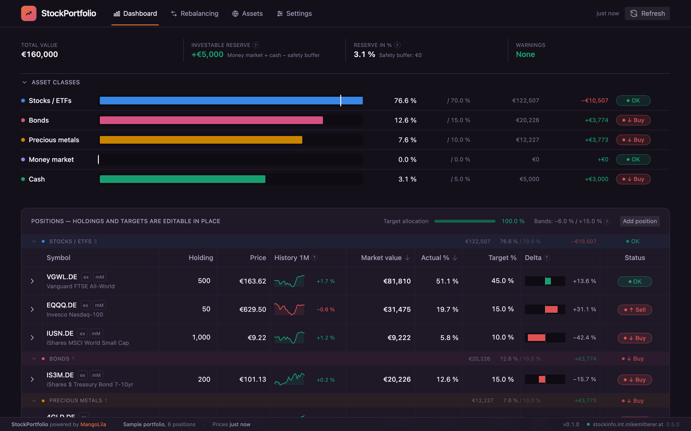
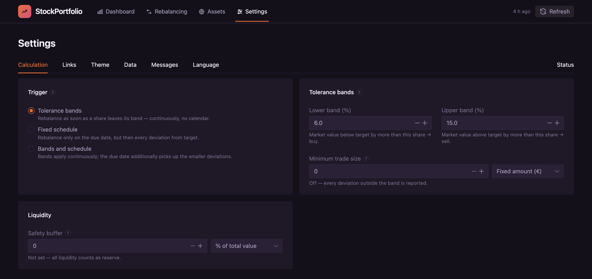
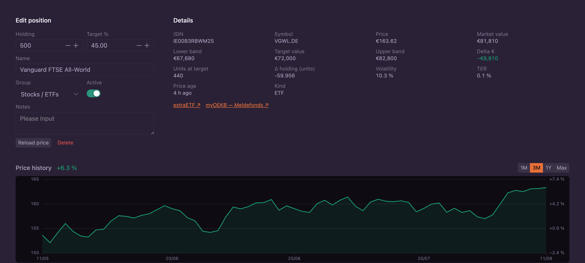
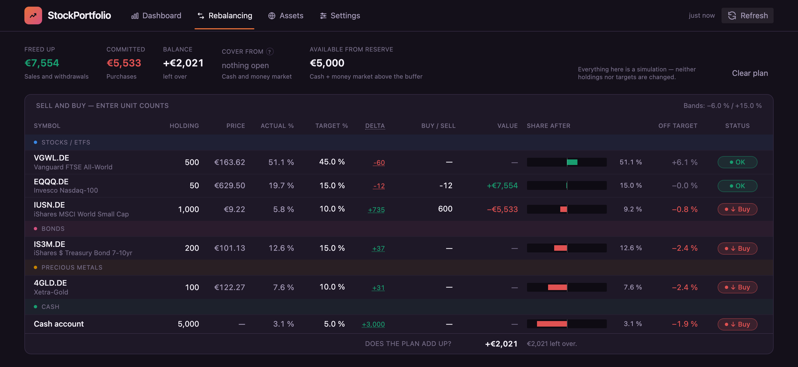

# StockPortfolio

Tolerance-band rebalancing as a web app — Vue 3 + Vite + TypeScript.
It replaces a spreadsheet; prices come from
[StockInfo](https://github.com/MikeMitterer/stockinfo), a separate service you
run yourself.




_The dashboard: asset classes at the top, positions below. Holdings and targets
are editable in place; the screenshots on this page use the sample portfolio the
app can load on first start._

## What it does

A portfolio is supposed to have a certain mix — say 70 % stocks, 10 % precious
metals, 15 % money market, 5 % cash. Prices keep shifting those shares. The two
questions are **when** to act and **how much** to move.

The app answers both.

### When: the trigger

Under _Settings → Calculation_ you choose what sets off a rebalance:

| Trigger                       | Meaning                                                                      |
| ----------------------------- | ---------------------------------------------------------------------------- |
| **Tolerance bands** (default) | Act as soon as a share leaves its band. Continuous, no calendar.             |
| **Fixed schedule**            | Act only on the due date, but then on every deviation from target.           |
| **Bands and schedule**        | Bands apply continuously; the due date also picks up the smaller deviations. |

Bands are relative to the target: with a 10 % target and a 6 % lower band, the
status flips to `Buy` at 9.4 %, not at 4 %. Both bands are set separately —
most people react earlier on the way down.

The schedule needs two things: an interval in months (12 = yearly) and the date
of the last rebalance. From those the app computes the next date and shows it —
in the settings, and next to the bands on the dashboard. The date belongs to the
portfolio, not to the settings, and you set it by hand: only whoever placed an
order knows whether it was actually filled.

Pure calendar rebalancing has a known weakness. If the market drops in March,
the allocation shifts at once but the date is in December. That is why the
combined option exists.



### How much: delta in units

Every row shows how many units are missing or in excess. If the targets add up
to 100 %, the deltas cancel out in euro terms — follow all of them and you get a
plan that balances by itself.

### Minimum trade size

Relative bands make small positions responsive, which is the point. In euro
terms they make them _over_-responsive: in a €100,000 portfolio a 2 % target
with a 6 % band already signals at €120. No order is worth that.

_Settings → Calculation_ therefore has an optional minimum trade size, either a
fixed amount or a share of the portfolio. If a position is outside its band but
the missing sum is below that limit, the status stays `OK` and gets a small
`min` marker. The deviation stays visible in the delta column — only the call to
action is suppressed. The default is 0, i.e. off.

### Portfolio base currency

Choose a currency for each portfolio in **Settings → Data → Portfolios**.
New portfolios default to EUR; USD, CAD and other ISO currencies are available.
Cash, security buffers and minimum trade amounts belong to that portfolio and
use its currency. You can change the currency at any time. A confirmation
shows the rate used to convert cash and absolute limits; holdings and percentage
limits stay unchanged. Without a valid conversion rate, stored amounts and
currency stay unchanged. The chart shows the selected currency series, and
earlier series remain available when switching back.

StockInfo FX rates convert foreign quotes into the portfolio currency before
calculating totals, allocations, bands and trades. A rate of 0.8 EUR per USD
turns a $100 holding into €80. Pence quotes (`GBp`) are first divided by 100
into GBP. Original quotes and plugin amounts retain their own currencies.

A stale FX rate remains usable with a persistent warning naming the pair and
rate date. If no valid rate exists, the affected position stays visible and is
excluded from totals and trades. Incomplete valuations do not overwrite daily
values. Snapshots carry their currency; unlabelled old snapshots are omitted. Backups
retain all currency series, while the chart shows only the selected currency. Historical backtests requiring FX are
hidden with an explanation because StockInfo does not supply historical FX.

Quotation currency does not describe currency exposure: a euro-quoted MSCI
World still holds assets in other currencies. The app does not calculate that
exposure.

### Valid prices before adding a position

Adding a security first fetches and validates its quote. If the symbol is
ambiguous or the response lacks a valid price or quote currency, the dialog
shows the reason and keeps the security out of the portfolio. A price shown
in the instrument catalog alone is insufficient.

When a later refresh fails, an existing position remains visible. Its last
valid price is marked stale and may still be used; without a valid price the
position is excluded from calculations and trade suggestions. Original quotes retain their currency, including `GBp` for pence; portfolio
market values use the converted price.

The client validates StockInfo Core 4.3.0 quote and catalog responses at one
boundary. It preserves listed, pair and ISIN-only identities. IndexedDB
schema 5 rebuilds older quote caches; portfolio positions remain stored.

### Additional instrument information

Open a position on the dashboard to see additional fields supplied by StockInfo
plugins. On mobile, use **Additional information** on the position card. Fields
already displayed in a configured main column are omitted from the details.
TER and volatility use the same display as plugin fields.

Labels, applicability and units come from StockInfo's field catalog. The app
shows the effective value, its provider or manual origin, date and any overridden
manual value. Zero and false remain values; missing values appear as a dash.
Amounts keep the currency attached to that value and never change the portfolio
calculations automatically.

If the field catalog is unavailable, quotes and the existing core information
remain usable. Older cached quotes without details are marked as not yet loaded;
reload the quote to fetch them. The field catalog is loaded for the current
session and API address, while detail values are stored with the quote.

### Value history

The total-value tile carries a small line and the change over the last 90 days;
a click opens the full chart below it. Two lines with different weight: solid
for **recorded daily values** — what the portfolio actually stood at, including
purchases and sales — and dashed for the **look back**, today's holdings valued
at past prices. The second one is not the portfolio's history: a security bought
last week appears across the whole period. The caption says from when the figure
is real.

Daily values start accumulating the first time this version runs, so the solid
line grows over the months. They are part of the backup — the look back can be
recomputed, they cannot.

### Price history

Every row carries a small sparkline. It answers a question no number does: is
the price coming from above or from below? The period is shown in the column
header and is chosen under _Settings → Data_ — one month, one week or one day.
"One day" shows no line but the change from the last trading day to today.

The expanded row holds a proper chart: prices on the left axis, the same line as
a percentage change on the right, time along the bottom, selectable from one
month up to "max". Hovering shows date, price and change for that day.

Daily closing prices change once a day, so they are cached in IndexedDB and
fetched at most once per day per security.



### Five asset classes

`Stocks / ETFs`, `Bonds`, `Precious metals`, `Money market`, `Cash`.

Money market is deliberately separate from the other bonds. Bonds with a
maturity fluctuate; money-market instruments barely do — which makes them,
together with cash, the thing a purchase can be paid from.

### Safety buffer and investment reserve

    investment reserve = (money market + cash) − safety buffer

The safety buffer is the amount meant to stay untouched. Whatever sits above it
is the investment reserve, and that figure is purely informational: it says how
much you _could_ invest in a downturn, not how much you should.

The buffer comes in two units because both readings are valid. An emergency fund
is a fixed amount and does not grow with the portfolio; a liquidity share is a
percentage. The default is 0 — how much someone leaves untouched depends on
their life, not on their portfolio.

### Rebalancing is a simulation

The rebalancing tab **books nothing**. You enter unit counts and immediately see
what it costs or yields, where the shares end up, and whether you land inside
the bands. Target shares can be changed there on a trial basis too — for the
case where a position serves as a source of money although it sits on target.
Those values live only in that tab.



_A plan in progress: 600 units of IUSN bought, 12 units of EQQQ sold, €2,021 left
over. Nothing is booked — the numbers only say what would happen._

You place the orders at your bank and update the holdings yourself in the
dashboard afterwards.

While a plan is underfunded, the header shows one button per liquid position
under _Cover from_ with the exact number of units that closes the gap.

### Explanations inside the app

Terms that are not self-explanatory — tolerance band, investment reserve, safety
buffer, delta, trigger — carry a small question mark with two or three sentences.
The tooltip has up to two links: _Read more →_ opens the page _The Method_, and
_Open setting →_ jumps straight to the settings tab that holds the value.

_The Method_ is deliberately **not** in the main navigation. People who open the
app want to try it, not read about it. The page is there to look things up when
a question actually comes up.

## Where the data lives

**Only in the browser** (IndexedDB), on the device you work on. No server stores
portfolio data — the StockInfo API only delivers prices and master data and
learns nothing about holdings.

That has consequences worth knowing:

- A different browser or device shows an empty portfolio.
- "Clear site data" in the browser deletes the portfolio too.
- A container update costs nothing — the data was never in the container.

_Settings → Data_ therefore offers backup and restore: a JSON file with the
portfolio, the settings and the list of hidden assets. Prices are not included —
the app fetches those anyway. On restore the file is checked and its contents are
shown first; nothing is overwritten without confirmation.

### Several portfolios

Under _Settings → Data_ you can create, rename, switch and delete portfolios —
one for the kids, say, or a variant to play through. Only the active one is ever
calculated; its name sits in the status bar so no number is ambiguous.

What belongs to a portfolio: holdings, targets, **the asset selection** and the
date of the last rebalance. Which securities are eligible for a children's
account is a different set from your own. Bands, buffer, minimum trade size and
appearance apply to all portfolios — they describe the method, not the single
portfolio.

A backup always contains just the active portfolio, including its asset
selection.

## Setup

```bash
make setup                 # .libs/ symlinks + npm install
cp .env.example .env       # adjust VITE_STOCKINFO_API_URL if needed
make dev                   # http://localhost:5175
```

`make setup` needs the environment variables `BASH_LIBS` and `DEV_MAKE`
(`make precheck` verifies that). Without them, a plain `npm install` works too.

## Commands

`make help` lists everything. The important ones:

| Command                        | Purpose                                     |
| ------------------------------ | ------------------------------------------- |
| `make dev`                     | Vite dev server (port 5175)                 |
| `make build`                   | Typecheck + production build into `dist/`   |
| `make preview`                 | Preview of the production build (port 4175) |
| `make test`                    | Vitest, single run                          |
| `make lint` / `make typecheck` | ESLint / `vue-tsc --noEmit`                 |
| `make docker-build`            | Build the Docker image                      |
| `make tag-minor`               | Bump the version + git tag                  |

The same steps exist directly as `npm run …`.

## Layout

```
src/
├── api/          HTTP client for StockInfo — the only place with `fetch`
├── domain/       Pure calculation, no DOM, no reactivity
├── db/           IndexedDB access (repository pattern)
├── stores/       Pinia — state and persistence
├── composables/  Reusable logic with reactivity
├── components/   Presentation, no business logic
├── views/        The five pages
└── theme/        Colour tokens and the Naive UI derivation
```

The calculation core in `src/domain/` is deliberately free of Vue:
`rebalancing.ts` (market values, bands, status, liquidity), `tradePlan.ts` (the
plan with cash flow, deltas and cover suggestions), `schedule.ts` (due dates) and
`amount.ts` (amounts that are either euro or percent). They are testable without
a browser, and that is where most of the roughly 500 tests live.

The router runs in **hash mode** (`/#/rebalancing`), so a server only ever sees
`/` and needs to know nothing about the app's routes. Settings tabs are
addressable as well (`/#/settings?tab=calc`) — that is what the _Open setting →_
links use.

## Language

German and English, switchable under _Settings → Language_. The choice covers
labels, numbers and dates together — treating them separately is the usual
mistake: an English label above a number in German format.

Without an explicit choice the browser's language decides; anything other than
German gets English. The choice is stored in the browser.

Visible text lives in the message catalogue ([`src/i18n/`](src/i18n/)), without
exception. An ESLint rule turns a hard-coded string in a template into an error,
and the typecheck reports every key missing in one of the languages.

## Typography

Two families, both shipped with the app: **Inter** carries the interface and
every number, **Space Grotesk** the wordmark and page titles. Numbers never
change family — digit widths differ between families, and the column would
shift.

Nothing is fetched at runtime. The fonts come from npm packages and are served
from wherever the app is served; a Google Fonts link would leak the visitor's IP
address on every page view. Only the `latin` subset is bundled, 69 KB for both.

## Themes

Eleven, under _Settings → Theme_. Seven dark — `MangoLila` (the family colour,
after the StockInfo backend), `Classic`, `Slate`, `Ocean`, `Forest`, `Aurora`,
`Carbon` — and four light: `Paper`, `Sepia`, `Meadow`, `Mono`. Without an
explicit choice the system setting decides between MangoLila (dark) and Paper
(light).

A theme also shapes the **bars**: header and status bar have their own surface
and text tokens, so a palette can sink them below the content (`Slate`), lift
them above it (`Carbon`), wash them with colour (`Aurora`, `Meadow`) or invert
them entirely — light content between dark bars (`Sepia`).

Asset-class colours are theme-independent and checked for distinguishability
with colour vision deficiency.

## Mobile

The dashboard works as a **reading view**: basic figures, delta and status.
Rebalancing stays on the desktop — entering unit counts in a wide table is not a
good idea on a phone.

## Docker

The image is on Docker Hub as
[`mangolila/stockportfolio`](https://hub.docker.com/r/mangolila/stockportfolio).
It contains the finished bundle and an nginx to serve it — no Node runtime, no
database, no volumes.

### Run it

```bash
docker run -d --name stockportfolio \
    -p 8080:80 \
    -e STOCKINFO_API_URL=https://stockinfo.example.com \
    --restart unless-stopped \
    mangolila/stockportfolio
```

Then open <http://localhost:8080>. `STOCKINFO_API_URL` is the address of **your
own** [StockInfo](https://github.com/MikeMitterer/stockinfo) instance — the app
has no public backend to fall back on. See [API address](#api-address) below.

If the API runs on the same machine but outside Docker, the container cannot
reach it via `localhost`; use `http://host.docker.internal:8000` instead (on
Linux, add `--add-host=host.docker.internal:host-gateway`).

### With Docker Compose

```yaml
services:
  stockportfolio:
    image: mangolila/stockportfolio
    container_name: stockportfolio
    ports:
      - '8080:80'
    environment:
      STOCKINFO_API_URL: https://stockinfo.example.com
    restart: unless-stopped
```

```bash
docker compose up -d
```

### Updating

```bash
docker pull mangolila/stockportfolio
docker rm -f stockportfolio
# then run the command above again — or: docker compose up -d
```

Nothing is lost in the process. Portfolios live in the browser, not in the
container, so an update is a plain pull & restart.

### Checking it works

```bash
docker ps                          # STATUS should say "healthy" after a few seconds
docker logs stockportfolio         # the entrypoint prints the API address it wrote
```

The app itself shows the address in use under _Settings → Status_ and in the
status bar at the bottom. If prices stay empty, that page is the place to look:
it distinguishes "not reachable" from "reachable but refused" (CORS).

### Building it yourself

```bash
make docker-build              # builds mangolila/stockportfolio:<git-tag>
make docker-build PLATFORM=arm # ... for linux/arm64 instead
make docker-samples            # prints ready-made `docker run` commands
```

The build needs a git tag and a clean working tree (`make tag-patch`). It is a
multi-stage build on Debian: `node:22-bookworm-slim` produces the bundle,
`nginx:1.27-bookworm` serves it.

The default platform is `x86` (`linux/amd64`), because that is what the image
usually runs on — Unraid and most NAS boxes are x86, and an arm64 build from an
Apple Silicon Mac would not start there. `PLATFORM=arm` builds for `linux/arm64`,
`PLATFORM=all` builds both and pushes them in one step (buildx, registry login
required).

| Command                                          | Purpose                             |
| ------------------------------------------------ | ----------------------------------- |
| `make docker-build [PLATFORM=…]`                 | build the image                     |
| `make docker-push [TARGET=dockerhub\|ghcr\|ecr]` | push the last build                 |
| `make docker-update`                             | pull a fresh base image             |
| `make docker-images`                             | list local images of this project   |
| `make docker-samples`                            | print example `docker run` commands |

The bundled nginx configuration only adds caching rules. Without them the
browser keeps serving the old `index.html` after an update and can no longer find
the bundle files it names.

### API address

It is **not** baked into the image. On start the entrypoint writes
`STOCKINFO_API_URL` into `config.js`, from where the app reads it. The same image
can therefore point at a different backend without being rebuilt. Without the
variable, the value baked in at build time from `VITE_STOCKINFO_API_URL` applies.

The address is mandatory. If neither source provides one, the app does not start
but shows a message saying so — there is no built-in fallback, because a fallback
address resolves for nobody but its owner and the mistake would only surface as an
empty price table.

### Unraid

In the Docker tab choose "Add Container", then:

| Field      | Value                                                   |
| ---------- | ------------------------------------------------------- |
| Repository | `mangolila/stockportfolio`                              |
| Port       | container `80` → host port of your choice               |
| Variable   | `STOCKINFO_API_URL` = address of the StockInfo instance |

There are no volumes — the app stores everything in the browser, not in the
container. An update is a plain "pull & restart" and loses no data. The image
carries the WebUI link and icon as labels, and the healthcheck colours the state
in the Docker tab.

## Not there yet

| Topic                                | State                                                                           |
| ------------------------------------ | ------------------------------------------------------------------------------- |
| Historical FX backtest               | unavailable — current FX rates cannot replace historical rates |
| Threshold notifications              | deliberately outside the MVP                                                    |
| CORS against the production API      | unverified — the container's origin has to be allowed                           |
| Pruning the price-history cache      | open — it only ever grows                                                       |

Details and verify matrices: [ticket board](_tickets/README.md).
The design this was built against:
[design spec](docs/superpowers/specs/2026-08-06-rebalancing-webapp-design.md).

## Licence

Private project — no licence granted.
