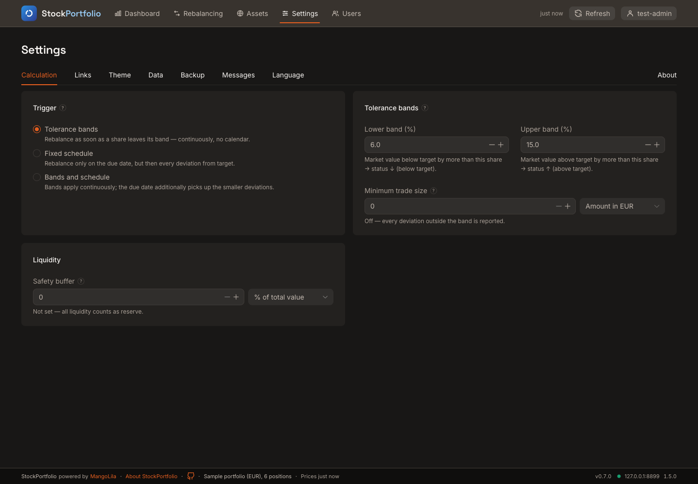
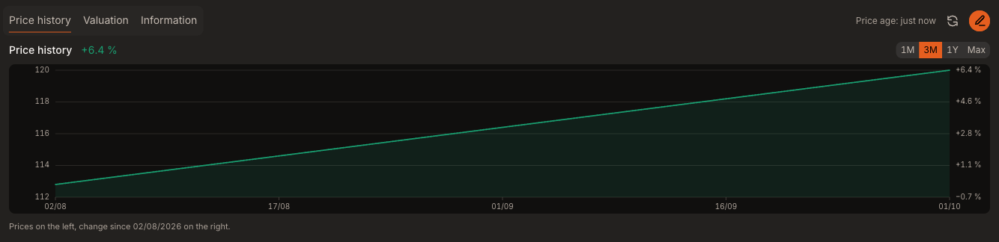
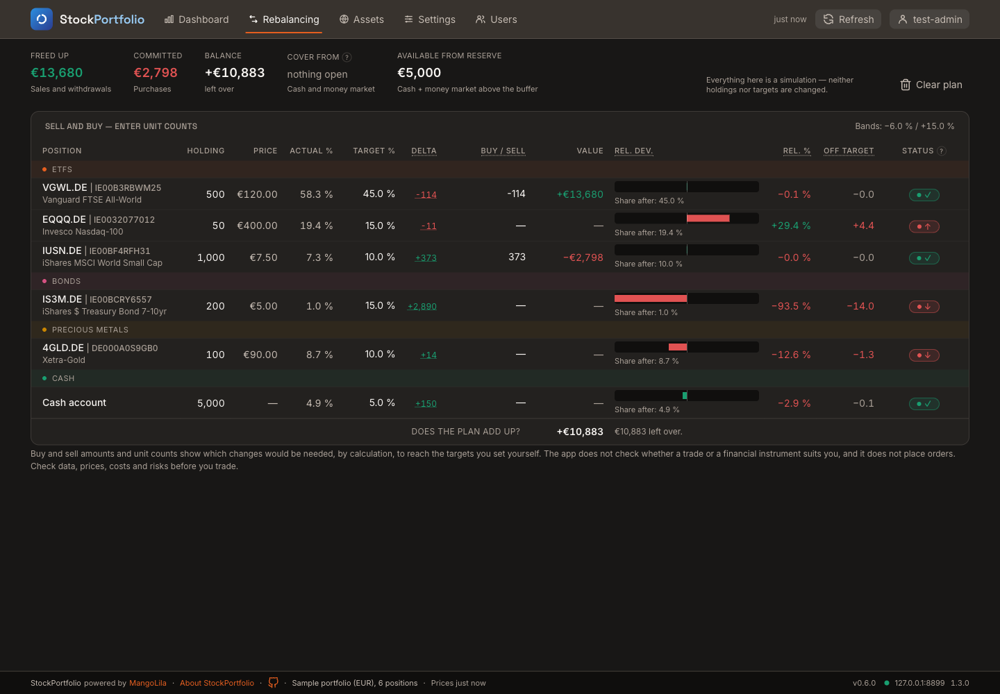

# StockPortfolio

Portfolio management with market data, valuation, charts and tolerance-band
rebalancing — built with Vue 3, Vite and TypeScript. Prices come from
[StockInfo](https://github.com/MikeMitterer/stockinfo), a separate service you
run yourself.

**Docker:** [Container setup and configuration](docker/README.md) ·
[Docker Hub repository](https://hub.docker.com/r/mangolila/stockportfolio)


_The dashboard: portfolio groups at the top, positions below. Holdings and targets
are editable in place and through the position dialog. Arrows mark positions
below (↓) or above (↑) their band. The screenshot shows the built-in sample
portfolio with test quotes, in English with the MangoLila theme._

### StockInfo: where the prices come from

StockPortfolio was built as a companion to
[StockInfo](https://github.com/MikeMitterer/stockinfo). StockInfo supplies
prices, exchange rates and fund metrics; StockPortfolio turns them into
portfolio values and rebalancing trades. StockPortfolio does not work
without a StockInfo instance.

StockInfo also works on its own, for example for scripts or spreadsheets.

|  | StockInfo | StockPortfolio |
|---|---|---|
| Purpose | Quotes, price history, ETF metrics | Portfolios, valuation, rebalancing |
| Runs without the other app | Yes | No, it needs StockInfo for prices |
| Docker image | [`mangolila/stockinfo`](https://hub.docker.com/r/mangolila/stockinfo) | [`mangolila/stockportfolio`](https://hub.docker.com/r/mangolila/stockportfolio) |

Set up StockInfo first, then point StockPortfolio at it with
`STOCKINFO_API_URL` (see [Setup](#setup)).

## What it does

Set a target allocation and choose when to rebalance under
_Settings → Calculation_:

| Trigger | Meaning |
|---|---|
| Tolerance bands | Act when a position leaves its band. |
| Fixed schedule | Act on the due date, on every deviation from target. |
| Bands and schedule | Check bands continuously and smaller deviations on the due date. |

Bands are relative to the target: a 10% target with a 6% lower band triggers
at 9.4%. Lower and upper bands are separate. Scheduled rebalancing uses an
interval in months and the portfolio's last rebalance date, which you set after
placing orders yourself.



Each position shows its delta in units. An optional minimum trade size suppresses
small trade amounts without hiding the deviation. The limit can be a fixed
amount in the portfolio currency or a percentage; its default is zero (off).
Changing units converts the current value. Buffer and minimum trade settings
are saved with the active portfolio.
The note below the dashboard table and Rebalancing table explains that buy and
sell amounts show what would be needed, by calculation, to reach your own
targets, and that the app neither checks whether a trade suits you nor places
orders. Login and About use the same wording.

### Portfolio base currency

Choose a currency for each portfolio in **Settings → Data → Portfolios**.
New portfolios default to EUR; USD, CAD and other ISO currencies are available.
The dashboard states the base currency beside the total value. The status bar
also shows its code beside the active portfolio name on every page.
Cash, security buffers and minimum trade amounts belong to that portfolio and
use its currency. You can change the currency at any time. A confirmation
shows the rate used to convert cash and absolute limits; holdings and percentage
limits stay unchanged. Without a valid conversion rate, stored amounts and
currency stay unchanged. The chart shows the selected currency series, and
earlier series remain available when switching back.

StockInfo FX rates convert foreign quotes into the portfolio currency before
calculating totals, allocations, bands and trades. A rate of 0.8 EUR per USD
turns a $100 holding into €80. Pence quotes (`GBp`) are first divided by 100
into GBP. Original quotes and plugin amounts retain their own currencies.

A stale FX rate remains usable with a persistent warning naming the pair and
rate date. If no valid rate exists, the affected position stays visible and is
excluded from totals and trades. Incomplete valuations do not overwrite daily
values. Snapshots carry their currency; unlabelled old snapshots are omitted. Backups
retain all currency series, while the chart shows only the selected currency. Historical backtests requiring FX are
hidden with an explanation because StockInfo does not supply historical FX.

Quotation currency does not describe currency exposure: a euro-quoted MSCI
World still holds assets in other currencies. The app does not calculate that
exposure.

### Valid prices before adding a position

Adding a security first fetches and validates its quote. If the symbol is
ambiguous or the response lacks a valid price or quote currency, the dialog
shows the reason and keeps the security out of the portfolio. A price shown
in the instrument catalog alone is insufficient.

When a later refresh fails, an existing position remains visible. Its last
valid price is marked stale and may still be used; without a valid price the
position is excluded from calculations and trade amounts. Original quotes retain their currency, including `GBp` for pence; portfolio
market values use the converted price.

The client validates StockInfo Core 4.3.0 quote and catalog responses at one
boundary. It preserves listed, pair and ISIN-only identities. IndexedDB
schema 5 rebuilds older quote caches; portfolio positions remain stored.

### Position information

The main row has a small type icon beside the name, on desktop and mobile.
Stocks use a chart, ETFs layers, ETCs a gem, funds a pie chart, crypto coins
and bonds a scroll. Other dynamic types use a neutral tag icon.
Hover or focus it to see the current StockInfo asset type; tap it on mobile.
The tooltip preserves new type identifiers without a fixed list.
The type is not repeated in the details.
Open a position on the dashboard. **Information** combines
fields supplied by StockInfo plugins, TER and volatility. Symbol, ISIN and the
original price stay in the main row without being repeated in the details.
A fund size appears in millions with its currency code, as StockInfo writes it,
for example `89,123.00 million EUR`; a manually entered size keeps the currency
it was entered in. StockInfo computes volatility for every asset type with
prices, so stocks and funds show it too. A value saved in the browser with an
older unit shows `—` until the next price refresh replaces it.
A converted unit price remains available here when needed. On mobile the area
also provides the quote age and external links, which the card does not show. On mobile, tap the position card
or its caret to reach the same sections. Fields already
displayed in a configured main column are omitted from additional information.
The dashboard's **Position** column shows both ticker and ISIN when StockInfo
provides both, separated by a vertical bar. The mobile card and rebalancing
view follow the same rule.
For an ISIN-only asset, the main row shows its ISIN without inventing a
ticker. Identifiers come from StockInfo and cannot be edited here. On desktop,
the refresh icon beside the quote age reloads that position's quote and rotates
while the request runs.

Labels, applicability and units come from StockInfo's field catalog. The app
shows the effective value, its provider or manual origin, date and any overridden
manual value. Technical field keys are hidden unless two populated fields need
distinguishing and no source name is available. Equal labels share one empty
placeholder; a populated field takes precedence over it. Zero and false remain
values; other missing values appear as a dash.
Amounts keep the currency attached to that value and never change the portfolio
calculations automatically.

If the field catalog is unavailable, quotes and the existing core information
remain usable. Older cached quotes without details are marked as not yet loaded;
reload the quote to fetch them. The field catalog is loaded for the current
session and API address, while detail values are stored with the quote.

### Value history

Click the total-value tile's 90-day sparkline to open the chart. The solid line
contains recorded daily portfolio values, including changes in holdings.
The dashed look back values **today's holdings** at past prices; it is not
historical portfolio performance. Recording starts when you use the app.
Daily values are included in backups; the look back can be recomputed.

### Price history

Clicking the small sparkline opens the row with **Price history** selected;
clicking it again closes the row. The sparkline answers a question no number does: is
the price coming from above or from below? The period is shown in the column
header and is chosen under _Settings → Data_ — one month, one week or one day.
"One day" shows no line but the change from the last trading day to today.

Opening a security selects **Price history**, the first tab, and loads the larger chart. It shows
prices on the left axis, the same line as a percentage change on the right,
and time along the bottom, selectable from one month up to "max". Hovering
shows date, price and change for that day. The larger chart and its history
request start when the position is opened; the small row sparkline loads on its
own.



Daily closing prices change once a day, so they are cached in IndexedDB and
fetched at most once per day per security.

The **Valuation** area shows the position's market value, target and bands.
Its unit delta is displayed as a whole number; calculations retain their precision.
The pencil icon opens the edit dialog. **Save** applies the changes;
**Cancel** and the close icon discard them. **Delete** stays separate on the
left and asks for confirmation.
The two symbols beside the desktop position heading **collapse all groups**
or **expand all groups**. Each has a text label for assistive technology. The
choice is kept for the next visit.

### Detail notes and information

The detail navigation uses text tabs with a thin underline for the active area,
with a subtle background behind the navigation. On mobile a compact menu selects
the area in one line; no horizontal scrolling is needed.
Saved position notes appear below the detail toolbar on desktop and mobile.
Empty notes leave no gap. Cash opens with **Valuation**. Information tabs without
content are hidden; loading states, missing cached details and errors remain
accessible. Additional values of zero or false count as content.

Asset type icons use Lucide. The icons for expanding and collapsing all groups
use Microsoft Codicons;
see [third-party notices](THIRD_PARTY_NOTICES.md).


### Six portfolio groups

`ETFs`, `Stocks`, `Bonds`, `Precious metals`, `Money market`, `Cash`.
The group is suggested from the security type and name, and can be changed
when adding or editing a position. A bond ETF can therefore remain under
`Bonds`. Existing ETFs in the former `Stocks / ETFs` group move once to `ETFs`;
later manual group choices are kept. This also applies when importing an older
backup.

Money market is deliberately separate from the other bonds. Bonds with a
maturity fluctuate; money-market instruments barely do — which makes them,
together with cash, the thing a purchase can be paid from.

The dashboard group overview hides groups whose actual and target shares are
both zero. A group with a target allocation remains visible even without holdings.

Under _Settings → Links_, asset types come from StockInfo's
`GET /instrument-types` catalog, independently of your holdings. The catalog
reloads when you open this tab; **Reload types** refreshes it while editing.
Identifiers such as `etf` and `fund` stay separate. New plugin types appear
without a StockPortfolio update.

A link can be limited to these types and independently to portfolio groups,
including `Cash`. An empty selection in either filter means all types or groups.
When both filters are set, a position must match both. Cash has no asset type,
so leave the type filter empty for a Cash link. Links needing an ISIN remain
unavailable for positions without one.

A partial, empty or unavailable type catalog is indicated beside the editor.
Existing filters are preserved and marked when their type is absent or cannot
be confirmed. There is no built-in fallback catalog. A source outage does not
necessarily make the catalog incomplete: StockInfo can still know which types
that source declares.

The current quote's type takes precedence over the stored position type.
Refreshes save updated types for offline use without changing portfolio groups.
Positions and link filters retain new type identifiers in backups.

If you delete the cash account, use **Add position → Cash account** to create it
again. Enter the balance in the portfolio currency and its target percentage.
Cash does not need a StockInfo quote and can be added without an available
security catalog. This option appears only when the portfolio has no cash account.

### Safety buffer and investment reserve

    investment reserve = (money market + cash) − safety buffer

The buffer can be a fixed amount or percentage; its default is zero. The
reserve is informational and does not initiate investments.

### Rebalancing is a simulation

Enter unit counts and trial target shares in _Rebalancing_ to see costs,
resulting allocations and bands. _Cover from_ offers liquid positions when a
plan is underfunded. **Nothing is booked.** Place orders at your bank, then
update holdings on the dashboard.



_Two suggested trades taken over from the Delta column: the plan shows the
amounts, the resulting shares and whether the plan adds up._

The bar and the separate _Rel. %_ column show the relative deviation from the target after
the planned trade, using the same format as the dashboard. The resulting
portfolio share appears below the bar; the _Off target_ column shows the difference
in percentage points. Relative deviation is undefined when the target is zero.
In Rebalancing, positive relative values are green and negative values red;
the bar fill continues to indicate the band status.
Hover over the dotted column headings for explanations of relative deviation,
percentage points, and positive or negative trade entries.
Below 1280 pixels, the bar and its share label are hidden. The _Rel. %_ value
remains visible in its own column, including its sign colour.
Below 1160 pixels, the simulation reminder above the table is hidden.
The workspace keeps a minimum width of 890 pixels, expanding when table content
needs more room. On narrower screens, the summary and table scroll horizontally
together. _Clear plan_ stays on the summary row. The scroll region also supports
keyboard navigation.

### Explanations inside the app

Question-mark tooltips explain the method and link to the relevant setting
or _The Method_ reference page.

The login page explains what the app does: it calculates deviations from
the targets you set, buy and sell values are arithmetic results, it does not
check whether a trade suits you, and it places no orders. Signing in requires
ticking "I have read the notice". The tick applies to that login only and is
not stored.

## Where the data lives

The StockPortfolio API stores accounts, sessions, portfolios, settings, asset
selection and recorded daily values in SQLite under `/data`. Each account has
its own data, including additional admin accounts. An admin can manage accounts
but cannot open another account's portfolios. StockInfo only delivers prices
and master data and learns nothing about holdings.


_Each login asks you to confirm a short notice on what the calculated values
mean. Admins manage accounts under **Users**:_


That has consequences worth knowing:

- The same account loads its portfolios on another browser or device after login.
- Open browsers signed in to the same account receive change notices and reload
  the affected data from the account API. The status bar warns when the live
  connection is unavailable. While the connection is up, the app relies on
  these notices and does not poll. While it is down, the app checks the server
  every 30 seconds; after reconnecting, and when you return to the tab, it
  fetches the current data once.
  When one browser uses **Refresh** for prices, the others fetch the current
  prices from StockInfo without reloading their pages. Restoring a backup in
  one browser updates the others in the same way. A stale edit still
  produces a conflict instead of overwriting another browser's change.
- A new account, including an additional admin, starts with an empty portfolio.
- Clearing browser site data removes market caches and browser preferences,
  but server portfolios remain. Keep and back up the same `/data` volume when
  updating the container.
- If the server is unavailable, changes cannot be saved. Concurrent changes
  from another browser produce a conflict instead of silently overwriting data.

Existing IndexedDB portfolios from before accounts are **not imported
automatically**. Only the original setup account can preview them in the old
browser profile and import them once, with confirmation. Until import or
explicit discard, they remain readable through that browser profile's
developer tools, even after sign-out. Other accounts do not see their names or
contents. After the one-time import, further old browser profiles offer a file
export for each portfolio; restore those files through the regular backup flow.

An account database created before the setup-account marker was introduced
cannot prove which admin owns that old browser data. For a disposable local
test installation, remove its **StockPortfolio API database**, restart setup,
and sign in with the newly created setup account in the browser containing the
old data. Preserve or export the browser data first. Do not reset a database
containing data you need.

_Settings → Backup_ offers backup and restore: a JSON file with the
portfolio, the settings and the list of hidden assets. Prices are not included —
the app fetches those anyway. On restore the file is checked and its contents are
shown first; nothing is overwritten without confirmation. The server applies
the confirmed restore as one transaction for that account.
Admins open **User management** directly from the people icon in the top bar.
The account list keeps actions for other accounts behind each row; an admin's
own row has no reset or deactivate action.
The top-right account button shows your username and opens the sign-out action.
On narrow screens it shows only the account icon; its accessible name retains
the username. The logo opens the dashboard, and the other navigation targets
remain available. Rebalancing keeps its text on phones where it fits; on the
smallest screens it uses an icon with an accessible name.
An empty portfolio also offers **Restore backup …**, which opens the Backup tab
directly, alongside adding a position or loading a sample portfolio.

### Several portfolios

Under _Settings → Data_ you can create, rename, switch and delete portfolios —
one for the kids, say, or a variant to play through. Only the active one is ever
calculated; its name sits in the status bar so no number is ambiguous.

What belongs to a portfolio: holdings, targets, **the asset selection** and the
date of the last rebalance. Which securities are eligible for a children's
account is a different set from your own. Base currency, safety buffer and minimum trade size also belong to the
portfolio. General calculation preferences and appearance apply across portfolios.

A backup always contains just the active portfolio, including its asset
selection.

## Setup

```bash
make setup                 # .libs/ links, local Python venv, frontend and API dependencies
cp .env.example .env       # adjust STOCKINFO_API_URL if needed
make dev-up                # Vue app on :5175 and account API on :8080
```

`make dev-up` runs both development servers in the background through Overmind.
`make dev-down` stops them and frees ports 5175 and 8080. It also cleans up
after a crash: it ends this project's leftover Overmind and tmux processes,
removes a stale `.overmind.sock`, and stops processes from this project that
still listen on those ports. Processes from other projects, such as StockInfo
or Docker, are left alone. Running it again without a stack is safe and exits
with 0. The ports are listed in `.dev-ports.conf.sh`; the cleanup itself
comes from ProjectTools' `dev-ports.sh`.

`make setup` links existing BashLib, MakeLib and ProjectTools repositories,
creates StockPortfolio's `.venv` with Python 3.11+, and installs the local
ProjectTools Python package there from `requirements-dev.txt`. `PYTHON_BOOTSTRAP`
selects the interpreter if `python3.11` is unavailable. Setup checks the
version before creating a venv; later runs reuse the venv and install the
package only when its UI module is missing. `make clean` keeps the venv.
For the first setup, set `BASH_LIBS`, `DEV_MAKE` and `PROJECT_TOOLS` to their
locations; later commands can use the links under `.libs/`. To install only
the frontend and API dependencies manually, use `npm ci --prefix frontend` plus
`npm ci --prefix api` works
without these shared tools. Each subproject keeps its own package lockfile.
The development targets use Overmind and tmux. Install them first (on macOS:
`brew install overmind tmux`).
`npm run dev --prefix frontend` starts only Vite. To start only the API from
the repository root, use
`STOCKPORTFOLIO_DATA_DIR="$PWD/.local-data" STOCKPORTFOLIO_PUBLIC_ORIGIN=http://localhost:5175 npm run dev --prefix api`.
With either start command, the API stores local accounts under `.local-data` unless
`STOCKPORTFOLIO_DATA_DIR` is set.
Until an admin exists, each API start prints a new code after
`StockPortfolio setup code:` in the API output. With `make dev-up`, open the
API's window with `overmind connect api` (leave it with Ctrl-B, then D);
`overmind echo` only shows output from that moment on and misses the code.
The setup page
closes after the first admin account is created. New passwords need 12 to 1024
characters, including an
uppercase letter, a number and a special character.
StockInfo is a separate service; `make dev-up` does not start it.
If the login page says the account service is unreachable, check that the
account API is running on port 8080. Vite alone serves the page but cannot
handle login requests; `make dev-up` starts both servers.

For browser checks with local StockInfo prices and an isolated account API,
run `make setup`, then start the complete test stack with StockPortfolio's
Python environment:

```bash
.venv/bin/python scripts/stockinfo-test-server.py --stack --run --stockinfo-root ../StockInfo
.venv/bin/python scripts/stockinfo-test-server.py --stack --status
.venv/bin/python scripts/stockinfo-test-server.py --stack --stop
```

The local venv provides `projecttools.ui.colors` for themed help and status.
Select a theme with `MAKE_THEME=ocean`. `NO_COLOR`, redirected output and
`TERM=dumb` disable ANSI colors. The script uses no machine-specific
ProjectTools source path. The StockInfo child process still uses
`../StockInfo/.venv/bin/python`; `make setup` does not change that environment.

The start command returns after the three processes are ready. It prints Vite
(`127.0.0.1:5175`), the account API (`127.0.0.1:8080`), StockInfo fixtures
(`127.0.0.1:8899`), and the path to the one-time setup code in the isolated
API log. Add `--demo-accounts` to create a synthetic admin and user instead;
their generated credentials are stored only in the printed temporary file.
Both generated passwords meet the account API's password rules.
Add `--demo-details` for screenshots and visual checks. StockInfo then serves
only ten readable instruments with real names: the five sample-portfolio
securities (Xetra-Gold as an ETC), iShares Core MSCI World, Vanguard Total
Stock Market, Apple, the DWS Vermögensbildungsfonds I fund and a German federal
bond. Type and detail values come from `scripts/fixtures/demo-details.json`
and follow StockInfo's own declarations: TER, fund size in millions, provider
and accumulating for ETFs and ETCs, volatility for every listing. Vanguard
Total Stock Market carries a manual fund size in USD. **Refresh** fetches
prices from the fixture source, which has no detail values: afterwards the
demo details are empty and volatility is recalculated from the synthetic
price series. Restart the stack to get them back. Without
`--demo-details`, the fixture server keeps its test cases instead: a crypto
pair, an OTC bond without listing, one symbol on two exchanges, a pence
listing and a listing without ISIN.
The stop command removes these test accounts and temporary databases. It does
not use Docker, change `.env` or `.local-data`, or call a Make target. The
script starts the account API without the project's environment file and
passes the fixture URL as `STOCKINFO_API_URL`, so a value in `.env` cannot
silently replace it. The status check confirms that Vite forwards
`/api/stockinfo/*` to the account API.

Ports 5175 and 8080 are fixed to match Vite's proxy; use `--port PORT` when
starting to change only the StockInfo fixture port. Status and stop read the
registered port. A port conflict or missing
dependency stops startup with an error and leaves other processes alone. The
script checks process identity with `ps`; restricted agent environments must
allow that read rather than bypass it. In a worktree outside the sibling layout,
pass an absolute path for `--stockinfo-root`. For the StockInfo-only server,
continue to use StockInfo's Python environment directly:

```bash
../StockInfo/.venv/bin/python scripts/stockinfo-test-server.py --run --stockinfo-root ../StockInfo
```

That single-server mode imports StockInfo in the same process. StockInfo's
`make setup` installs the shared ProjectTools package into its `.venv`, so the
help uses the common CLI theme there as well.

The live sync between browsers has a visible browser smoke test. It needs the
test stack started with `--demo-accounts` and a local Google Chrome
(`CHROME_PATH` overrides the default macOS path):

```bash
npm --prefix frontend run smoke:live-sync -- <temporary-dir>/demo-accounts.json
```

It opens two windows of one account side by side and a third window of the
second account. It checks that a change in one window appears in the other
without a page reload, that the other account sees nothing, that a price
refresh in one window makes the other fetch prices, that a backup restore
reaches the second window, reconnection after an interrupted stream,
the 15-second keep-alive through the Vite proxy, conflict handling and
logout. A forced password change of a new test account is handled
automatically. The windows stay open until you press Enter.

The images under `docs/images/` come from a script, so a later release can
take them again in the same way. With the same test stack running:

```bash
npm --prefix frontend run screenshots -- <temporary-dir>/demo-accounts.json
```

It signs in as the synthetic admin, loads the sample portfolio and saves
`login.png`, `dashboard.png`, `drilldown.png`, `rebalancing.png`,
`settings-calculation.png` and `user-admin.png` in English with the MangoLila
theme. Full pages are 1440 × 1000; `drilldown.png` is a cut-out of the opened
position. No real portfolio data is involved.

## Commands

`make help` lists everything. The important ones:

| Command                        | Purpose                                     |
| ------------------------------ | ------------------------------------------- |
| `make dev-up`                  | Start both development servers in the background |
| `make dev-down`                | Stop the dev stack and free ports 5175/8080 |
| `make test`                    | Frontend and API tests, single run          |
| `make clean`                   | Remove generated files; keep the local Python venv |
| `make build`                  | Build and load the Docker image for testing |
| `make push`                   | Publish the tested image, then Docker Hub README |
| `make tag-minor MSG="…"`      | Bump, commit, tag and push; then publish the changelog |
| `make changelog`              | Regenerate `CHANGELOG.md` without committing |

The root Makefile covers whole-project workflows. Its Development group contains
`make dev-up`, `make dev-down`, `make test` and `make clean`;
the latter two cover both packages.
Run lint and typechecks per package with `npm --prefix frontend run lint`,
`npm --prefix api run lint`, `npm --prefix frontend run typecheck`, and
`npm --prefix api run typecheck`. Package builds and preview remain npm scripts.

### Command-line themes

Make, BashLib helpers and ProjectTools Python scripts share the themes from
MakeLib: `classic`, `ocean`, `earth`, `night`, `mono`, `sunset`, `forest`, `neon`
and `shell`. `scripts/setup-libs.sh` uses the same theme for help and status;
it uses the shared `printTheme*` helpers from BashLib `tools.lib.sh`.
Without BashLib, it shows brief startup help; set `BASH_LIBS` to the source
library’s `src` directory before installing the links.
`--info` also checks the shared CLI files. Select one with `make help MAKE_THEME=ocean`; Make passes it to
scripts it starts. `THEME_WIDTH_TARGET` (22) and `THEME_COLUMN_GAP` (1) control
the shared columns. Group and item indentation use `THEME_INDENT_GROUP` and
`THEME_INDENT_TARGET` (two and seven spaces). Python help uses
`THEME_WIDTH_HELP` (110); group spacing uses `THEME_GROUP_SPACING` (1).

```bash
MAKE_THEME=ocean ./.libs/ProjectTools/src/bash/py-run.sh --help
./.libs/ProjectTools/src/bash/py-run.sh --list
./.libs/ProjectTools/src/bash/changelog.sh --dry-run
```

The runner and Changelog support Python 3.9+. For tools with package
dependencies, the runner automatically finds an installed Python 3.11+ and
creates and reuses a separate cached environment. This also works when
`src/python/py-run.py` is started directly with Python 3.9.
`PYTHON_BOOTSTRAP` overrides the interpreter used for package setup.
Changelog needs only the standard library. The existing Docker Hub README command delegates
to the shared runner through a relative symlink, as does `changelog.sh`.
Run these links directly; their target is Python. Help and listing do not
install packages.

## Layout

`frontend/src/api/` owns StockInfo requests, `frontend/src/auth/` calls the
StockPortfolio account API, `frontend/src/data/` owns private REST access,
`frontend/src/db/` owns legacy IndexedDB data and market caches, and
`frontend/src/stores/` holds application state. The account service lives under
`api/`, with HTTP routes in `api/src/routers/` and SQLite access in
`api/src/persistence/`. `frontend/package.json` is the project version source
and declares frontend dependencies; `api/package.json` declares API dependencies.
The router uses hash URLs (`/#/rebalancing`); settings tabs are addressable as
`/#/settings?tab=calc`. The server needs no application-route rewrites.

## Language

German and English, switchable under _Settings → Language_. The choice covers
labels, numbers and dates together — treating them separately is the usual
mistake: an English label above a number in German format.

Without an explicit choice the browser's language decides; anything other than
German gets English. The choice is stored in the browser.

Visible text lives in the message catalogue ([`frontend/src/i18n/`](frontend/src/i18n/)), without
exception. An ESLint rule turns a hard-coded string in a template into an error,
and the typecheck reports every key missing in one of the languages.

## Typography and themes

Inter and Space Grotesk are bundled locally; no runtime font request goes to
Google. Eleven themes are available under _Settings → Theme_, including dark
and light choices. Without an explicit choice, the system preference selects
MangoLila or Paper. Asset-group colours remain consistent across themes.

## Mobile

The dashboard works as a **reading view**: basic figures, delta and status.
Each card shows target percentage before actual percentage. Its compact delta
bar sits beside the deviation value instead of spanning the card.
Positions appear as separate cards beneath their asset-class heading.
Tap a position card or its caret for **Price history**, **Valuation** and
**Information**, when additional information is available. A compact menu selects
the section on a narrow screen.
The card does not offer editing.
Rebalancing retains its desktop table layout. On a narrow screen, scroll its
summary and table together horizontally; a wider window is more practical for
entering trades.
Settings uses a section selector below 768 px, so About and the other sections
remain reachable without scrolling through a wide row of tabs.

## Docker

The Docker Hub image name is
[`mangolila/stockportfolio`](https://hub.docker.com/r/mangolila/stockportfolio).
It contains the finished Vue bundle and the StockPortfolio account API on one
Node server. Accounts and sessions need a persistent `/data` volume.

Do not put StockPortfolio or StockInfo on the internet. Use both only in your
home network. From outside, connect to your home network with a VPN, for
example WireGuard or Tailscale.

### Run it

```bash
docker run -d --name stockportfolio \
    -p 8080:8080 \
    --mount type=volume,source=stockportfolio-data,target=/data \
    -e STOCKINFO_API_URL=https://stockinfo.example.com \
    --restart unless-stopped \
    mangolila/stockportfolio:latest
```

Then read the one-time setup code from `docker logs stockportfolio` and open
<http://localhost:8080> to create the first admin account. `STOCKINFO_API_URL` is the address of **your
own** [StockInfo](https://github.com/MikeMitterer/stockinfo) instance — the app
has no public backend to fall back on. See [API address](#api-address) below.

The **container** calls StockInfo; the browser only talks to StockPortfolio
under `/api/stockinfo/*`. Use an API address reachable from the container,
such as the server's LAN hostname or a Docker-internal name on a shared
network. `localhost` refers to the container itself. StockInfo needs no CORS
setting for StockPortfolio.

StockPortfolio forwards StockInfo requests only for signed-in users, but its
login does not protect StockInfo's own address: anyone who reaches that
address can use StockInfo.
If a reverse proxy in your home network serves the app over HTTPS, set
`STOCKPORTFOLIO_PUBLIC_ORIGIN` to the exact browser origin and
`STOCKPORTFOLIO_SECURE_COOKIES=true`.
The same account's open browsers use a long-lived `/api/data/events` stream
for change notices. A reverse proxy must pass that stream without buffering
and keep idle connections open for more than the server's 15-second keep-alive
interval. Portfolio data still travels through authenticated REST requests.

The container listens on **8080** and the API runs without root. Older images
used port 80: update an existing port mapping when switching to this version.

The container starts as root only to prepare `/data`: it gives the directory
to `PUID`/`PGID` (default **99:100**, Unraid's `nobody:users`) and then starts
the app with those IDs, never as root. This also fixes a host directory that
Docker created as root. Data written by older images (UID 1000) is taken over
on the first start. If ownership cannot be changed, for example on a network
share, the container logs a warning and starts as long as that user can
create files in `/data` and read and write an existing database
(`stockportfolio.sqlite` and its `-wal`, `-shm` and `-journal` files); other
files there do not matter. Otherwise it stops with a message naming the
blocked path and the IDs.
With `--user`, no switch happens and `/data` must already be writable for that
user.
Keep the host address/port stable so the browser retains the same storage origin.

### With Docker Compose

```yaml
services:
  stockportfolio:
    image: mangolila/stockportfolio:latest
    container_name: stockportfolio
    ports:
      - '8080:8080'
    volumes:
      - stockportfolio-data:/data
    environment:
      STOCKINFO_API_URL: https://stockinfo.example.com
    restart: unless-stopped
volumes:
  stockportfolio-data:
```

```bash
docker compose up -d
```

### Updating

```bash
docker pull mangolila/stockportfolio:latest
docker rm -f stockportfolio
# then run the command above again — or: docker compose up -d
```

Reuse and back up the same `/data` volume so accounts and portfolios survive
recreation. Keep the browser address stable for its preferences and any old
IndexedDB portfolios awaiting import.

### Checking it works

```bash
docker ps                          # STATUS should say "healthy" after a few seconds
docker logs stockportfolio         # first-start setup code and API output
```

The app itself shows the address in use on the separate _Status_ page and in the
status bar at the bottom. Click the API address in the status bar to open
_Status_ directly. If prices stay empty, that page is the place to look:
it shows whether the server reached StockInfo and, if not, whether the
address is missing, unreachable or too slow.

### Building and publishing

```bash
make build                    # build and load linux/amd64; no push
make docker-samples           # show container commands for testing
make push                     # publish that same image, then README
make build PLATFORM=arm       # optional local ARM build
```

As in StockInfo, building and publishing are separate steps: test the built
container before running `make push`. `make build` defaults to linux/amd64,
independently of the host architecture. Package builds remain available
through their npm scripts.

`./docker/smoke-test.sh` checks the built image with throw-away containers:
setup and login, a root-owned `/data`, data from older images, `--user`,
a share without `chown`, missing capabilities, `PUID`/`PGID` values and the
StockInfo forwarding to a Docker-internal name. It removes everything it
created.

`./docker/browser-check.sh` checks the built image in a visible browser. It
needs the local test stack (StockInfo fixtures on port 8899, started without
`--demo-details`) and starts two throw-away containers: one reaches StockInfo
through `host.docker.internal`, the other gets an address that does not
resolve. Both run `frontend/scripts/stockinfo-proxy-check.mjs`, which also
works directly against the test stack:
`npm --prefix frontend run check:stockinfo-proxy -- <data_dir>/demo-accounts.json`.
It checks prices, price history, refresh and the status page, and that every
forwarded StockInfo route of the server is used at least once.

Bash 4+, BashLib, Docker/buildx, a Git tag and a clean working tree are required.
`STRICT=2` allows commits after a tag; `STRICT=1` requires the tagged commit.
Version changes use `make tag-major/minor/patch MSG="Release summary"`, which
commit, tag and push to GitHub. Each target then generates and publishes
[CHANGELOG.md](CHANGELOG.md) in a separate commit. The release tag itself
precedes this changelog update. A normal image build does not bump the version.

The shared ProjectTools generator reads complete Git history and release tags
on the current branch's first-parent history. It groups Conventional Commits,
uses annotated tag messages as summaries, and omits internal ticket, activity,
merge and version-bump commits. Untagged changes are not included. Keep the
working tree clean before running a release target. The generator runs directly
with Python 3.9+ and uses only the standard library. No packages, Bash launcher or virtual environment are needed.
Use `make changelog PYTHON=/path/to/python3` to select another interpreter.

`make changelog` regenerates the file locally. Generated text is replaced on
the next run. Commit messages and the release `MSG` determine its contents. If the changelog step or its push fails after tagging, the release
already exists. Fix the reported cause and run
`python3 .libs/ProjectTools/src/python/changelog.py --publish` to
retry without increasing the version again. A repeated successful call creates
no additional changelog commit.
The build uses `node:22-bookworm-slim` for build and runtime, with locked `serve` dependencies.

`TARGET=dockerhub` is the default; GHCR and ECR remain optional. `make push`
uses the immutable image ID saved by the local build, including for `latest`.
Failed or incomplete builds cannot reuse an old build marker. For an explicit
base-image refresh, run `BASE_IMAGE=node:22-bookworm-slim ./docker/build.sh --update`.

After a successful Docker Hub image push, the common **ProjectTools** helper
updates the repository overview from [docker/README.md](docker/README.md) and
reads it back. That file is the dedicated container guide; this README remains
the full project documentation. Other registries skip this step. Python 3.11+ and Pandoc are required; the helper
manages its own Python environment in the user cache. `make setup` provides
the `.libs/ProjectTools` link. No helper copy or separate README Make target is used.

Preview without uploading:

```bash
./.libs/ProjectTools/src/bash/dockerhub-readme.sh \
  --readme docker/README.md --preview --ref master
```

Edit only `docker/README.md`. The helper generates `docker/preview/README.md`
with the converted Docker Hub content and overwrites it on each preview.
This output is ignored by Git and excluded from the Docker build.

Relative image/document links become absolute GitHub URLs. Set
`DOCKER_README_REF` to a **published** branch or commit containing those files
(default `master`). The converted Docker Hub guide must fit in **25,000 UTF-8 bytes**;
the preview checks the limit and never truncates content. Recheck after changes
to `docker/README.md`. Raw HTML must use absolute links.

The helper reads the Docker Hub token from `DOCKER_PW_FILE`, otherwise
`${DOCKER_CONFIG:-$HOME/.docker}/dockerhub.sec`. Keep it outside the repository;
pass the file path, never the token itself. Updating the description requires a
Personal Access Token with **Read, Write, Delete** permissions; image push
permissions alone are insufficient.
A failed README upload returns failure even though the image is already online.
Retry the metadata upload without rebuilding or repushing the image:

```bash
./.libs/ProjectTools/src/bash/dockerhub-readme.sh \
  --readme docker/README.md --publish --ref master --repository mangolila/stockportfolio
```

### API address

It is **not** baked into the image. The account API reads `STOCKINFO_API_URL`
at start and forwards the browser's StockInfo requests there. Only listed
StockInfo paths are forwarded, only for signed-in users, and without the
browser's cookies; a request that takes longer than 60 seconds is aborted. The
same image can therefore point at a different backend without being rebuilt.
In development, `make dev` passes the value from the project's environment file
to the account API.

The address is mandatory. Without it, setup and login still work, but the app
shows a message saying the address is missing — there is no built-in
fallback, because a fallback address resolves for nobody but its owner and the
mistake would only surface as an empty price table.

### Unraid

See the [Unraid guide](unraid/README.md) for installation, configuration,
backups, updates and local template testing.

## Not there yet

| Topic                                | State                                                                           |
| ------------------------------------ | ------------------------------------------------------------------------------- |
| Historical FX backtest               | unavailable — current FX rates cannot replace historical rates |
| Threshold notifications              | deliberately outside the MVP                                                    |
| Pruning the price-history cache      | open — it only ever grows                                                       |

Details and verify matrices: [ticket board](_tickets/README.md).
The design this was built against:
[design spec](docs/superpowers/specs/2026-08-06-rebalancing-webapp-design.md).

## Support

StockPortfolio is built for its author's own use and shared free of charge.
[Issues](https://github.com/MikeMitterer/stockportfolio/issues) and pull
requests are read, but there is no promise of a reply, a fix or a new feature.

## License

Copyright © 2026 Michael Mitterer. **MangoLila GmbH** is the provider and licensor.

The **[EUPL 1.2](LICENSE)** permits personal and commercial use,
modifications, redistribution, sale and hosting without an additional paid
license. Modified versions may be offered under another name. Preserve the
required notices, identify changes and comply with the license's source-code
and copyleft requirements, including for covered network services.
StockPortfolio is licensed under version 1.2 only.

[Provider and consumer declaration](LICENSING.md): MangoLila GmbH does not
rely on the warranty and liability exclusions in EUPL Articles 7 and 8 when
dealing with consumers. Statutory rules apply; no additional voluntary
guarantee is provided. The official [German license text](LICENSE.de.txt)
is included alongside the English version.

Every production build includes the license documents and a source archive
made from the same working files. Open **Settings → About** for the license,
consumer declaration and a link to `/legal.html` with the source archive.
In the container these files are under `/app/public`.
**About StockPortfolio** in the status bar, immediately after the MangoLila
credit, opens **Settings → About**. It explains the limits of displayed prices,
portfolio calculations and trade amounts. The page shows MangoLila GmbH's
address, website and logo, using the light or dark logo for the current theme.
It also links to MangoLila's separate notice for financial content on its
website and in publications.
[SOURCE.md](SOURCE.md) explains how to rebuild the archive. Building requires
`tar` as well as Node.js and npm; the Docker build image provides them.

Third-party components keep their own licenses; see
[THIRD_PARTY_NOTICES.md](THIRD_PARTY_NOTICES.md). The separate StockInfo service
has its own license. Contact **office@MangoLila.at**.
