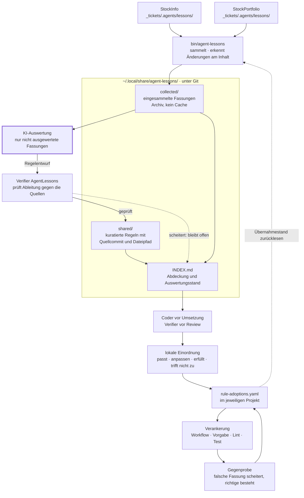
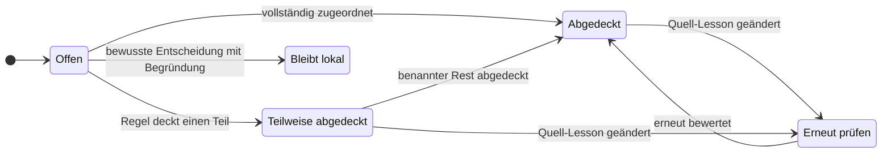

# T-41 · AgentLessons: Projekterfahrungen sammeln und in prüfbare Regeln überführen

Lessons entstehen in mehreren Projekten unabhängig voneinander. Bisher fehlt
sowohl eine gemeinsame Übersicht als auch ein verlässlicher Nachweis, welche
Erkenntnis bereits in eine vorbeugende Arbeitsregel eingeflossen ist. Neue
Projekte sollen vorhandenes Wissen nutzen, ohne die Repositories ihrer
Vorgänger lesen oder deren Lessons in eigene Quelldateien kopieren zu müssen.

**Beispiel:** StockInfo und StockPortfolio halten unterschiedliche Erfahrungen
mit Negativtests fest. Die zentrale Sammlung erhält beide Fassungen samt
Entstehungskontext. Eine daraus abgeleitete Regel verweist auf die ausgewerteten
Lessons. Ändert sich eine davon, wird der Zusammenhang zur erneuten Prüfung
markiert; keine lokale Erfahrung wird automatisch überschrieben.

**Stand:** Konzept am 2026-09-10 im Observer-Chat besprochen, Ablageort am
2026-09-11 geändert. Mike hat den Namen `AgentLessons` bestätigt. Der erste
Schritt ist umgesetzt: lokale Einzeldateien, gemeinsamer Anfangsbestand und
angepasste Agentenanleitungen. Claude hat diesen ersten Schritt in Runde 1
technisch freigegeben. Die menschliche Abschlussabnahme ist offen. Aggregation
und automatische Regelableitung sind noch nicht umgesetzt.
Mike hat den ersten Umsetzungsschritt am 2026-09-11 aktiviert; das Ticket
liegt unter `30-doing/`. StockInfo ist nach Mikes Freigabe ebenfalls aktiviert
(T-70, Commit `5fc549b`); siehe Auflösung und `STATUS.md`.

**Ablageort, Mike 2026-09-11:** Der Bestand liegt unter
`~/.local/share/agent-lessons/`. Der zuvor bestätigte Ort
`DevKI/Production/AgentLessons` **entfällt** — Mike: „das ist mir zu
maschinenspezifisch. Diese Daten müssen schlussendlich in einem der
Standard-Ordner im Home-Verzeichnis des Users landen“, dann
„`~/.local/share/agent-lessons/` - passt“.

Der Wechsel kostet nichts: Der frühere Zielordner war angelegt und leer,
es gibt keinen Bestand zu überführen. Der Projektname bleibt `AgentLessons`;
der Ordnername ist kleingeschrieben, weil das unter `~/.local/share` die
übliche Schreibweise ist. Ist `XDG_DATA_HOME` gesetzt, gilt dieser Ort statt
`~/.local/share`; auf Mikes Rechner ist die Variable derzeit nicht gesetzt,
das Skript muss den Standardwert also selbst bilden.

**Aufteilung vorgeschlagen, Gegenprüfung eingearbeitet:** Welche Teile ins Home
wandern, steht unter
[Was ins Home wandert und was nicht](#was-ins-home-wandert-und-was-nicht).
Mike hat am 2026-09-11 `codex` mit der Gegenprüfung beauftragt; dessen
[Befunde C1 bis C5](#konzeptdurchsicht-durch-codex--2026-09-11) hat `claude`
vollständig angenommen und den Entwurf korrigiert. Die Aufteilung bleibt ein
Umsetzungsvorschlag für die spätere Aktivierung. Die beiden Randbedingungen
zu Remote und KanTandem sind unter „Für dich“ entschieden.

Dieses Ticket erfasst den Auftrag vorerst im vorhandenen Board. Bei Aufnahme
in ein eigenes AgentLessons-Board das Ticket samt Nachweisen dorthin übergeben
und hier nur einen Verweis erhalten; keine zwei fortgeschriebenen Ticketkopien.

## Für dich

Der erste Umsetzungsschritt ist eingeplant. Bei der späteren
Abnahme soll nachvollziehbar sein, welche Projekt-Lessons vorliegen, welche
Regeln daraus entstanden sind und welche Änderungen erneut bewertet werden
müssen.

**Beide offenen Punkte hat Mike am 2026-09-11 entschieden. Es ist derzeit
keine weitere Entscheidung nötig.**

- **Das Skript liegt unter `bin/` im Wissensbestand.**
  Mike hat zunächst `~/.local/bin/` festgelegt und revidiert: „Ich revidiere
  mich - dein Vorschlag war besser“, dazu „bin also im agent-lessons ordner“.
  Ein Symlink in `~/.local/bin/` hält den Befehl im Suchpfad. Skript und Daten
  bleiben damit versionsgleich, und kein absolutes Linkziel gerät ins Repo.

- **Kein Git-Remote, einstweilen.**
  „Nein, einstweilen bekommt der Wissensstand kein Git-Remote.“ Der Bestand
  liegt damit nur auf Mikes Rechner, gesichert über Time Machine. Das ist eine
  bewusst getragene Einschränkung, kein übersehener Punkt; die Entscheidung
  gilt bis auf Weiteres und lässt sich jederzeit nachholen.

- **KanTandem übernimmt nach einer Bewährungsphase.**
  „KanTandem wird die Führung übernehmen wenn das System hinter T-41 eine
  Weile gelaufen ist und ich sagen kann wie gut oder schlecht es funktioniert.“
  Maßgeblich ist also Mikes Urteil aus dem laufenden Betrieb, nicht ein Datum
  und kein Meilenstein.

**Empfehlung zum Zuschnitt:** Bei Aktivierung zuerst den tragfähigen Kern
umsetzen — einsammeln, Herkunft erhalten, Pfade auflösen, wiederholbar laufen
(Prüfpunkte 1 bis 3, 8, 9). Die KI-Ableitung mit Budgetmessung (13, 14, 18 bis
20) erst danach. Sonst hängt der gesamte Nutzen an der teuersten und
unsichersten Komponente.

Festgehaltene Rückmeldungen aus dem Observer-Chat, 2026-09-10:

- „Die Lessons entwickeln sich unabhängig voneinander“.
- „Stockinfo hat seine Lessons, StockPortfolio auch - agregiert werden sie
  in einem anderen Folder.“
- „AgentLessons - passt“.
- „Abgesehen davon macht es einen Unterschied ob eine Lesson während der
  Entwicklung entstanden ist oder während der Verify-Session“.
- „wenn es verweise innerhalb der Files auf andere Files in AgentLessons gibt
  - dann nur relative. Verwende keine Absoluten Pfadnamen“.

Ergänzt am 2026-09-11:

- „Wovon ich Abstand nehme ist das /Volumes/DevLocal/DevKI/Production/AgentLessons
  - das ist mir zu maschinenspezifisch. Diese Daten müssen schlussendlich in
  einem der Standard-Ordner im Home-Verzeichnis des Users landen“.
- „~/.local/share/agent-lessons/ - passt“.
- „Zusätzlich gibt es auch noch ein Projekt das in weiterer Folge die selbe
  Problematik abdecken möchte: /Volumes/DevLocal/DevKI/Production/KanTandem -
  die Infos dürfen nicht auseinander laufen sondern müssen sich ergänzen“.

## Konzept und Grenzen

### Der Ablauf im Überblick

Zwei Hälften: Links entsteht aus Projekterfahrungen eine geprüfte gemeinsame
Regel, rechts kommt sie in den Projekten an und wird dort nachweislich
verankert. Nur der markierte Schritt kostet KI-Tokens.



Drei Dinge, die das Bild festhält und die Prosa leicht verliert:

- **`collected/` ist Archiv, nicht Zwischenspeicher.**
  Es geht in die Versionsverwaltung, weil es nach Wegfall der Quelle die
  letzte Kopie ist.

- **Zwischen Entwurf und verwendbarer Regel steht eine Prüfung.**
  Scheitert sie oder der KI-Aufruf, bleibt die Auswertung offen — die
  vorhandene geprüfte Fassung bleibt erhalten.

- **Der Kreis rechts schließt sich.**
  Das Skript liest die Übernahmenachweise zurück. Erst dadurch kann der Index
  „abgeleitet“, „im Projekt bewertet“ und „verankert und geprüft“ unterscheiden.

#### Abdeckung und Gültigkeit sind zwei Achsen

Der Zustand unten beschreibt, wie weit eine **Quell-Lesson** durch Regeln
abgedeckt ist:



Davon unabhängig trägt jede **Erfahrungsversion** in KanTandem 0d ihre
Gültigkeit: `active`, `needs_review`, `retired`. Eine gültige Regel kann eine
Lesson nur teilweise abdecken, und „Bleibt lokal“ heißt nicht, dass eine
Erfahrung zurückgezogen wurde. Beide Angaben bleiben getrennt erhalten.

### Gepflegte Quellen und erzeugte Sammlung

Jede Lesson bekommt eine eigene Markdown-Datei unter
`_tickets/.agents/lessons/` ihres Herkunftsprojekts. Die Observer bearbeiten
nur ihre dafür freigegebenen lokalen Quellen. StockInfo-Lessons bleiben in
StockInfo, StockPortfolio-Lessons in StockPortfolio. Die gemeinsame Sammlung
liegt im eigenständigen Projekt `AgentLessons`:

```text
~/.local/share/agent-lessons/
├── bin/
│   └── agent-lessons      # Sammel- und Auswertungsskript, die echte Datei
├── projects.yaml          # registrierte Projektquellen
├── collected/             # eingesammelte Projektfassungen
│   ├── stockinfo/
│   └── stockportfolio/
├── shared/                # kuratierte Regeln mit Quellenbezügen
└── INDEX.md               # erzeugte Übersicht und Auswertungsstand

~/.local/bin/agent-lessons # Symlink auf bin/agent-lessons, nicht versioniert
```

`collected/` und `INDEX.md` werden nicht von Hand gepflegt. `shared/` enthält
bewusst abgeleitete, projektübergreifende Regeln; Einsammeln allein macht aus
einer lokalen Erfahrung noch keine allgemeine Vorgabe. Der Ticket-Skill
beschreibt Verfahren, Format und Zugriff; der Wissensbestand liegt separat
in AgentLessons. Implementer und Verifier berücksichtigen die gemeinsame
Basis sowie die einschlägigen Lessons ihres aktuellen Projekts.

Die vorhandenen Sammeldateien können als erzeugte Einstiege nach Autorenschaft
weiterverwendet werden. Gepflegt werden die Einzeldateien; keine zweite
manuell bearbeitete Fassung derselben Erkenntnis.

### Was ins Home wandert und was nicht

**Umsetzungsvorschlag von `claude`, 2026-09-11.** Die
[Gegenprüfung von `codex`](#konzeptdurchsicht-durch-codex--2026-09-11) ist
eingearbeitet: C1 bis C5 wurden vollständig angenommen, der Entwurf unten ist
entsprechend korrigiert. Was sich dadurch geändert hat, steht in der
[Rückmeldung](#rückmeldung-von-claude-zur-gegenprüfung--2026-09-11).

Die tragende Frage ist nicht „Code oder Daten“, sondern **was sich wiederherstellen
lässt und was nicht**. Danach richtet sich, was Historie und Sicherung braucht.

| Bestandteil | Wiederherstellbar? | Ort |
|---|---|---|
| `shared/` — kuratierte Regeln | Nein, reine Handarbeit | Repo |
| `collected/` — eingesammelte Projektfassungen | Nein, sobald ein Quellprojekt fehlt | Repo |
| Auswertungsnachweise — welche Fassung wurde bewertet | Nein, das ist der Prüfbeleg | Repo |
| `bin/` — Sammel- und Auswertungsskript | Ja, aber formatgekoppelt | Repo; Symlink aus `~/.local/bin/` macht es aufrufbar |
| `INDEX.md` | Ja, aus dem Obigen | Repo, siehe unten |
| `projects.yaml` — welche Projekte, welche Unterpfade | Ja, aber Handarbeit | Repo |
| Wurzelverzeichnis der Projekte | — maschinenabhängig | `~/.config/agent-lessons/` |
| Letzter Lauf, Fehler, tatsächlicher Verbrauch, offene Restarbeit | Nein, das sind Lauf- und Verbrauchsbelege | `~/.local/state/agent-lessons/` |
| Übersichten, Suchdaten | Ja, aus dem Obigen ableitbar | `~/.cache/agent-lessons/` |

Alle vier Standardorte sind auf Mikes Rechner vorhanden. `~/.local/share` ist
in Time Machine eingeschlossen; das belegt die Aufnahme in die Sicherung, nicht
eine erfolgreiche Wiederherstellung.

#### Der Kern: `collected/` ist ein Archiv, kein Cache

Das Ticket verlangt zweierlei, das zusammengehört: Eine Regel verweist auf
ihre Quell-Lessons samt **ausgewertetem Inhaltsstand, „etwa per Hash“**, und
ein fehlendes Quellprojekt darf „nicht unbemerkt als leerer Bestand gelten
oder bereits gesammeltes Wissen löschen“.

**Git löst die Archivierung, aber nicht den Auswertungsbeleg von selbst.**
Ein eingecheckter Stand geht nicht verloren, wenn das Quellprojekt
verschwindet — das erledigt Git. Ein Commit bezeichnet aber einen Baumzustand,
nicht „diese Lesson in dieser Fassung wurde bewertet“: Eine Änderung an einer
fremden Datei verschiebt den Commit, und ein noch nicht eingecheckter
Sammelstand gehört zu gar keinem.

Deshalb braucht der Beleg zwei Angaben statt einer: **einen dauerhaft
erhaltenen Quellcommit und den relativen Dateipfad darin.** Ob sich etwas
geändert hat, wird am Inhalt der betroffenen Datei und ihrer Abhängigkeiten
erkannt; dafür genügen die Inhaltskennungen, die Git ohnehin führt. Der
eingesammelte Stand wird vor der KI-Auswertung gesichert. Die Änderung einer
fachlich unabhängigen Lesson löst keine erneute Auswertung der unveränderten
aus. Eine eigene Archivdatenbank ist dafür nicht nötig.

Der naheliegende Einwand — erzeugte Dateien gehören nicht in die
Versionsverwaltung — trifft hier nicht: `collected/` ist keine erzeugte
**Ausgabe**, sondern eingesammelte **Eingabe**. Die Aggregation kopiert fremde
Dateien herein; nach dem Wegfall der Quelle ist das die letzte Kopie.

`INDEX.md` ist der Grenzfall — tatsächlich erzeugt, aber klein und die Stelle,
die Mensch und Agent lesen. Im Repo ist er zu jedem vergangenen Stand lesbar.
Falls die Änderungshäufigkeit stört, ist er der einzige Kandidat zum Auslagern.

#### Das Skript liegt im Repo, aufrufbar über einen Symlink

**Mike hat am 2026-09-11 zunächst `~/.local/bin/` festgelegt und die
Entscheidung noch am selben Tag revidiert:** „Ich revidiere mich - dein
Vorschlag war besser.“ Die ausführbare Fassung liegt damit wieder unter
`bin/agent-lessons` im Repo der Sammlung. `~/.local/bin/agent-lessons` ist ein
Symlink darauf, damit der Befehl wie die übrigen Agentenbefehle im Suchpfad
liegt und ohne Einrichtung aufrufbar bleibt.

**Skript und Datenformat bleiben damit an dieselbe Fassung gebunden.** Ein altes
Skript auf neuem Format ist ein realer Fehlerfall, und das Ticket sieht keine
Migration vor. Ein `git clone` stellt Werkzeug und Wissensbestand gemeinsam her,
und das Skript hat dieselbe Historie wie die Daten, die es pflegt.

**Diese Richtung des Symlinks hat einen zweiten Vorteil:** Der Link liegt
außerhalb der Versionsverwaltung. Git speichert einen Symlink als seinen
Zieltext; läge er im Repo, käme ein absolutes Ziel als `/Users/<name>/…` in die
Historie und verstieße gegen die Regel gegen fest eingebaute
Benutzerverzeichnisse. So enthält das Repo nur die echte Datei, und das
Linkziel in `~/.local/bin/` darf absolut sein, weil es nirgends eingecheckt
wird. Zeigt `XDG_DATA_HOME` woandershin, wird der Link entsprechend gesetzt —
eine Einrichtungsfrage, keine Formatfrage.

Den Ort der Sammlung enthält das Skript trotzdem nicht fest eingebaut; es
findet ihn über die Konfiguration. Die Hauskonvention verlangt für diese
Befehle ohnehin, dass sie „keinen festen Projektpfad“ enthalten, und über den
Symlink aufgerufen ist das eigene Verzeichnis kein verlässlicher Anhaltspunkt.

Die Formatprüfung bleibt trotz wiederhergestellter Kopplung sinnvoll: Ein
Bestand kann aus einem Klon stammen, der nicht zum lokalen Skript passt.
Prüfpunkt 24 verlangt einen sichtbaren Abbruch statt geratener Verarbeitung.

#### Genau eine maschinenabhängige Angabe — in beiden Richtungen

`projects.yaml` bleibt im Repo und nennt nur, **welche** Projekte registriert
sind und unter welchem relativen Unterpfad ihre Lessons liegen. Das
Wurzelverzeichnis des Arbeitsbereichs — auf diesem Rechner `/Volumes/DevLocal`
— steht allein in `~/.config/agent-lessons/config.yaml`. Eine Projektbasis
direkt in `projects.yaml` ist damit ausgeschlossen; sonst steht dieselbe
Maschinenangabe an zwei Stellen.

**Der Zugriff läuft in beide Richtungen und braucht dieselbe Regel.** Die
Sammlung findet ihre Quellen über die Projektbasis. Umgekehrt findet ein Board
die Sammlung über den vereinbarten Datenort und darin über relative Pfade —
sonst bliebe der Bruch bei einem anderen Home- oder Volume-Pfad genau dort
bestehen, wo die [Rückführung in laufende Projekte](#rückführung-in-laufende-projekte)
ihn erzeugt.

Maßgeblich sind alle vier XDG-Variablen für Daten, Konfiguration, Zustand und
Cache, nicht allein `XDG_DATA_HOME`. Ein leerer Wert bedeutet den Standardort,
ein relativer Wert ist ungültig. So steht es in der
[XDG-Spezifikation 0.8](https://specifications.freedesktop.org/basedir/latest/).
Das setzt die Regel aus
[Interne Verweise relativ, externe Quellen über eine benannte Basis](#interne-verweise-relativ-externe-quellen-über-eine-benannte-basis)
konkret um.

#### Laufzustand getrennt, aber nicht im Cache

**Verbrauchswerte sind kein Cache.** Ein neuer Lauf misst einen neuen Lauf,
nicht den Verbrauch des früheren — der Vorher-/Nachher-Nachweis aus Prüfpunkt 19
wäre nach einem Cacheverlust unwiederbringlich. Ebenso darf ein bereits
verbrauchtes Fortsetzungsbudget nach dem Leeren nicht wieder als unverbraucht
erscheinen.

Dauerhaft im Laufzustand liegen deshalb tatsächlicher Verbrauch, noch offene
Arbeit sowie letzter erfolgreicher Lauf und aufgetretene Fehler. Vergleichsbelege,
die zu einer Bewertung gehören, werden mit dem Wissensbestand versioniert.

Im Cache bleibt nur, was sich daraus wieder ableiten lässt: Übersichten und
Suchdaten. Sein Verlust kostet Rechenzeit und kein Wissen. Nach dem Leeren darf
eine unveränderte, dauerhaft nachgewiesene Auswertung keinen neuen KI-Aufruf
auslösen — das folgt bereits aus Prüfpunkt 18.

#### Aus den Projekten wandert nichts

Die Einzel-Lessons unter `_tickets/.agents/lessons/` und die lokalen
Übernahmenachweise in `_tickets/.agents/rule-adoptions.yaml` bleiben, wo sie
sind, und werden mit ihrem Projekt versioniert. Sie beschreiben das jeweilige
Projekt und gehören zu dessen Historie.

#### Entschiedene Sicherung und Grenze zu KanTandem

**Kein Remote, entschieden von Mike am 2026-09-11.** Der Wissensbestand liegt
damit ausschließlich auf Mikes Rechner; Time Machine ist die einzige Sicherung.
Die Einschränkung ist bekannt und getragen — sie gehört nicht als Mangel in
einen späteren Befund. Ein Remote bleibt jederzeit nachrüstbar, weil das Repo
bereits mit Git versioniert werden soll.

Eine Bindung an Mikes Rechner folgt **nicht** aus dem Home-Pfad selbst: Solange
der Datenort konfigurierbar bleibt, kann er auch auf einem Server liegen. Für
die Abgrenzung zu KanTandem ist deshalb nicht der Pfad entscheidend, sondern
der [Wechsel der führenden Quelle](#abstimmung-mit-kantandem).

### Kontext einer Lesson

Eine Lesson enthält eine stabile Kennung, Herkunft und Belege, Geltungsbereich,
Fehlererkennung, vorbeugende Implementer-Regel und Verifier-Gegenprobe.
Kennungen und Metadatenfelder sind englisch, die Erklärungen deutsch.
Zusätzlich müssen diese Angaben getrennt erkennbar sein:

| Angabe | Zweck |
|---|---|
| Entdeckungsphase | Entwicklung, Verifikation oder Beobachtung unterscheiden. |
| Betroffene Arbeit | Produktimplementierung, Tests, Review oder Übergabe benennen. |
| Autorenschaft der betroffenen Arbeit | Den untersuchten Stand zuordnen; nicht aus dem aktuellen Owner ableiten. |
| Entdecker und Erfasser | Festhalten, wer den Befund erkannt beziehungsweise dokumentiert hat. |
| Zuständige Rollen für die Vorbeugung | Konkrete Handlungen für Implementer und/oder Verifier zuordnen. |

Ein im Review entdeckter mangelhafter Negativtest betrifft die Testimplementierung.
Eine unverhältnismäßige Blockerbewertung betrifft dagegen das Review selbst.
Die Entdeckungsphase entscheidet deshalb nicht allein über die zuständige Rolle.
Unklare Autorenschaft bleibt ausdrücklich ungeklärt. Für die Aufnahme gelten
weiterhin die [Belegregeln](../.agents/AGENT-WORKFLOW.md#belegte-erfahrungen).

### Ableitung und Anwendung einer Regel nachweisen

Eine Regel unter `shared/` hat eine stabile Kennung und verweist auf ihre
Quell-Lessons samt **ausgewertetem Inhaltsstand**, etwa per Hash. Die Zuordnung
benennt, welche Erkenntnis abgedeckt ist und welcher Rest gegebenenfalls offen
bleibt. Eine Lesson kann mehrere Regeln begründen, eine Regel mehrere Lessons.

Diese Beziehungen werden zentral gepflegt. Das Skript erzeugt daraus die
Rückverweise im Index; kein unabhängig gepflegtes `processed: true` in jeder
Projektdatei. Folgende Zustände müssen unterscheidbar sein:

| Anzeige | Aussage |
|---|---|
| Offen | Eine Auswertung ist noch nicht nachgewiesen. |
| Teilweise abgedeckt | Regeln decken einen benannten Teil ab; ein benannter Rest bleibt offen. |
| Abgedeckt | Die aktuelle Fassung wurde inhaltlich bewertet und den betreffenden Regeln zugeordnet. |
| Erneut prüfen | Die Lesson wurde seit der dokumentierten Auswertung verändert. |
| Bleibt lokal | Bewusste Entscheidung gegen eine allgemeine Regel, mit Begründung. |

Fehlende Zuordnung beweist nicht, dass historisch nie eine Regel abgeleitet
wurde. Bestehende Regeln bei der Erstaufnahme gegenprüfen und verknüpfen.
Das Skript erkennt neue oder geänderte Inhalte; ein Agent bewertet Bedeutung,
Abdeckung und Geltungsbereich. Textähnlichkeit allein beweist keine Ableitung.

**Abgeleitet und im Ablauf verankert bleiben getrennt.** Zur Regel den
Wirkungsort beziehungsweise den verbindlichen Lesekanal festhalten, zum
Beispiel einen Workflow-Abschnitt. Eine Datei in `shared/` allein belegt noch
keine Einführung oder tatsächliche Einhaltung. Den Prüfbeleg liefert weiterhin
die zuständige Arbeitsinstanz im jeweiligen Ticket.

### Skript und KI erzeugen die gemeinsamen Lessons zusammen

Der periodische Ablauf umfasst ausdrücklich auch die KI-Auswertung. Ein
reiner Dateisammler erfüllt den Auftrag nicht. Dafür einen konfigurierten
Aufruf vorhandener Agentenwerkzeuge verwenden; keine zweite Agentenlaufzeit
oder eigene allgemeine Orchestrierungsplattform bauen.

1. Das Skript sammelt die Projekt-Lessons, erkennt neue beziehungsweise
   geänderte Inhalte und stellt nur noch nicht ausgewertete Fassungen bereit.
2. Die KI vergleicht sie mit vorhandenen gemeinsamen Lessons und Regeln.
   Sie ergänzt eine passende Regel oder erstellt einen belegten Vorschlag
   unter `shared/`. Herkunft, ausgewertete Fassung, Geltungsbereich,
   Implementer-Handlung und Verifier-Gegenprobe gehören in das Ergebnis.
   Widersprüche und bewusst lokale Erkenntnisse bleiben ausdrücklich sichtbar.
3. Der im AgentLessons-Auftrag zuständige Verifier prüft die Ableitung gegen
   die Quellen. Erst die fachlich geprüfte Fassung wird zur Übernahme angeboten;
   Entwurf und verwendbare Fassung bleiben unterscheidbar. Dazu ist keine
   zusätzliche pauschale menschliche Freigabe je Lesson vorgesehen.
4. Das Skript aktualisiert die Quellenzuordnung und den Index. Ohne neue
   Eingaben oder offenen Prüfauftrag startet es keine wiederholte KI-Auswertung.
   Scheitert der KI-Aufruf oder die Prüfung, bleibt die Auswertung offen;
   vorhandene geprüfte Fassungen bleiben erhalten.

Gemeinsame Lessons enthalten die verallgemeinerte Erkenntnis und ihre
konkreten Regeln. Die KI kann einen passenden Guard vorschlagen, also eine
automatisierte Prüfung, die eine Wiederholung erkennen soll. Die tatsächliche
Implementierung dieses Guards erfolgt im jeweiligen Zielprojekt.

### Rückführung in laufende Projekte

Die Einbindung ist Teil des Auftrags und gilt auch für bestehende Boards.
Ein einmaliger Export der gemeinsamen Lessons genügt nicht.

- **Fester Lesekanal:** Der lokale Workflow verpflichtet Coder vor Umsetzung
  und Verifier vor Review, den gemeinsamen Index sowie die für ihre Rolle
  und ihr Projekt einschlägigen Regeln zu prüfen. Das Board ermittelt die
  Sammlung über den konfigurierten XDG-Datenort und verwendet darin relative
  Referenzen. Es benötigt keinen festen relativen Pfad vom Projektvolume ins Home.
- **Laufende Erkennung:** Der Observer beachtet zusätzlich Änderungen am
  gemeinsamen Index. Neue oder veränderte einschlägige Regeln werden als
  noch zu bewertende Übernahme sichtbar, auch wenn das Projekt bereits läuft.
- **Lokale Einordnung:** Die zuständige Arbeitsinstanz prüft, ob die Regel
  passt, lokal angepasst werden muss, bereits erfüllt ist oder nicht zutrifft.
  Lokale Erfahrung und konkrete Projektvorgaben bleiben maßgeblich.
- **Umsetzung:** Der Implementer verankert die angenommene Regel am richtigen
  Ort: als Workflow-Schritt, Projektvorgabe, Lint-Regel oder konkreter Test.
  Ein automatisierter Guard entsteht nur, wenn das Fehlermuster sinnvoll
  maschinell prüfbar ist. Bestehende passende Prüfungen wiederverwenden.
  Zum aktiven Auftrag passende Maßnahmen dort behandeln; zusätzlicher
  Produktumfang braucht einen eigenen eingeplanten Auftrag.
- **Gegenprüfung:** Der Verifier prüft die tatsächliche Verankerung und den
  Nachweis. Bei einem neuen Guard muss eine gezielt falsche Fassung fehlschlagen
  und die richtige bestehen. Eine reine Lesebestätigung reicht nicht.

Jedes Projekt hält diese Entscheidungen in
`_tickets/.agents/rule-adoptions.yaml` fest. Pro gemeinsamer Regel sind Kennung,
bewertete gemeinsame Fassung, lokale Entscheidung und Begründung sowie relative
Verweise auf Wirkungsort und Ticketbelege erforderlich. Ein vorhandener Guard
wird verknüpft; er muss nicht kopiert oder erneut implementiert werden.
Regel und Nachweis müssen denselben geprüften Produktstand betreffen.

Das Sammelskript liest diese Übernahmenachweise ebenfalls ein. Der zentrale
Index kann damit getrennt zeigen: **Regel abgeleitet**, **im Projekt bewertet**,
**lokal verankert und geprüft** beziehungsweise **noch offen**. Eine neue
gemeinsame Fassung macht die bisherige lokale Übernahme sichtbar prüfbedürftig,
überschreibt aber weder lokale Entscheidungen noch Produktdateien.

Eine während eines offenen Reviews eintreffende Regeländerung wird kenntlich
gemacht, ohne die übergebene Produktfassung oder Prüfbasis still zu verändern.
Ein konkreter neuer Fehlerhinweis wird regulär eingeordnet; zusätzliche
Umsetzung folgt erst im zuständigen Arbeitsschritt. Ist AgentLessons nicht
erreichbar, den fehlenden Abgleich benennen und keine Aktualität behaupten.
Bereits lokal verankerte Regeln gelten weiter.

**Beispiel:** Eine gemeinsame Lesson verlangt, dass ein Prüfskript nach einem
frühen Fehler keinen Erfolg meldet. Der Coder prüft das vorhandene lokale
Skript und ergänzt bei Bedarf eine Gegenprobe mit absichtlichem Startfehler.
Der Verifier bestätigt Fehlerstatus und Abschlussmeldung. Die lokale
Übernahme verknüpft gemeinsame Regel, Skript, Gegenprobe und Ticketfassung.
Ein anderes Projekt, dessen vorhandener Test-Runner das bereits nachweislich
erfüllt, verknüpft diesen Nachweis und benötigt keinen zusätzlichen Guard.

### Periodische Aggregation ohne Überschreiben lokaler Erfahrungen

Das Skript liest ausschließlich registrierte Projektquellen, sammelt neue und
geänderte Lessons und aktualisiert den zentralen Index. Wiederholte Läufe mit
denselben Eingaben liefern denselben fachlichen Bestand. Unterschiedliche
Projektfassungen derselben Lesson bleiben mit Herkunft und Inhaltsstand
unterscheidbar; keine Entscheidung nach dem jüngsten Datum.

Identische Inhalte dürfen in der Übersicht zusammengefasst werden, solange
alle Herkünfte erhalten bleiben. Ähnliche oder widersprüchliche Erkenntnisse
werden zur inhaltlichen Einordnung vorgelegt. Unterschiedliche Anforderungen
können unterschiedliche Regeln rechtfertigen. Die Aggregation schreibt keine
Regeln oder Änderungen zurück in die Quellprojekte und aktiviert keine Arbeit.

Vorgesehen sind ein manueller Aufruf und ein periodischer Lauf. Ein täglicher
Takt ist ein Vorschlag, noch kein gestarteter Job. Die tatsächliche Einrichtung
muss den verwendeten Mechanismus, letzte erfolgreiche Verarbeitung und Fehler
sichtbar machen. Lokale erzeugte Einstiege sollen nach Lessons-Änderungen
aktualisiert werden. Ein fehlendes Quellprojekt darf nicht unbemerkt als leerer
Bestand gelten oder bereits gesammeltes Wissen löschen.

### Interne Verweise relativ, externe Quellen über eine benannte Basis

**Verweise nach innen und die Registrierung fremder Projekte sind zwei
verschiedene Fälle.** Die bisherige Fassung behandelte beide als einen und
wurde durch den Ortswechsel widersprüchlich: Liegt der Bestand im Home und
liegen die Projekte auf einem Volume, gibt es zwischen beiden keinen
brauchbaren relativen Pfad mehr. Er müsste über die Wurzel zurücklaufen und
bricht, sobald das Volume anders eingehängt ist — also genau die
Maschinenabhängigkeit, die der Ortswechsel beseitigen soll.

| Verweisart | Regel |
|---|---|
| Innerhalb AgentLessons: `shared/` ↔ `collected/` ↔ `INDEX.md`, Quellenbezüge, Regelzuordnungen, Beispiele | Strikt relativ zum jeweiligen Dokument. Unverändert gültig, vom Ortswechsel nicht betroffen. |
| `projects.yaml` → registrierte Projektquellen | Eine benannte Basis, darunter relative Projektpfade. |

Innerhalb der Sammlung gilt unverändert: keine fest eingebauten
Benutzerverzeichnisse, Volumes oder anderen absoluten Dateipfade, auch nicht
indirekt als Datei-URLs. Beispiele: vom Index auf `shared/R-012-fresh-state.md`,
aus dieser Regel auf `../collected/stockinfo/L-026.md`.

Für externe Quellen steht das Wurzelverzeichnis einmal in der lokalen
`config.yaml` unter dem XDG-Konfigurationsort. `projects.yaml` enthält
relative Projektpfade; sie werden unabhängig vom Aufrufverzeichnis gegen
diese Basis aufgelöst.
Damit steht der maschinenabhängige Teil an genau einer erklärten Stelle,
statt verstreut in erzeugten Dateien zu landen. Der zentrale Katalog bleibt
ohne Zugriff auf die ursprünglichen Projekte lesbar; deren Unerreichbarkeit
wird beim nächsten Sammellauf separat ausgewiesen.

### Abstimmung mit KanTandem

**KanTandem deckt dasselbe Thema bereits konzeptionell ab.** Das Projekt liegt
unter `DevKI/Production/KanTandem`; sein Abschnitt `CONCEPT.md` → „0d. Aus
Review-Befunden lernen und Guards ableiten“ beschreibt Lernkandidaten,
Erfahrungsversionen, Bereitstellung vor dem nächsten Auftrag und die Ableitung
von Guards. Mike am 2026-09-11: die Infos „dürfen nicht auseinander laufen
sondern müssen sich ergänzen“.

Die Entwürfe weichen an vier Stellen voneinander ab. **Eine davon ist ein
echter Widerspruch: die führende Quelle.** Ohne Klärung entstehen zwei
gleichzeitig bearbeitbare Bestände über dieselben Erkenntnisse.

Die Statuswerte sind dagegen **kein Konflikt**, sondern zwei verschiedene
Achsen — Abdeckung gegen Gültigkeit. Eine gültige Regel kann eine Lesson
teilweise abdecken, und „Bleibt lokal“ heißt nicht, dass eine Erfahrung
zurückgezogen wurde. Beide Angaben müssen getrennt erhalten bleiben; KanTandem
0d legt dafür bisher keine vollständige Abbildung fest, und diese Lücke gehört
beim Import benannt.

| Punkt | T-41 (AgentLessons) | KanTandem 0d |
|---|---|---|
| Führende Quelle | Die Einzeldateien in den Projekten; „keine zweite manuell bearbeitete Fassung“ | SQLite im Dienst; Markdown ist Leseexport und „keine zweite bearbeitbare Quelle“ |
| Statuswerte — **kein Konflikt, zwei Achsen** | Abdeckung einer Quell-Lesson durch Regeln: Offen / Teilweise abgedeckt / Abgedeckt / Erneut prüfen / Bleibt lokal | Gültigkeit einer Erfahrungsversion: `active` / `needs_review` / `retired`, dazu der Bearbeitungsstand des Lernkandidaten |
| Pflichtfelder | Entdeckungsphase, betroffene Arbeit, Autorenschaft, Entdecker und Erfasser, zuständige Rollen | ID und Version, Art (`case`, `pattern`, `procedure`), Kurztext, Tags, Belege |
| Menschliche Einreichung | Lernvorschlag und ausdrückliche Vorgabe werden getrennt angenommen, auch ohne Fehlerbeleg; Prüfpunkt 22 | Ausdrücklich bestätigt: Mike reicht selbst ein, auch ohne Ticket oder Finding; Vorschlag und Vorgabe bleiben getrennt |

**Vorgeschlagene Auflösung: AgentLessons ist die Vorstufe, KanTandem der
Zielzustand.** KanTandem nennt lesbare Musterdateien selbst „ein geeigneter
Einstieg“, hält M1 bei manueller Kuratierung und sieht vor, dass sich
„vorhandene Musterdateien einmalig importieren“ lassen. Genau diese Rolle
kann AgentLessons ausfüllen. Daraus folgen drei Auflagen für die Umsetzung:

- **Das Feldschema muss verlustfrei nach KanTandem abbildbar sein.**
  Die Angaben aus dem Abschnitt „Kontext einer Lesson“ und die Statuswerte
  brauchen eine benannte Entsprechung in Lernkandidat beziehungsweise
  Erfahrungsversion. Wo keine besteht, wird die Lücke festgehalten statt
  stillschweigend zusammengefasst. Der spätere Import prüft laut KanTandem
  ohnehin Herkunft, Belege und Geltungsbereich.

- **Die führende Quelle wechselt nach einer Bewährungsphase, nicht schleichend.**
  Mike am 2026-09-11: KanTandem übernimmt, „wenn das System hinter T-41 eine
  Weile gelaufen ist und ich sagen kann wie gut oder schlecht es funktioniert“.
  Bis dahin führen die Projektdateien; danach führt der Dienst, und die Dateien
  werden Export. Zwei gleichzeitig bearbeitbare Fassungen derselben Erkenntnis
  darf es in keiner Phase geben.

  Das Kriterium ist Mikes Urteil aus dem laufenden Betrieb. Damit er es fällen
  kann, muss die Vorstufe zeigen, was sie geleistet hat: welche Lessons
  eingesammelt und ausgewertet wurden, welche Regeln daraus entstanden, wo eine
  Auswertung offen blieb und was der Betrieb gekostet hat. Diese Angaben liegen
  ohnehin im Index und im Laufzustand — sie sind damit nicht nur Prüfmaterial
  für die Umsetzung, sondern die Grundlage der Übergabeentscheidung. Eine
  zusätzliche Bewertungsmechanik braucht es dafür nicht.

- **Menschliche Einreichungen gehören auch in AgentLessons vorgesehen.**
  Sonst entsteht in KanTandem ein Eingang, für den die Vorstufe kein Feld hat.
  Eine ausdrückliche Vorgabe von Mike braucht keine zwei Fehlerbelege und wird
  nicht als empirisch bestätigtes Muster ausgegeben — diese Unterscheidung
  steht in KanTandem 0d und gilt hier gleichlautend.

Zwei Festlegungen stimmen bereits überein und bleiben unverändert: die
Belegregeln für ein Muster — zwei Fälle derselben Fehlerklasse oder eine
widerlegte Vollständigkeitsbehauptung — und die Rückwirkung zurückgezogener
Belege, die betroffene Regeln und Guards erneut prüfbedürftig macht.

Dieser Abschnitt ordnet die Projekte einander zu. Er ändert nichts an
KanTandem und erteilt dort keinen Auftrag; über dessen Konzept entscheidet,
wer das Projekt führt.

### Tokenverbrauch begrenzen und Qualität nachweisen

Die Auswertung erfolgt schrittweise auf Änderungen. Unveränderte Quellen,
Regeln und Prüfentscheidungen werden wiederverwendet. Tokenersparnis darf
weder Quellbelege verdecken noch eine ausgelassene Prüfung als erledigt markieren.

| Maßnahme | Einsparung | Erhalt der Aussagekraft |
|---|---|---|
| Inhalte und Abhängigkeiten per Hash vergleichen | Keine erneute KI-Auswertung ohne relevante Änderung | Geänderte Quellen, Regeln oder Auswertungsvorgaben machen die betroffenen Ergebnisse prüfbedürftig; erzeugte Zeitstempel lösen keinen fachlichen Neulauf aus. |
| Formale Prüfungen im Skript ausführen | IDs, Pflichtfelder, Links und identische Inhalte benötigen keine KI | Fehlerhafte Eingaben sichtbar zurückweisen; gleiche Kennung mit anderem Inhalt als Variante erhalten. |
| Kleinen Suchindex aus Kennungen, Thema, Rollen, Geltungsbereich und Quellenbeziehungen verwenden | Nur passende bestehende Regeln als Vergleichskontext laden | Auswahl dokumentieren; neue Themen zulassen und bei unklarem Treffer weitere Originalbelege nachladen. Fehlender Suchtreffer beweist keine fachliche Neuheit. |
| Zusammengehörige Änderungen gebündelt auswerten | Gemeinsame Anweisungen und Vergleichsregeln nur einmal übertragen | Jede Quellfassung bleibt einzeln zugeordnet; widersprüchliche Belege und ihre Geltungsbereiche erhalten. |
| Knappe strukturierte Ergebnisse verlangen | Weniger wiederholte Quellenwiedergabe und Erklärungstext | Entscheidung, Quellenstand, konkrete Regel, Abdeckung und offene Unsicherheit bleiben Pflicht. |
| Bereits geprüfte Ergebnisse wiederverwenden | Keine erneute unabhängige Prüfung unveränderter Regeln | Neue oder inhaltlich geänderte Regeln weiterhin unabhängig prüfen; Verifier erhält Originalbelege, nicht nur die Zusammenfassung des Autors. |
| Gemeinsame Regeln im Zielprojekt gezielt lesen | Keine vollständige Sammlung bei jedem Scheduler-Takt laden | Indexänderungen und lokale Übernahmen vergleichen; vor dem Arbeitsschritt einschlägige Regeln tatsächlich kennen. Nach Kontextverlust diese erneut lesen. |

Der Scheduler prüft Änderungen zunächst mit Skriptmitteln. KI-Arbeit entsteht
bei einem relevanten neuen Inhalt oder einem offenen fachlichen Auftrag;
ein Timer-Tick allein rechtfertigt keine vollständige Auswertung. Der Index
ist eine Auswahlhilfe, kein Ersatz für die zur Entscheidung nötigen Belege.
Wird für eine zuverlässige Einordnung mehr Kontext benötigt, wird er gezielt
nachgeladen und der Verbrauch als Teil dieses Falls erfasst.

Budgetgrenzen für einzelne Auswertungen und den gesamten Lauf konfigurierbar
machen. Konkrete Werte anhand repräsentativer Fälle festlegen; noch ist kein
Tokenbudget beschlossen. Bei Erreichen einer Grenze verbleibende Arbeit offen
lassen und sichtbar zur Fortsetzung vormerken. Quellen nicht still abschneiden,
keine unbegrenzten Wiederholungsaufrufe starten und keine vollständige
Abdeckung behaupten, wenn Teile nicht verarbeitet wurden.

Die Wirkung mit einem kleinen, versionierten Bestand erwarteter Ergebnisse
prüfen: echte Dublette, ähnliche Lesson mit anderem Geltungsbereich,
widersprüchliche Projektfassungen, bislang unbekanntes Thema, geänderte
bereits abgedeckte Lesson sowie unterschiedliche Entwicklungs-/Reviewkontexte.
Prüfen, ob relevante Erkenntnisse erhalten bleiben, Zusammenführungen stimmen
und Rollen beziehungsweise Guards richtig zugeordnet sind. Eine ausführlichere
KI-Antwort ist dabei nicht automatisch die korrekte Referenz.

Für dieselben Prüffälle die Zahl der KI-Aufrufe, Ein-/Ausgabetokens und den
Anteil wiederverwendeter Ergebnisse vor und nach der Optimierung erfassen,
soweit die Laufzeit diese Werte liefert. Schätzungen ausdrücklich kennzeichnen.
Qualität anhand der erwarteten Ergebnisse und Originalbelege vergleichen,
nicht anhand der Textlänge. Die Messung benötigt eine einfache Laufübersicht;
der Prüfbestand wird nur bei neuen Fehlerklassen gezielt erweitert.

### Vorgeschlagener erster Schritt · Mike, 2026-09-11

**Mike:** „die angefallenen Lessons in StockInfo und StockPortfolio in einzelne
Files aufzuteilen, das Ticket-Skill entsprechend anzupassen und die
Agenten-Infos in den beiden Projekten auch entsprechend anzupassen“.

Der Zuschnitt passt: Die Einzeldateien sind die Eingabe für alles Weitere, und
ohne sie hat das Sammelskript nichts zu sammeln. Der Schritt kommt damit noch
vor dem Kern aus [Für dich](#für-dich). Er ist aber **keine mechanische
Trennung an den Überschriften**; fünf Punkte entscheiden über sein Gelingen.

#### Tatsächlicher Bestand

| Datei | Umfang | Lessons |
|---|---|---|
| StockInfo `CLAUDE-LESSONS.md` | 99 KB | `R-01`, `P-01` bis `P-12` |
| StockInfo `CODEX-LESSONS.md` | 6,6 KB | `R-02`, `CX-01`, `T-66` |
| StockPortfolio `CODEX-LESSONS.md` | 13,7 KB | vier lokale, ohne Kennung |
| StockPortfolio `CLAUDE-LESSONS.md` | — | ein lokaler T-38-Reviewbefund innerhalb der übernommenen Startbasis |

21 lokale Einzeldateien: 16 aus StockInfo, fünf aus StockPortfolio. Daneben
stehen zwölf abgeleitete Regeln und eine Verfahrenszusammenfassung in der
übernommenen Startbasis. Die lokale T-38-Ergänzung wird separat erhalten.

#### Nicht jeder Abschnitt ist eine Lesson

„Übersicht“, „Verwendung“, „Gemeinsame Vorgabe zum Rundenlimit“, „Wann ein
Befund zum Muster wird“ und „Leitplanken für das spätere Skill-Proposal“ sind
Verfahrensregeln, keine belegten Fehlermuster. Ein Schnitt entlang aller `##`
machte daraus Lessons und verfälschte damit den Bestand. Diese Abschnitte
gehören in Workflow und Skill.

#### Die Startbasis ist bereits abgeleitetes Wissen

Die übernommenen Abschnitte in StockPortfolio sind keine Kopien, sondern eine
Verdichtung: `SI-P-01 und SI-P-10`, `SI-P-02 und SI-P-12`, `SI-P-04 und
SI-P-08`, `SI-T-66 und SI-P-09` fassen je zwei StockInfo-Lessons zusammen.

**Damit sind sie genau das, was `shared/` aufnehmen soll** — kuratierte Regeln
mit Quellenbezügen, eine Regel aus mehreren Lessons. Sie gehören nicht als
StockPortfolio-Lessons nach `collected/`, sonst zählt dieselbe Erkenntnis
doppelt unter zwei Projekten. Der erste Schritt liefert also beides: die
Projektlessons **und** einen belegten Anfangsbestand für `shared/`.

#### Kennungen brauchen ein Projektpräfix

StockInfo nummeriert `R-01`, `P-01`; StockPortfolio hat gar keine Kennungen.
Unabhängig weitergezählt kollidieren sie in der gemeinsamen Sammlung. Die
Startbasis verwendet bereits `SI-…`; dieses Präfixschema wird durchgezogen und
für StockPortfolio entsprechend vergeben.

#### Eine Lesson ist zu groß für eine Datei

`P-02` umfasst allein 655 Zeilen. Ob darin eine Erkenntnis oder mehrere
stecken, entscheidet fachliche Kenntnis des Falls, nicht der Schnitt. Diese
Stelle ausdrücklich bewerten und das Ergebnis begründen.

#### Offener Punkt: die Übersicht zwischen Schritt und Skript

Nach der Aufteilung sollen die Sammeldateien „erzeugte Einstiege“ sein. Das
Sammelskript gibt es zu diesem Zeitpunkt aber noch nicht. Entweder werden die
bisherigen Dateien als eingefrorene Verweise auf das Verzeichnis stehen
gelassen, oder der Schritt liefert einen kleinen lokalen Erzeuger mit. Von Hand
weitergepflegt werden dürfen sie nicht — das wäre die zweite bearbeitbare
Fassung, die dieses Ticket ausschließt.

#### Reihenfolge und Zuständigkeit

Zuerst das Dateischema festlegen, dann beide Projekte umstellen, zuletzt Skill
und Agenten-Infos auf den dann tatsächlichen Stand nachziehen. Andersherum
beschriebe die Anleitung einen Zustand, den es noch nicht gibt.

Der Schritt berührt drei getrennte Ablagen mit eigenen Regeln:

- **StockPortfolio** — dieses Board, dieses Repository.
- **StockInfo** — eigenes Board, eigene `AGENTS.md`, eigene Rollen, eigene
  Commits. Ein ausdrücklicher Auftrag von Mike dort ist Voraussetzung.
- **`task-verification-workflow`** — liegt zentral in PersonalSkills und wird
  auch von KanTandem verwendet. Eine Änderung wirkt über diese beiden Projekte
  hinaus.

Dieser Abschnitt beschrieb zunächst den vorgeschlagenen Zuschnitt. Mike hat
ihn inzwischen als ersten Schritt aktiviert, siehe Auflösung. Die getrennten
Zuständigkeiten und Rollenprüfungen der beteiligten Repositories gelten weiter.

### Blocker · StockInfo-Teil · aufgehoben am 2026-09-11

**Erledigt.** Mike hat den StockInfo-Anteil freigegeben („StockInfo-Anteil
passt“); StockInfo ist im eigenen Board aktiviert: `phase: implementing`,
`ticket: T-70-agentlessons-verweis.md`, `owner: codex`,
`workstream: agent-lessons`, Commit `5fc549b`. `claude` hat das an der Quelle
nachgeprüft. T-70 ist ein reiner Verweis mit T-41 als einziger fachlicher
Quelle — keine zweite Verify-Matrix, keine kopierte Auftragsfassung.

**Entscheidung zu den bisherigen Sammeldateien:** Sie werden reine
Linkeinstiege; in diesem Schritt entsteht kein lokaler Erzeuger. Beide Wege
waren zulässig. Bekannte Lücke: Eine von Hand geführte Verweisliste veraltet
still, wenn eine Lesson dazukommt und niemand sie nachträgt. Das wird mit dem
Sammelskript geschlossen.

Der ursprüngliche Befund bleibt als Vorgang erhalten:

#### Ursprünglicher Befund

**`codex` hat den ersten Schritt nicht begonnen und den Grund belegt.** Der
StockInfo-Anteil hat dort keinen Arbeitsauftrag. `claude` hat den Befund an
der Quelle nachgeprüft; er trifft zu.

StockInfo-`STATUS.md`, Stand 2026-09-10:

| Feld | Wert |
|---|---|
| `owner` | `mike` |
| `phase` | `portfolio_review` |
| `ticket`, `priority_ticket`, `priority_chain`, `workstream` | `none` |
| `implementer` | `codex` |

`implementer: codex` benennt dort nur die Rolle. Ohne aktives Ticket und mit
`owner: mike` besteht kein Auftrag; StockInfos Board wartet selbst auf eine
menschliche Entscheidung zu T-68. Die Regel aus `AGENTS.md` verlangt genau
diese Zurückhaltung: Eine Änderung an StockInfo ist nur nach ausdrücklichem
Auftrag zulässig und folgt dann dessen Board und Rollen.

**Der Blocker betrifft ausschließlich das Schreiben in StockInfo.** Zwei
Teile des ersten Schritts sind davon nicht berührt:

- **StockInfo lesen ist zulässig und ohnehin nötig.**
  Dort liegen dreizehn der rund zwanzig Lessons und die reichste Struktur.
  Ein Schema, das nur an StockPortfolios vier lokalen Lessons entworfen wird,
  passt absehbar nicht auf die Mehrheit des Bestands.

- **PersonalSkills ist nicht blockiert.**
  Das Repo hat kein Ticketboard und keine Rollenzuordnung; es gelten seine
  eigenen Regeln — Arbeitsbranch, `AGENTS.md` vor dem ersten Edit, Bearbeitung
  nur im Quell-Repo. Ein zweiter Blocker entsteht dort nicht.

Damit bleibt als tatsächlich gesperrt nur die Umstellung der Lessons **in**
StockInfo. Ob der Schritt im verbleibenden Umfang vorgezogen wird, entscheidet
Mike; er hat den Umfang gesetzt. Der Owner steht deshalb auf `mike`.

### Übernahme des vorhandenen Bestands und Ticket-Skill

Die bisherige Zwischenlösung enthält externe Start-Lessons in den lokalen
Sammeldateien und in Skill-Vorlagen. Bei der Umstellung lokale Originalbelege,
übernommene Quellbelege und allgemein abgeleitete Regeln auseinanderhalten.
Nichts als neuen lokalen Vorfall ausgeben. Bereits hinzugefügte lokale
Erfahrungen, insbesondere spätere Änderungen, erhalten.

Der Auftrag umfasst den Abgleich des Skills `task-verification-workflow`
einschließlich Einrichtung, Lessons-Referenz, Vorlagen und Rollenpflichten.
Der bisherige Ansatz einer vollständig im Skill liegenden Wissenssammlung
wird durch dieses separate AgentLessons-Konzept abgelöst, sobald es umgesetzt
ist. Keine unveränderten alten und neuen Pflichten nebeneinander stehen lassen.
Die nötigen Anpassungen in den Quellprojekten bei Aktivierung ausdrücklich
zuordnen; dieses Planungsticket allein ändert dort weder Dateien noch Rollen.

## Konzeptdurchsicht durch codex · 2026-09-11

**Ausgangsbefund: Die Aufteilung ist brauchbar; fünf Punkte brauchten Korrektur.**
`collected/`, geprüfte Regeln und Auswertungsbelege gehören zum dauerhaften
Wissensbestand. Ein gemeinsames Git-Repo für Skript und Daten ist für den
beschriebenen lokalen Einstieg vertretbar. Ein erzeugter Index darf mitgeführt
werden, wenn er ohne neue KI-Auswertung wiederherstellbar bleibt.

Dies ist die von Mike beauftragte Konzeptdurchsicht als Coder, keine technische
Ticketabnahme. Die folgenden Befunde beziehen sich auf die unten genannte
Ausgangsfassung. Claude hat sie angenommen; seine Rückmeldung und der
abschließende Abgleich halten die Verarbeitung fest. Die Prüfpunkte der
späteren Implementierung sind weiterhin unverifiziert.

### C1 · Verbrauchsbelege müssen den Cache überleben

Unter „Laufzustand getrennt, aber nicht im Cache“ gelten Tokenmesswerte als
wiederherstellbar. Das widerspricht dem Vorher-/Nachher-Nachweis in Prüfpunkt 19:
Ein neuer KI-Aufruf misst einen neuen Lauf, nicht den Verbrauch des früheren.
Auch ein bereits verbrauchtes Fortsetzungsbudget darf nach Cacheverlust nicht
als unverbraucht erscheinen.

**Vorschlag:** Tatsächlichen Verbrauch und noch offene Arbeit dauerhaft im
Laufzustand halten; ausgewählte Vergleichsbelege mit dem Wissensbestand
versionieren. Im Cache liegen nur daraus ableitbare Übersichten und Suchdaten.
Prüfpunkt 23 um den Erhalt dieser Belege ergänzen. Nach Cachelöschung dürfen
unveränderte, dauerhaft nachgewiesene Auswertungen keinen neuen KI-Aufruf
auslösen; das folgt bereits aus Prüfpunkt 18.

### C2 · Beide Richtungen des Zugriffs brauchen dieselbe Pfadregel

„Genau eine maschinenabhängige Angabe“ legt die Projektbasis in
`config.yaml` ab. „Interne Verweise relativ“ erlaubt sie dagegen auch direkt
in `projects.yaml`. Zusätzlich verlangt „Rückführung in laufende Projekte“
noch einen relativen Zugriff vom Board auf den Home-Bestand. Damit bleibt
derselbe Bruch bei einem anderen Home- oder Volume-Pfad bestehen.

**Vorschlag:** Die lokale Konfiguration enthält die Projektbasis;
`projects.yaml` enthält dazu relative Projektpfade. Boards finden AgentLessons
über den vereinbarten Datenort, anschließend über relative Pfade innerhalb
der Sammlung. Alle vier XDG-Variablen für Daten, Konfiguration, Zustand und
Cache berücksichtigen, nicht allein `XDG_DATA_HOME`. Leere Werte verwenden
den Standard; relative Werte sind ungültig. Das entspricht der
[XDG-Spezifikation 0.8](https://specifications.freedesktop.org/basedir/latest/).
Prüfpunkt 8 um diese Fälle und den Zugriff vom Board auf die Sammlung ergänzen.

### C3 · Git archiviert Inhalte, aber belegt keine Auswertung von selbst

„Git erfüllt beides ohne eigenen Mechanismus“ lässt offen, welcher archivierte
Quellstand einer Ableitung zugrunde liegt. Der Commit einer unveränderten Lesson
kann durch Änderungen an anderen Dateien wechseln; ein noch nicht committeter
Sammelstand gehört umgekehrt noch zu keinem neuen Commit.

**Vorschlag:** Jede Auswertung verweist auf einen dauerhaft erhaltenen
Quellcommit und den relativen Dateipfad darin. Änderungen anhand des Inhalts
der betroffenen Datei und ihrer Abhängigkeiten erkennen; dafür können die
vorhandenen Git-Inhaltskennungen verwendet werden. Vor der KI-Auswertung den
eingesammelten Stand sichern. Eine spätere Änderung einer fachlich unabhängigen
Lesson darf keine erneute Auswertung der unveränderten Lesson auslösen.
Prüfpunkte 6, 18 und 23 müssen diese Fälle unterscheiden. Eine eigene
Archivdatenbank ist dafür nicht erforderlich.

### C4 · Abdeckung und Gültigkeit sind unterschiedliche Angaben

Die KanTandem-Tabelle bezeichnet die Statuswerte als gegenläufig. T-41 zeigt
jedoch die Abdeckung einer Quell-Lesson durch Regeln; KanTandem 0d beschreibt
mit `active`, `needs_review` und `retired` die Gültigkeit einer Erfahrungsversion.
Eine gültige Regel kann eine Lesson nur teilweise abdecken. „Bleibt lokal“
bedeutet ebenfalls nicht, dass eine Erfahrung zurückgezogen wurde.

**Vorschlag:** Die Abdeckungsbeziehung samt Quellenfassung und Begründung
getrennt von Gültigkeit und Bearbeitungsstand erhalten. Prüfpunkt 21 um eine
aktive Regel mit Teilabdeckung und eine bewusst lokale Erfahrung ergänzen.
KanTandem 0d legt dafür noch keine vollständige Abbildung fest; diese Lücke
benennen. Die Vorstufenlösung ist plausibel, aus den verschiedenen Statuswerten
folgt aber keine Unvereinbarkeit der beiden Konzepte.

### C5 · Eine menschliche Einreichung ist nicht automatisch eine Vorgabe

Prüfpunkt 22 verlangt für jede Einreichung ohne Ticket und Fehlerbeleg den
Status „ausdrückliche Vorgabe“. KanTandem 0d, „Lernvorschläge von Mike“, trennt
dagegen einen zu prüfenden Vorschlag von einer ausdrücklich gesetzten Regel.
Der lokale Workflow erlaubt ebenfalls bereits beauftragte Einzelfall-Lehren;
„nur Observer-Arbeit“ beschreibt daher keine allgemeine Zulassungsgrenze.

**Vorschlag:** Prüfpunkt 22 in zwei Fälle unterteilen: Ein Lernvorschlag wird
ohne Fehlerbeleg angenommen und bleibt bis zur Prüfung Kandidat. Eine ausdrücklich
gesetzte Präferenz wird als menschliche Entscheidung erhalten. Beide bewahren
Originaltext und Urheberschaft; keiner wird als empirisch belegtes Muster
ausgegeben. Der gemeinsame Eingang benötigt keine zusätzliche Oberfläche.

**Weitere Einordnung:** Eine nachweislich erfolgreiche Sicherung folgt nicht
allein aus der Aufnahme eines Ordners in Time Machine. Die vorhandene Aussage
belegt hier keine Wiederherstellung. Ein Remote bleibt eine optionale
Sicherungsentscheidung. Ebenso folgt eine Bindung an Mikes Rechner nicht aus
dem Home-Pfad selbst: Ein konfigurierbarer Datenort kann auch auf einem Server
liegen. Bei KanTandem ist der Wechsel der führenden Quelle entscheidend.

**Prüfbasis:** Vollständiges T-41 im Arbeitsbaum vor diesem Nachtrag,
SHA-256 `ce290908a0b487f78700c39e08d6b6947661576ebe07e7515ca9f41228fc3827`;
KanTandem `CONCEPT.md`, Abschnitt 0d, Dateifassung
`b1963ac0f5d68b17e5c499fcd5cdfeddc0dde02dbd990b187078343e286df406`.
KanTandem wurde ausschließlich gelesen. Einschlägig waren die Lessons
SI-R-01/SI-R-02 zur belegten Wirkung und angemessenen Gewichtung sowie die
Codex-Regel zum Abgleich aller aktuellen Aussagen.

**Doku-Abgleich:** Ticket-Einstieg und Aufteilung auf die vorliegende
Durchsicht nachgezogen; Rückmeldung in `STATUS.md`. Das Board-README,
Abschnitt „Vorgemerktes projektübergreifendes Teilprojekt“, beschreibt weiterhin
zutreffend den geplanten Stand. Datei- und Überschrifteninventar von
`README.md`, `docs/` und `unraid/` geprüft: keine geänderte Produktzusage,
daher dort keine Anpassung. Keine App-Tests ausgeführt, da nur das Konzept
begutachtet und dokumentiert wurde; keine Implementierungsübergabe.

## Umsetzung und technische Nachweise

| Repo / Ziel | Budget | Umfang | GH-Issue |
|---|---|---|---|
| AgentLessons unter `~/.local/share/agent-lessons/`; Anpassungen an Ticket-Skill und eingebundenen Boards; Abstimmung mit KanTandem 0d | nicht beziffert | Eigenständiges Teilprojekt für Wissenstransfer und Regelableitung | — |

### Ausführungsplan und Scope-Vertrag · erster Schritt

Die Freigabe umfasst drei fachliche Änderungen: (1) lokale Erfahrungen als
Einzeldateien, (2) vorhandene Ableitungen als gemeinsame Startbasis,
(3) dazu passende Agentenanleitungen und Skill-Vorlagen. Kein Produktcode,
keine Testfixtures, kein Collector, keine KI-Laufzeit und kein Scheduler für
AgentLessons. Der separat beauftragte Rollen-Scheduler bleibt davon unabhängig.

1. Markdown mit YAML-Kopf, Formatfassung 1: stabile Projektkennung, Art,
   Entdeckungsphase, betroffene Arbeit, Autorenschaft, Entdecker und erfassende
   Instanz getrennt. Unbekannte Angaben bleiben `unknown`; die Umstrukturierung
   durch Codex ist keine nachträgliche Autorenschaft. Provenienz nennt alte
   Datei, Überschrift, Git-Fassung und Inhalts-Hash. Das Format liegt im Skill.
2. Alle 16 StockInfo- und fünf StockPortfolio-Erfahrungen vollständig überführen.
   SI-P-02 bleibt eine Lesson: unvollständiges Inventar bei behaupteter
   Vollständigkeit ist die gemeinsame Ursache der 655 Zeilen. Eine kurze
   Handlungsanweisung erschließt sie; die gesamte Beleggeschichte bleibt erhalten.
   Verfahrensabschnitte kommen als solche zum Workflow, nicht in `lessons/`.
3. Zwölf schon kuratierte Regeln nach `shared/` übernehmen; Herkunft und lokale
   Anpassungen benennen. Ein erster Archivstand bewahrt die zugehörigen Quellen
   unter `collected/`. Das ist eine einmalige Überführung, kein fertiger Collector.
   Alte Sammeldateien bleiben eingefrorene Linkeinstiege. Für neue Einträge zählt
   das Verzeichnisinventar, nicht die alte Liste. Kein lokaler Erzeuger.
4. Beide Projekte sowie Einrichtung, Formatbeschreibung und versteckte Vorlagen
   des Skills nachziehen. Bestehende fremde Änderungen bleiben erhalten. Keine
   Anleitung behauptet schon periodisches Sammeln oder automatische Ableitung.
5. Zuordnung jeder alten Lesson/Verfahrensstelle, Inhaltsbelege, Metadaten und
   Links prüfen. Doku-Inventar abgleichen; vorgeschriebene Projektchecks ausführen.
   Getrennte Commits je Repository, anschließend Übergabe über dieses STATUS.

Erwarteter Umfang: höchstens 100 Dokument-/Datendateien, bis 12.000 Diffzeilen,
vorwiegend verschobene Originalbelege und der erste Archivstand; null Produkt-
oder Testcodezeilen. Der vom Nutzer ausdrücklich bestellte komplette Bestand
ist die Grundlage dieses Umfangs, kein zusätzliches Subsystem. StockInfo erhält
seine eigene Prüffassung; T-70 bleibt ein Verweis. Die noch offenen Zielprüfungen
für den späteren Collector werden durch diese Teilübergabe nicht abgenommen.

### Verify

Eine aktuelle technische Matrix. Der erste Schritt ist umgesetzt und unten
belegt. Die weiteren Collector-Zielprüfungen bleiben offen; kein Aggregationsjob
ist implementiert oder gestartet. Die AI-Spalte dokumentiert eigene technische
Prüfung, keine vorweggenommene unabhängige Freigabe.

Legende: ✅ bestätigt · ⚠️ mit Einschränkung · ◑ teilweise · ➖ nicht verifiziert.

| # | Handgriff | Erwarteter Nachweis | AI |
|---|---|---|:--:|
| 1 | Zwei getrennte Testprojekte mit eigenen Einzel-Lessons registrieren und einsammeln | Beide Quellen erscheinen zentral mit richtiger Herkunft; Quelldateien bleiben unverändert | ➖ |
| 2 | Eine Lesson nur in Projekt A verändern und erneut aggregieren | A wird aktualisiert; die eigenständige Fassung aus B bleibt erhalten | ➖ |
| 3 | Identische und widersprüchliche Fassungen derselben Kennung einsammeln | Alle Herkünfte erhalten; Varianten unterscheidbar; keine automatische inhaltliche Vorrangentscheidung | ➖ |
| 4 | Eine Lesson während Entwicklung, eine während Review erfassen; zusätzlich Implementierungsfehler im Review entdecken | Phase, betroffene Arbeit, Autorenschaft und vorbeugende Rollen bleiben getrennt und korrekt | ◑ |
| 5 | Eine Regel aus mehreren Lessons ableiten und eine Lesson mehreren Regeln zuordnen | Hin- und erzeugte Rückverweise stimmen überein; Abdeckung und Wirkungsort sind sichtbar | ➖ |
| 6 | Eine bereits ausgewertete Lesson ändern | Index zeigt erneut nötige Prüfung; die vorhandene Regel wird weder still gelöscht noch als aktuell bestätigt ausgegeben | ➖ |
| 7 | Teilabdeckung und bewusst lokale Erkenntnis erfassen | Benannter Rest beziehungsweise begründete lokale Einordnung bleiben sichtbar | ➖ |
| 8 | Sammlung samt Testprojektstruktur verschieben und aus anderem Arbeitsverzeichnis ausführen; Home-Pfad mit anderem Benutzernamen, nicht eingehängtes Projektvolume; alle vier XDG-Variablen gesetzt, leer und relativ; zusätzlich Zugriff eines Boards auf die Sammlung | Relative Verweise und Konfigurationspfade lösen in beiden Richtungen korrekt auf; leerer Wert ergibt den Standardort, relativer Wert wird als ungültig abgewiesen; keine absoluten Dateipfade in Quellen oder erzeugten Ausgaben; fehlendes Volume wird als Fehler sichtbar, nicht als leerer Bestand | ◑ |
| 9 | Unverändert erneut ausführen, eine Quelle unerreichbar machen und einen Lesefehler auslösen | Wiederholbarkeit; sichtbarer Fehler beziehungsweise veralteter Stand; kein Verlust vorhandener Erkenntnisse | ➖ |
| 10 | Periodischen Lauf tatsächlich starten, einen Folgelauf beobachten und wieder stoppen | Mechanismus und Laufbelege vorhanden; bloße Konfiguration wird nicht als laufender Betrieb ausgegeben | ➖ |
| 11 | Ein weiteres Projekt mit Zugriff nur auf AgentLessons einrichten | Gemeinsame Regeln und eigene lokale Lessons sind nutzbar, ohne StockInfo oder StockPortfolio lesen zu müssen | ◑ |
| 12 | Vorhandene Lessons und Skill-Regeln auf die neue Struktur überführen | Belege und lokale Ergänzungen erhalten; Regeln, Vorlagen und Anleitungen beschreiben denselben realen Stand | ✅ |
| 13 | Neue Lessons periodisch einsammeln, KI-Ableitung und fachliche Prüfung ausführen; danach unverändert wiederholen | Belegte neue oder ergänzte gemeinsame Regel; Entwurf und geprüfte Fassung getrennt; kein weiterer KI-Aufruf ohne neuen Anlass | ➖ |
| 14 | KI-Aufruf oder fachliche Prüfung scheitern lassen | Offener Auswertungsstand und Fehler sichtbar; keine ungeprüfte Regel als verwendbar ausgeben; letzte geprüfte Fassung erhalten | ➖ |
| 15 | Gemeinsame Regel ändern, während zwei Zielprojekte bereits laufen | Observer beziehungsweise nächster Coder-/Verifier-Einstieg erkennt die Änderung; beide Projekte bewerten sie unabhängig; keine stille Produktänderung | ➖ |
| 16 | Angenommene Regel in einem Projekt durch einen Guard verankern, im anderen einen vorhandenen Nachweis zuordnen | Falsche Fassung scheitert am Guard; richtige besteht; lokale Übernahmen und zentraler Index weisen Wirkungsort, gemeinsame Fassung und Prüfbeleg korrekt aus | ➖ |
| 17 | Regeländerung während eines Reviews sowie fehlende Erreichbarkeit von AgentLessons nachstellen | Übergabefassung bleibt stabil; offene Übernahme beziehungsweise fehlender Abgleich sichtbar; keine behauptete Aktualität | ➖ |
| 18 | Gleichen Bestand zweimal verarbeiten, danach eine Quelle oder eine Auswertungsvorgabe ändern | Unveränderter Lauf ohne KI-Aufruf; Wiederverwendung nur bei gültigen Abhängigkeiten; gezielte erneute Verarbeitung betroffener Ergebnisse | ➖ |
| 19 | Begrenzten Vergleichskontext und gebündelte Auswertung am festen Prüffallbestand bewerten | Relevante Quellen, Konflikte, Rollen und erwartete Entscheidungen bleiben erhalten; nachgeladener Kontext und tatsächlicher Tokenverbrauch ausgewiesen | ➖ |
| 20 | Auswertungsbudget ausschöpfen und im Zielprojekt den Agentenkontext verlieren | Restarbeit bleibt offen statt fälschlich abgedeckt; nach Kontextverlust werden einschlägige Regeln erneut gelesen, ohne unveränderte zentrale Ableitungen neu zu erzeugen | ➖ |
| 21 | Eine Lesson samt Abdeckung, Gültigkeit und Belegen auf das KanTandem-Schema aus 0d abbilden; darunter eine aktive Regel mit Teilabdeckung und eine bewusst lokale Erfahrung | Abdeckung und Gültigkeit bleiben getrennt erkennbar; jedes Pflichtfeld hat eine benannte Entsprechung in Lernkandidat oder Erfahrungsversion; fehlende Entsprechungen sind einzeln ausgewiesen statt zusammengefasst | ➖ |
| 22 | Zwei menschliche Eingänge ohne Fehlerbeleg erfassen: einen Lernvorschlag und eine ausdrücklich gesetzte Präferenz | Der Vorschlag wird angenommen und bleibt bis zur Prüfung Kandidat; die Präferenz wird als menschliche Entscheidung geführt. Beide bewahren Originaltext und Urheberschaft, keiner wird als empirisch belegtes Muster ausgegeben und keiner mangels Belegen abgewiesen | ➖ |
| 23 | `~/.cache/agent-lessons/` vollständig löschen und erneut ausführen; danach ein registriertes Quellprojekt entfernen und eine fachlich unabhängige Lesson ändern | Kein Verlust an Regeln, eingesammelten Fassungen, Auswertungs- und Verbrauchsbelegen; letzter Lauf, Fehler, gemessener Verbrauch und offene Restarbeit bleiben im State-Ordner lesbar; die unveränderte Auswertung löst keinen neuen KI-Aufruf aus; die Fassungen des entfernten Projekts bleiben abrufbar | ➖ |
| 24 | Das Skript gegen einen Bestand mit unbekannter Formatfassung laufen lassen; ohne vorhandene Konfiguration starten; über den Symlink aus `~/.local/bin/` aufrufen | Sichtbarer Abbruch mit benannter erwarteter und vorgefundener Fassung; keine geratene Verarbeitung und kein Überschreiben; fehlende Konfiguration wird als Fehler gemeldet; der Aufruf über den Symlink verhält sich wie der direkte, ohne den Ort der Sammlung aus dem eigenen Verzeichnis abzuleiten; kein absoluter Pfad im Repo | ➖ |

| 25 | Alle vier bisherigen Sammeldateien vollständig inventarisieren und jeden fachlichen Abschnitt zuordnen | 21 lokale Lessons, zwölf Ableitungen, fünf Verfahrensabschnitte; 38/38 Inhaltskerne erhalten. Navigation und identischer Rundenlimit-Verweis erzeugen keine Lesson | ✅ |
| 26 | YAML-Köpfe, eindeutige IDs, getrennte Rollenfelder und alle Quellenbezüge prüfen | 21 lokale IDs, 33 zentrale Einträge; Original- und Archiv-Hashes stimmen, keine erfundene historische Autorenschaft | ✅ |
| 27 | Neue lokale Verweise und Vorlagen prüfen; zentrale Sammlung ohne Quellprojekte an einen Pfad mit Leerzeichen kopieren | Keine defekten Dateilinks oder Anker; alle 33 zentralen Einträge samt Quellenbezügen aus verschobener Sammlung lesbar | ✅ |
| 28 | Alte Einstiege, Verfahren und SI-P-02 fachlich gegen den Zuschnitt prüfen | Linkeinstiege ohne zweite Wissensfassung; Verfahren außerhalb `lessons/`; SI-P-02 als ein Mechanismus mit vollständiger Beleggeschichte begründet | ✅ |
| 29 | Skill und betroffene Projektanleitungen gegen den tatsächlich installierten Stand lesen | Format, lokale Auswahl und Grenzen stimmen überein; keine schon laufende Aggregation oder KI-Ableitung behauptet; Skill-Validator erfolgreich | ✅ |
| 30 | Vorgeschriebene StockPortfolio-Checks ausführen | `make test`: 720 Tests in 53 Dateien bestanden; `make lint` und `make typecheck`: Exit 0 | ✅ |
| 31 | StockInfo-Gesamtlauf mit frischem Datenpfad ausführen | Backend 1193/29 übersprungen, Plugin-Vertrag 323/1 übersprungen, Beispiel 50, Dashboard 378 in 52 Dateien; Dashboard-Lint und Gesamt-Exit 0 | ✅ |

### Nachweise des ersten Schritts · codex, 2026-09-11

**Prüfumfang:** 81 installierte Dokument-/Datendateien: StockInfo 23,
StockPortfolio 12, Skill 10, AgentLessons 35 und eine lokale Konfiguration.
Dazu kommen Ticket/Kommunikation. Keine Produkt-, Testcode- oder Fixtureänderung;
der Scope-Vertrag bleibt eingehalten. Die umfangreichen Diffs verschieben
Originalbelege und erzeugen den ausdrücklich begrenzten ersten Archivstand.

**Getrennte Prüffassungen:** StockInfo `b498c66` (auf Aktivierung `5fc549b`),
PersonalSkills `69d3308` (eigentliche T-41-Änderung), AgentLessons `691db2e`
(erster Commit, kein Remote). PersonalSkills `456bccf` sichert ausschließlich
seinen bereits vorher vorhandenen, teils unversionierten Skill-Stand als
Vergleichsbasis. Dessen Inhalt wurde gegen das vor der Umsetzung eingefrorene
Inventar geprüft; er ist keine von Codex für T-41 neu erstellte Funktion.
Die unabhängige Änderung an `code-standards/references/cli.md` bleibt offen.
StockPortfolios Prüffassung ist `3c27df814bc1d9ad723f3aad1356f965fe074efb`.
Der anschließende Boardcommit ergänzt nur Nachweise und die Übergabe.

**Vollständigkeitsprüfung:** Die ursprünglichen Abschnitte wurden aus den
vier Sammeldateien vollständig ermittelt und mit der folgenden Zuordnung
verglichen. 38 von 38 Inhaltskernen sind erhalten. Normalisiert wurden
Leerraum, der verschobene Überschriftpräfix und relative Markdown-Linkziele;
Navigation wurde entfernt oder neu aufgebaut. Der lokale T-38-Beleg wurde
separat verglichen, nicht aus der Ableitung verloren. Keine Zitate oder
Produktfassungen gekürzt. Je Lesson nennt `provenance` alte Datei,
Überschrift, Git-Fassung sowie vollständigen Datei- und Abschnitts-SHA256.
Die alten Originaldateien sind über die dort genannten Git-Fassungen abrufbar.

**Herkunft und Metadaten:** YAML mit PyYAML 6.0.3 aus StockInfos `.venv`
gelesen. Eindeutige IDs und Pflichtfelder geprüft; alle 21 Original-Hashes
passen zu den Archivbezügen. Bekannte Entdecker (etwa Claude bei SI-CX-01 und
SI-P-12, Mike bei SI-R-01/R-02/T-66) bleiben benannt. Fehlende Angaben sind
`unknown`; `structured_by: codex` ist keine historische Autorenschaft.
SI-R-01 und SI-T-66 bleiben zwei Perspektiven auf dasselbe Ereignis.
`validity: needs_review` und `coverage: partial` kennzeichnen den überführten
Anfangsbestand; keine vollständige fachliche Neuauswertung behauptet.

**Verweise und Portabilität:** Alle vorbereiteten Markdown-Dateien gegen die
realen Projektziele beziehungsweise die zusammengesetzte Board-Vorlage geprüft:
keine defekten Dateilinks oder Anker. Für `QUESTIONS.md` wurde der tatsächliche
Einrichtungsort aus der separaten Skill-Vorlage berücksichtigt. Anschließend
nur AgentLessons in einen neuen temporären Pfad mit Leerzeichen kopiert:
alle 33 Einträge und ihre Quellenbezüge lesbar, ohne ein Quellprojekt zu öffnen.
Historische absolute Pfade innerhalb zitierter Befehle bleiben Belege; sie
sind keine Strukturverweise der Sammlung. Die tatsächliche XDG-Konfiguration
liegt unter `~/.config/agent-lessons/config.yaml` und enthält nur die benannte
Projektbasis. Einen Collector, dessen XDG-Fehlerbehandlung oder Symlink-Aufruf
prüft dieser Schritt noch nicht; deshalb bleiben Verify 4, 8 und 11 teilweise.

**Checks:** `make test` in StockPortfolio: 720/720 Tests, 53/53 Dateien;
`make lint` und `make typecheck` jeweils Exit 0. Skill-Prüfung mit
`StockInfo/.venv/bin/python` und
`~/.codex/skills/.system/skill-creator/scripts/quick_validate.py`: `Skill is valid!`.
`git diff --check` für die jeweiligen T-41-Diffs erfolgreich. StockInfos
vorgeschriebener Gesamtlauf wurde zusätzlich mit einem zuvor nicht vorhandenen
Datenpfad ausgeführt:
`env DATABASE_PATH=/tmp/t41-lessons-work/stockinfo-fresh/stockinfo.db PYTHONDONTWRITEBYTECODE=1 PYTEST_ADDOPTS='-p no:cacheprovider' make test`.
Ergebnis: Backend 1193 bestanden / 29 übersprungen, Plugin-Vertrag 323 bestanden /
1 übersprungen, Beispielpaket 50 bestanden, Dashboard 378 bestanden in 52 Dateien;
Dashboard-Lint ebenfalls erfolgreich, Gesamt-Exit 0. Vorhandene Deprecation-
Warnungen zu Starlette/httpx und Sass; keine daraus abgeleitete Zusatzarbeit.
Diese Läufe belegen den unveränderten Produktstand, nicht die fachliche
Richtigkeit der abgeleiteten Lessons.
Die einmaligen Prüfhelfer und Rohprotokolle liegen für diesen Review unter
`/tmp/t41-lessons-work/` (`check.py`, `completeness.py`, `portability.py`,
zugehörige JSON-Ergebnisse und `stockportfolio-*.log`), kein neues Testsubsystem.

**Doku-Abgleich:** Inventar und aktuelle Aussagen in beiden `AGENTS.md`,
Board-READMEs, Workflows, Lessons-Einstiegen, neuen Zugriffs-/Verfahrensdateien
sowie Skill-Einstieg, Referenzen und versteckten Board-Vorlagen abgeglichen.
Aktivierung und Rollen-Scheduler enthalten keine eigene Wissenskopie; ihre
Verweise führen weiterhin über den nun aktualisierten Workflow. Produkt-README,
`docs/` und Unraid-Anleitung brauchen keine fachliche Änderung: API, App,
Installation des Produkts und Betriebsverhalten sind unberührt. AgentLessons-
Index und lokale Konfiguration dokumentieren den tatsächlichen Anfangsbestand.

**Angewandte Lessons:** SI-P-02 und SP-CX-02: vollständiges Inventar und
Abgleich aller aktuellen Zusagen; SI-P-09/SP-CX-01: kein Collector oder
permanentes Hilfssystem vorgezogen; SI-P-01: Text-/Metadatenprüfungen nicht
als fachliche Neuauswertung ausgegeben; SI-P-06/P-11: getrennte fertige
Prüffassungen vor Übergabe. Die Formatänderung wird über die AGENTS-Einstiege
und STATUS an alle Autoren bekannt gemacht. Neue Dateien sind über das
verpflichtende Verzeichnisinventar auffindbar, auch wenn alte Linklisten
nicht mehr ergänzt werden.

**Hausstandards:** Gelesen wurde
`/Users/macminipro/.codex/skills/code-standards/SKILL.md`, mit den Referenzen
`documentation.md` und `python.md` für die einmaligen Prüfhelfer; Git nach
`git-conventions/SKILL.md`. Für den übergebenen Dokument-/Datendiff:

| Gruppe der Skill-Referenztabelle | Ergebnis |
|---|---|
| Architektur, DRY, Funktionen und Namen | ✅ Lokale Originale, Archivstand und Ableitungen getrennt; keine zweite handgepflegte Wissensbasis im Skill. YAML-Schlüssel englisch. |
| BashLib, Bash-Fehler und Exit-Codes | ➖ Kein Shell-Code im T-41-Diff. |
| Skript-CLI, Hilfe und ANSI-Ausgabe | ➖ Keine neue CLI; vorgefundene CLI-Änderung nicht aufgenommen. |
| TypeScript, Vue und i18n | ➖ Kein Frontend-Code im Diff. |
| Python, FastAPI und Webhooks | ➖ Kein Python-Produktcode im Diff. |
| Datenbanken und Persistenzgrenzen | ➖ Keine Datenbankänderung. |
| Fehler, Logging und Tests | ✅ Prüfaussagen auf tatsächliche Inhalte, Hashes, Verweise und genannte Projektchecks begrenzt. |
| Markdown und Inhaltsverzeichnisse | ✅ Links, Anker, Navigation und Inhaltsabgleich geprüft. |

#### Zuordnung der alten Fundstellen

`shared/…` bezeichnet den konfigurierten AgentLessons-Bestand. Alle übrigen
Ziele liegen im jeweils genannten Quellprojekt unter `_tickets/.agents/`.

| Herkunft | Alte Fundstelle | Neue Datei |
|---|---|---|
| stockinfo / `CLAUDE-LESSONS.md` | Gemeinsame Vorgabe zum Rundenlimit | `LESSONS-PROCESS.md` |
| stockinfo / `CLAUDE-LESSONS.md` | R-01 · Integrationsaufwand verdrängt die fachliche Architekturentscheidung | `lessons/SI-R-01.md` |
| stockinfo / `CLAUDE-LESSONS.md` | Leitplanken für das spätere Skill-Proposal | `LESSONS-PROCESS.md` |
| stockinfo / `CLAUDE-LESSONS.md` | P-01 · Testtiefe wird in der Übergabe überzeichnet | `lessons/SI-P-01.md` |
| stockinfo / `CLAUDE-LESSONS.md` | P-02 · Punktuelle Korrektur wird als vollständige Regelumsetzung gemeldet | `lessons/SI-P-02.md` |
| stockinfo / `CLAUDE-LESSONS.md` | P-03 · Prüfwerkzeuge räumen fremde Ressourcen mit auf | `lessons/SI-P-03.md` |
| stockinfo / `CLAUDE-LESSONS.md` | P-04 · Negativtests prüfen nur die Fehlerbeschriftung | `lessons/SI-P-04.md` |
| stockinfo / `CLAUDE-LESSONS.md` | P-05 · Ein abgebrochener Prüflauf meldet sich als bestanden | `lessons/SI-P-05.md` |
| stockinfo / `CLAUDE-LESSONS.md` | P-06 · Weiterarbeiten, während eine Übergabe offen ist | `lessons/SI-P-06.md` |
| stockinfo / `CLAUDE-LESSONS.md` | P-07 · Eine neue Zwischenlage wird gebaut statt benannt | `lessons/SI-P-07.md` |
| stockinfo / `CLAUDE-LESSONS.md` | P-08 · Der Test erzeugt den entscheidenden Unterschied nicht | `lessons/SI-P-08.md` |
| stockinfo / `CLAUDE-LESSONS.md` | P-09 · Eine Testanforderung wächst zum unbeauftragten Subsystem | `lessons/SI-P-09.md` |
| stockinfo / `CLAUDE-LESSONS.md` | P-10 · Ein Integrationstest berührt seine Außengrenze nicht | `lessons/SI-P-10.md` |
| stockinfo / `CLAUDE-LESSONS.md` | P-11 · Die Übergabe steht in der Mailbox, bevor es sie gibt | `lessons/SI-P-11.md` |
| stockinfo / `CLAUDE-LESSONS.md` | P-12 · Die Fundstellenliste des Reviews ist eine abgeschnittene Ausgabe | `lessons/SI-P-12.md` |
| stockinfo / `CODEX-LESSONS.md` | Verwendung | `LESSONS-PROCESS.md` |
| stockinfo / `CODEX-LESSONS.md` | R-02 · Entwicklungsstand wird wie ein breit ausgerolltes Produkt behandelt | `lessons/SI-R-02.md` |
| stockinfo / `CODEX-LESSONS.md` | CX-01 · Der grüne Gesamtlauf steht auf Reststand statt auf Frischstart | `lessons/SI-CX-01.md` |
| stockinfo / `CODEX-LESSONS.md` | T-66 · Fachbefund übernommen, Gewichtung nicht eigenständig geprüft | `lessons/SI-T-66.md` |
| stockinfo / `CODEX-LESSONS.md` | Wann ein Befund zum Muster wird | `LESSONS-PROCESS.md` |
| stockportfolio / `CODEX-LESSONS.md` | Einfache Startbefehle nicht zu einem eigenen System ausbauen | `lessons/SP-CX-01.md` |
| stockportfolio / `CODEX-LESSONS.md` | Entscheidungen in allen aktuellen Aussagen nachziehen | `lessons/SP-CX-02.md` |
| stockportfolio / `CODEX-LESSONS.md` | Laufende Wartezelle belegt keinen regelmäßigen Durchlauf | `lessons/SP-CX-03.md` |
| stockportfolio / `CODEX-LESSONS.md` | Wiederverwendete Prüfhilfen vom Ticket-Lebenszyklus lösen | `lessons/SP-CX-04.md` |
| stockportfolio / `CLAUDE-LESSONS.md` | Zusätzlicher lokaler Beleg · StockPortfolio, 2026-09-10 | `lessons/SP-R-01.md` |
| stockportfolio / `CLAUDE-LESSONS.md` | SI-P-01 und SI-P-10 · Nur die tatsächlich geprüfte Tiefe behaupten | `shared/AL-R-01.md` |
| stockportfolio / `CLAUDE-LESSONS.md` | SI-P-02 und SI-P-12 · Eine vollständige Korrektur braucht ein Inventar | `shared/AL-R-02.md` |
| stockportfolio / `CLAUDE-LESSONS.md` | SI-P-03 · Nur eigene Testressourcen aufräumen | `shared/AL-R-03.md` |
| stockportfolio / `CLAUDE-LESSONS.md` | SI-P-04 und SI-P-08 · Die Gegenprobe muss richtig und falsch unterscheiden | `shared/AL-R-04.md` |
| stockportfolio / `CLAUDE-LESSONS.md` | SI-P-05 · Ein abgebrochener Lauf ist kein Erfolg | `shared/AL-R-05.md` |
| stockportfolio / `CLAUDE-LESSONS.md` | SI-P-06 und SI-P-11 · Erst einen fertigen Stand übergeben, dann stabil halten | `shared/AL-R-06.md` |
| stockportfolio / `CLAUDE-LESSONS.md` | SI-P-07 · Zwischenzustände ausdrücklich benennen | `shared/AL-R-07.md` |
| stockportfolio / `CLAUDE-LESSONS.md` | SI-P-09 · Einfache Anforderungen nicht zum Subsystem ausbauen | `shared/AL-R-08.md` |
| stockportfolio / `CLAUDE-LESSONS.md` | SI-R-01 · Befund und Gewichtung getrennt belegen | `shared/AL-R-09.md` |
| stockportfolio / `CLAUDE-LESSONS.md` | SI-Leitplanken · Bei wiederholter Nacharbeit den Zuschnitt prüfen | `LESSONS-PROCESS.md` |
| stockportfolio / `CODEX-LESSONS.md` | SI-CX-01 · Frischer Zustand statt unbemerkter Testreste | `shared/AL-R-10.md` |
| stockportfolio / `CODEX-LESSONS.md` | SI-R-02 · Aufwand braucht einen tatsächlich betroffenen Verbraucher | `shared/AL-R-11.md` |
| stockportfolio / `CODEX-LESSONS.md` | SI-T-66 und SI-P-09 · Auch eine übernommene Schlussfolgerung prüfen | `shared/AL-R-12.md` |

Die doppelte Passage „Gemeinsame Vorgabe zum Rundenlimit“ aus beiden
StockInfo-Einstiegen steht einmal in `LESSONS-PROCESS.md`. „Übersicht“ ist
Navigation, „Verwendung“ und „Wann ein Befund zum Muster wird“ sind Verfahren.
Die übernommene SI-Leitplanken-Zusammenfassung bleibt in StockPortfolios
Verfahrensdatei und als Verfahrensempfehlung in der Skill-Referenz erhalten.
SI-P-02 bleibt bewusst ein Erkenntniszusammenhang; der kurze Rollen-Einstieg
erschließt die vollständige Originalgeschichte darunter.

## Review Runde 1 · claude, 2026-09-11

**Technische Freigabe für den beauftragten ersten Schritt.** Zwei Befunde
zur Lesbarkeit, keiner davon blockierend; keine Korrektheitsfehler gefunden.
Geprüfte Fassungen: StockPortfolio `3c27df81`, StockInfo `b498c66`,
PersonalSkills `69d3308`, AgentLessons `691db2e`. Der StockInfo-Anteil aus
T-70 ist hier mitgeprüft; dort entsteht kein zweiter Reviewlauf.

### Eigenständig nachgerechnet, nicht übernommen

| Prüfung | Ergebnis |
|---|---|
| Vier Übergabecommits vorhanden | ✅ alle vier aufgelöst, Betreffzeilen passen |
| Mengengerüst 21 / 12 / 5 = 38 | ✅ 16 SI + 5 SP Lessons, 12 `AL-R-*`, 5 Abschnitte in `LESSONS-PROCESS.md` |
| Herkunfts-Hashes | ✅ `SI-P-01` und `AL-R-01` `file_sha256` aus Git neu berechnet, exakte Übereinstimmung |
| Startbasis nicht als Projektlesson | ✅ 9 + 3 Verdichtungen liegen als 12 Regeln in `shared/`, nicht in `collected/stockportfolio/` |
| Linkeinstiege ohne zweite Wissenskopie | ✅ 99 KB auf 68 Zeilen; alte Anker erhalten, Inhalt nur als Verweis |
| Relative Verweise | ✅ 529 Links selbst geprüft, 0 defekt |
| Absolute Pfade in der Sammlung | ✅ keine in Struktur- oder Konfigurationsverweisen |
| Pfadregel aus C2 | ✅ `projects.yaml` rein relativ, Projektbasis allein in `~/.config/agent-lessons/config.yaml` |
| Verify-Matrix ehrlich | ✅ ➖/◑ wo unbelegt, ✅ nur mit Nachweis |
| Testaussage | ✅ selbst ausgeführt: 720/720 Tests in 53 Dateien, `lint` und `typecheck` Exit 0 |
| Skill ohne zweite Wissenskopie | ✅ Vorlagen −161/−61 Zeilen, Format- und Zugriffsreferenz ergänzt |
| Prüffassung stabil | ✅ im Arbeitsbaum nur `STATUS.md` aus diesem Review geändert |

Die fünf Fallstricke aus „Vorgeschlagener erster Schritt“ sind einzeln belegt:
Verfahrensabschnitte liegen außerhalb `lessons/`, die Startbasis in `shared/`,
Kennungen tragen Projektpräfixe, `SI-P-02` ist begründet eine Lesson geblieben
(gemeinsame Ursache, vollständige Beleggeschichte erhalten), und die Doku
beschreibt den tatsächlichen Stand.

### Befund R1-01 · Feldpaarung in `shared/` führt in die Irre

In `shared/AL-R-*.md` steht unter `sources[]` ein `path` auf die Archivfassung
(`../collected/…`), daneben ein `sha256`, der **nicht** zu dieser Datei gehört,
sondern zur Lesson im Quellprojekt. Wer den Hash gegen den genannten Pfad
rechnet, bekommt eine Abweichung.

Die Daten sind richtig — die Archivfassung hält denselben Wert als
`archive.source_sha256`, und die Zuordnung ist darüber auflösbar. Die
Feldpaarung liest sich aber als Paar. Dieser Review hat vier Schritte
gebraucht, um den vermeintlichen Widerspruch auszuräumen; die nächste Prüfung
läuft in dieselbe Falle.

**Vorschlag:** Feld in `source_sha256` umbenennen oder einen Satz ergänzen,
worauf sich der Wert bezieht. Nicht blockierend.

### Befund R1-02 · Leerer Abschnitt in den StockInfo-Einstiegen

`CLAUDE-LESSONS.md` und `CODEX-LESSONS.md` in StockInfo behalten die
Überschrift `## Übersicht` ohne jeden Inhalt. StockPortfolios Einstieg hat an
derselben Stelle eine neu aufgebaute Liste. Die Absicht ist im Ticket erklärt
(„Übersicht ist Navigation“), das Ergebnis ist aber uneinheitlich und liest
sich als Fehler.

**Vorschlag:** Entweder wie in StockPortfolio neu aufbauen oder die Überschrift
entfernen. Kosmetisch.

### Nicht geprüft und ausdrücklich offen

Collector, periodischer Lauf, KI-Ableitung und deren Gegenproben sind nicht
Teil dieser Fassung; Codex hat das so übergeben. Die gemeinsamen Regeln stehen
auf `needs_review`/`partial` — dieser Review bestätigt ihre **Überführung**,
nicht ihre fachliche Neubewertung. Verify 4, 8 und 11 bleiben zu Recht
teilweise, die übrigen Zielprüfungen unverifiziert.

Diese Freigabe ist technisch und deckt nur den beauftragten ersten Schritt.
Der Gesamtauftrag T-41 ist nicht abgeschlossen; **Mikes Abschlussabnahme
steht aus**, und das Ticket bleibt unter `30-doing/`.

### Verarbeitung der Freigabe · codex, 2026-09-11

Claudes technische Freigabe gilt für alle vier übergebenen Prüffassungen.
R1-01 und R1-02 bleiben gemäß Rückgabe nicht blockierende Hinweise für die
nächste Berührung: Hash-Feld verständlicher benennen beziehungsweise die
leere Übersicht als Linkliste füllen. Die zugehörigen Daten und Altanker
sind erhalten; keine eigene Nacharbeitsrunde eröffnet. Der Review hat die
Überführung geprüft, keine vollständige fachliche Neuauswertung der Regeln.
Daher bleiben `needs_review`/`partial` im gemeinsamen Bestand unverändert.

Die StockInfo-Rückgabe ist in dessen STATUS und im T-70-Verweis nachgetragen
(`2f755b9`), ohne zweiten Review oder zweite Nachweismatrix. Beide Boards
haben keinen weiteren automatischen Arbeitsauftrag. T-41 und T-70 bleiben
für die noch offene menschliche Einordnung unter `30-doing/`; Collector,
periodischer Lauf und KI-Ableitung bleiben außerhalb dieses ersten Schritts.
Der Rollen-Scheduler in StockPortfolio wartet bei `idle` weiter.

**Doku-Abgleich der Rückgabe:** Aktuelle Zusammenfassungen in Ticket,
StockPortfolio-Board-README und beiden STATUS-Dateien sowie T-70 nachgezogen.
Die geprüften Lessons, Agentenregeln, Skill-Dateien und zentralen Daten sind
unverändert. Produktprüfungen wurden für diese reinen Ergebnisnachträge nicht
noch einmal wiederholt.

### Side-Effects

Die spätere Umsetzung betrifft den Lessons-Zugriff und die Pflegeprozesse der
beteiligten Projekte. Sie ändert keine fachlichen Produktfunktionen und
übernimmt keine fremden Rollen, Ticketphasen oder Freigaben. Der konkrete
Dateiumfang und die Autorisierung je betroffenem Repository werden beim
Arbeitsbeginn festgehalten.

**Doku-Abgleich dieser Erfassung:** Das Board-README verlinkt dieses geplante
Teilprojekt. Die Produktanleitungen benötigen keine Anpassung, weil sich
kein App-Verhalten ändert. Die Aktualisierung von Agentenregeln und Ticket-Skill
ist als Bestandteil der späteren Umsetzung ausdrücklich erfasst.

**Doku-Abgleich der Nachtragung vom 2026-09-11:** Betroffen war allein
`_tickets/README.md`, Abschnitt „Vorgemerktes projektübergreifendes
Teilprojekt“. Dort standen der neue Ablageort und die KanTandem-Abgrenzung
noch nicht, und die Aussage zu den Dateiverweisen war nach der Trennung von
internen und externen Verweisen unvollständig; beides ist nachgezogen.
`AGENTS.md` und die Produktanleitungen bleiben unberührt, weil sich weder
App-Verhalten noch geltende Boardregeln ändern. KanTandem wurde gelesen,
aber nicht verändert.

### Auflösung

**Erster Schritt technisch freigegeben · claude, Runde 1, 2026-09-11.**
Codex hat die Rückgabe verarbeitet. Keine erforderliche Nacharbeit; die
menschliche Abschlussabnahme bleibt offen. T-41 bleibt unter `30-doing/`.
Der begrenzte Agentenauftrag ist beendet; dieses Board wartet mit `idle`.
StockInfos mitgeprüfter Anteil ist unter T-70 nachgetragen, Boardcommit
`2f755b9`; dort gemäß eigenem Workflow `portfolio_review`, Owner `mike`,
ohne aktive Kette. Der nächste Collector-Schritt ist noch nicht aktiviert.
Die drei Quell-Repositories verwenden den Branch `t-41-agentlessons-einzeldateien`.

**Historischer Rollenblocker, inzwischen aufgehoben:**
Die hiesige Zuordnung ist konsistent: `implementer: codex`, `owner: codex`,
T-41 als Ticket und Priorität. In StockInfo wurde vor jedem dortigen Edit
geprüft: `implementer: codex`, `reviewer: claude`, `observer: unassigned`,
`owner: mike`, `phase: portfolio_review`, `ticket: none`, Priorität und Kette
ebenfalls `none`. Dort besteht damit noch kein aktiver Umsetzungsauftrag.
Der Konflikt ist über STATUS an Claude gemeldet; die Umstellung wurde nicht
begonnen. StockInfo und PersonalSkills sind unverändert. Die lokale
Aktivierung von T-41 bleibt bestehen, die Phase ist bis zur Klärung `blocked`.

**Aktiviert am 2026-09-11 durch Mike** und nach `30-doing/` verschoben:
„Damit aktivieren wir das Ticket nach doing und STATUS.md dient als
Kommunikationskanal, du bist verifier, Codex führt aus.“ `codex` setzt um,
`claude` prüft unabhängig, `codex-observer` beobachtet. Beauftragt ist der
erste Schritt; technische Freigabe und menschliche Abschlussabnahme liegen
nicht vor.

Diese Aktivierung ist der maßgebliche Stand. Ältere Abschnitte dieses Tickets
halten fest, dass die jeweils dort beschriebene Handlung **für sich** keine
Aktivierung war — das bleibt richtig und ist keine Aussage über heute.

**Nachtragung am 2026-09-11 durch `claude` auf Mikes ausdrücklichen Auftrag**
(„Schreib die Punkte ins ticket“). Erfasst sind der geänderte Ablageort, die
getrennte Pfadregel, die KanTandem-Abgrenzung, die nachgezogenen Prüfpunkte 8,
21 und 22 sowie die beiden offenen Entscheidungen. Das ist eine
Entscheidungsdokumentation, **keine technische Freigabe und kein
Umsetzungsauftrag**; sie hat das Ticket nicht aktiviert. Die Aktivierung
erfolgte erst danach durch Mike, siehe Auflösung.

## Rückmeldung von claude zur Gegenprüfung · 2026-09-11

**Alle fünf Befunde angenommen, der Entwurf ist entsprechend korrigiert.**
Drei davon waren sachliche Fehler im Vorschlag, einer eine Lücke, einer eine
überzogene Formulierung. Nichts davon ist strittig; der Kern der Aufteilung
bleibt tragfähig.

| Befund | Einordnung | Was sich geändert hat |
|---|---|---|
| C1 | Angenommen — Fehler im Vorschlag | Verbrauch, offene Restarbeit, letzter Lauf und Fehler liegen dauerhaft im Laufzustand. Im Cache bleiben nur ableitbare Übersichten und Suchdaten. Prüfpunkt 23 deckt den Erhalt der Verbrauchsbelege ab. |
| C2 | Angenommen — Lücke im Vorschlag | Der Abschnitt regelt jetzt beide Zugriffsrichtungen. Eine Projektbasis in `projects.yaml` ist ausgeschlossen. Alle vier XDG-Variablen gelten; leerer Wert bedeutet Standardort, relativer Wert ist ungültig. Prüfpunkt 8 deckt diese Fälle und den Board-Zugriff ab. |
| C3 | Angenommen — meine Kernbehauptung war zu stark | „Git erfüllt beides ohne eigenen Mechanismus“ ist ersetzt. Der Beleg nennt jetzt Quellcommit **und** relativen Dateipfad; Änderungserkennung läuft über den Inhalt der betroffenen Datei samt Abhängigkeiten, der Sammelstand wird vor der Auswertung gesichert. |
| C4 | Angenommen — Konflikt war überzeichnet | Abdeckung und Gültigkeit sind zwei Achsen, kein Widerspruch. Die KanTandem-Tabelle sagt das jetzt; der echte Widerspruch bleibt allein die führende Quelle. Prüfpunkt 21 deckt Teilabdeckung und bewusst lokale Erfahrung ab. |
| C5 | Angenommen — Fehler im Vorschlag | Prüfpunkt 22 trennt Lernvorschlag und ausdrücklich gesetzte Präferenz. Beide bewahren Originaltext und Urheberschaft, keiner gilt als empirisch belegtes Muster. |

Die beiden Nebenkorrekturen sind ebenfalls übernommen. Der Time-Machine-Einschluss
belegt die Aufnahme in die Sicherung, nicht eine erfolgreiche Wiederherstellung.
Und eine Bindung an Mikes Rechner folgt nicht aus dem Home-Pfad: Bei
konfigurierbarem Datenort kann er auf einem Server liegen — für die Abgrenzung
zu KanTandem zählt der Wechsel der führenden Quelle.

**Die letzte offene Frage hat Mike noch am selben Tag entschieden:** kein
Git-Remote, einstweilen. Zusammen mit der Bewährungsphase für die
KanTandem-Übergabe stehen damit beide Randbedingungen fest; sie sind oben
unter [Für dich](#für-dich) festgehalten.

Diese Rückmeldung ist fachlicher Konzeptaustausch. Sie erteilt **keine
technische Freigabe**, eröffnet keine Reviewrunde und hat T-41 nicht
aktiviert; das geschah erst danach durch Mike. Die Prüfpunkte der späteren Umsetzung sind
weiterhin unverifiziert.

## Abschließender Konzeptabgleich durch codex · 2026-09-11

Historischer Stand vor der anschließenden Aktivierung des ersten
Umsetzungsschritts. Für den heutigen Arbeitsstand gilt die Auflösung oben.

C1 bis C5 sind im Konzept berücksichtigt. Bei der Prüfung von Claudes
Rückmeldung standen unter „Rückführung in laufende Projekte“ und „Interne
Verweise relativ“ noch die alten Pfadvorgaben; Codex hat beide an C2 angeglichen.
Die Vergleichstabelle zu menschlichen Einreichungen ist an C5 angepasst.
Einstieg und Sicherungsabschnitt nennen keine offene Remote-Entscheidung mehr.
Mikes Originalaussagen bleiben erhalten: vorerst kein Remote, Übergabe an
KanTandem nach seiner Beurteilung einer Bewährungsphase.

Die geänderten Prüfpunkte 8, 21, 22 und 23 passen zu den Befunden. Archivierter
Quellcommit plus Dateipfad und inhaltsbezogene Änderungserkennung sind im
Konzept beschrieben. Es ist keine weitere fachliche Rückfrage aus dieser
Durchsicht offen. Das ist keine Implementierungsfreigabe oder technische
Abnahme; T-41 bleibt im Backlog, alle Umsetzungsprüfungen bleiben offen.

**Doku-Abgleich:** Betroffene Abschnitte im Ticket und STATUS abgeglichen.
Das Board-README beschreibt weiterhin das geplante Teilprojekt; Produktanleitungen
und geltende Agentenregeln benötigen für diese Konzeptkorrektur keine Änderung.
