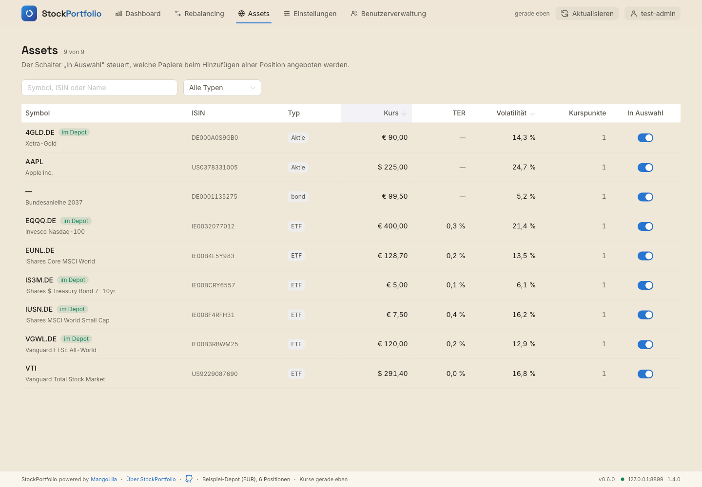
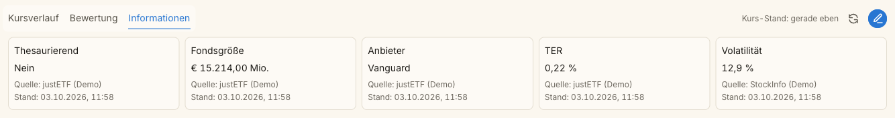

# T-78 · Lesbare Testdaten im Teststack und Fondsgröße in den Fixtures

**Warum dieses Ticket:** Die Testdaten für StockInfo taugen nicht für
Screenshots und sichtbare Browserprüfungen, und eine Kopie der
StockInfo-Vertragsbeispiele ist veraltet.

1. **Demodaten im Teststack.** `scripts/stockinfo-test-server.py` legt auch
   mit `--demo-details` Instrumente mit Testfallnamen an: „T39 Kryptopaar“,
   „T39 OTC Anleihe“, „T39 Mehrdeutig XNAS“ und „T39 Mehrdeutig XNYS“ (zweimal
   `DUAL`), „T39 Pence Listing“. Fast alle tragen TER 0,2 %, auch BTC. Das
   sind wertvolle Randfälle für Tests, aber kein verständliches Bild für
   Screenshots oder für Mikes Sichtprüfung.
2. **Fondsgröße in den Fixtures.** StockInfo führt die Fondsgröße seit
   [StockInfo T-88](/Volumes/DevLocal/DevWeb/Production/StockInfo/_tickets/40-done/T-88-fondsgroesse-in-euro.md)
   einheitlich in Mio. EUR. StockInfos Vertragsbeispiele stehen dort auf
   `"fund_size": 89123.0`. Unsere Kopie unter
   `frontend/tests/fixtures/stockinfo/` (`instruments-200.json`,
   `quote-200.json`) steht noch auf `89123000000.0`.

**Beispiel:** Für die StockInfo-Screenshots am 2026-10-01 musste Claude eine
eigene StockInfo-Instanz mit echten Livedaten aufsetzen. Der Teststack
zeigte 14 Einträge, darunter „T39 Kryptopaar“ für 50.000 EUR mit TER 0,2 %.

**Stand:** Angelegt am 2026-10-01 aus StockInfo heraus (Mike: „Leg ein Ticket
in StockPortfolio an zum Thema Testdaten … Das Ticket in StockPortfolio soll
gleich nach doing“). Liegt in `30-doing/`; Rollen und Aktivierung legt
StockPortfolios `STATUS.md` fest. StockInfo T-88 ist abgeschlossen. Am
2026-10-03 aktiviert (Mike: „Setze die Tickets in doing um und lass den
Verifier die jeweilige Umsetzung überprüfen“) und in Runde 1 an den Verifier
übergeben (siehe Review-Verlauf).

## Was zu tun ist

- **Lesbarer Demomodus:** Mit `--demo-details` zeigt der Teststack nur
  verständliche Instrumente mit echten Namen und plausiblen Werten: etwa
  zwei ETFs mit TER, Anbieter, Fondsgröße und Volatilität, eine Aktie ohne
  TER, Gold. Keine Testfallnamen, keine Dubletten.
- **Randfälle bleiben:** Ohne `--demo-details` bleiben die T39-Fälle
  (Kryptopaar, OTC-Anleihe, mehrdeutiges Symbol, Pence-Listing) erhalten;
  die Tests, die sie brauchen, laufen unverändert.
- **Fixture-Abgleich:** `fund_size` in beiden Fixtures auf `89123.0`, sobald
  StockInfo T-88 freigegeben ist. Prüfen, ob ein Test oder Normalizer eine
  Größenordnung annimmt.

### Akzeptanzkriterien

- [x] `--stack --run --demo-details` zeigt im Browser nur lesbare
      Instrumente ohne „T39“ im Namen und ohne doppelte Symbole.
- [x] Die Randfälle stehen ohne `--demo-details` weiter zur Verfügung; die
      betroffenen Tests sind grün.
- [x] `frontend/tests/fixtures/stockinfo/` stimmt bei `fund_size` mit
      StockInfos Vertragsbeispielen überein.
- [x] **Sichtbare Prüfung im Browser** (nicht headless): Teststack mit
      `--demo-details` starten, Assets-Übersicht und eine Detailansicht
      ansehen; Ergebnis mit Screenshot im Ticket.
- [x] Doku-Abgleich: `AGENTS.md` und `README.md` beschreiben, was
      `--demo-details` zeigt.

### Side-Effects

StockInfos Screenshots können danach mit dem Teststack entstehen statt mit
einer eigenen Live-Instanz.

## Review-Verlauf (neueste Runde zuerst)

### Übergabe Runde 1 · claude-coder · 2026-10-03

**Umfang** (Produktcommit siehe STATUS `handoff_commit`):

- **Lesbarer Demomodus** (`scripts/stockinfo-test-server.py`, neue Datei
  `scripts/fixtures/demo-details.json`): Mit `--demo-details` legt der
  Testserver nur die neun Instrumente aus `demo-details.json` an: die fünf
  Wertpapiere des Beispiel-Depots, iShares Core MSCI World (EUNL.DE),
  Vanguard Total Stock Market (VTI), Apple (AAPL) und „Bundesanleihe 2037“
  (DE0001135275). Jedes trägt eigene Detailwerte, deklariert wie in StockInfo
  (`app/details.py` · `CANONICAL`): TER, Fondsgröße in Mio. mit Währung,
  Anbieter, Ausschüttung für ETFs; Volatilität für alle Gattungen (wie nach
  StockInfo T-89). VTI hat eine **manuelle Fondsgröße in USD** (Vorlage für
  T-79). Quellen heißen „justETF (Demo)“ und „StockInfo (Demo)“. Die
  synthetischen T-40-Felder (`risk-a.*`) gibt es im Demomodus nicht mehr;
  die frühere Umbenennung zu „Demo Source A“ ist entfallen.
- **Randfälle unverändert:** Ohne `--demo-details` liefert der Server
  weiter alle 14 Einträge samt Kryptopaar, OTC-Anleihe, `DUAL` auf zwei
  Börsen, Pence-Listing und Listing ohne ISIN, mit `--detail-fixtures` auch
  die T-40-Felder (per `GET /instruments` geprüft).
- **Startprüfung:** Nennt `demo-details.json` ein Instrument ohne Testkurs,
  bricht der Start mit Meldung und Exit 1 ab, statt es still wegzulassen.
- **Fixture-Abgleich:** `fund_size` in `instruments-200.json` und
  `quote-200.json` auf `89123.0`. Beide Dateien sind damit bytegleich mit
  StockInfos `contract/fixtures/` (`cmp -s`, Stand `20b673a` = StockInfo
  T-88). Herkunft in `frontend/tests/fixtures/stockinfo/README.md`
  ergänzt. Kein Test und kein Normalizer nimmt eine Größenordnung an:
  `fund_size` geht nur durch `optionalNumber` in `normalizers.ts`; die
  übrigen Treffer sind `null`-Werte in Testobjekten. Die Core-Version 4.4.0
  in StockInfo stammt vom 2026-09-26 (Typkatalog) und betrifft T-78 nicht.
- **Wächter-Test** `frontend/tests/demoDetails.spec.ts` (4 Tests): echte,
  eindeutige Namen ohne `T<Zahl>`, Beispiel-Depot vollständig abgedeckt,
  Werte in StockInfos Grenzen (TER 0–5 %, Volatilität 0–500 %, Fondsgröße
  unter 2.000.000 Mio.), TER und Fondsgröße nur bei ETFs.
- **Neues Prüfskript** `frontend/scripts/demo-data-check.mjs`
  (`npm --prefix frontend run check:demo-data -- <demo-accounts.json> [Bildordner]`):
  prüft sichtbar die Assets-Übersicht (Anzahl, Namen, keine Testfallnamen,
  keine doppelten Symbole) und für jede Marktposition des Beispiel-Depots die
  Zusatzinformationen im Reiter „Informationen“ (Feldmenge, kein „—“,
  Anbieter, Fondsgröße als Zahl in Mio.). Ein Ablauffehler wird zum Befund,
  Exit 1 bei jeder Abweichung. Fenster links 100 px frei.
- **Hilfe und Übersetzung:** Hilfetext zu `--demo-details` in Skriptkopf,
  `argparse` und `.po` angepasst, `.mo` mit `msgfmt` neu erzeugt (dasselbe
  `msgfmt` erzeugt aus der alten `.po` bytegleich die alte `.mo`).

**Pflichtprüfungen** (nach letzter Änderung):

| Befehl | Ergebnis |
|---|---|
| `make test` | Exit 0; Frontend 83 Dateien / 856 Tests (+4 aus `demoDetails.spec.ts`), API 5 / 20 |
| `npm --prefix frontend run lint`, `npm --prefix api run lint` | je Exit 0 |
| `npm --prefix frontend run typecheck`, `npm --prefix api run typecheck` | je Exit 0 (erster Lauf mit 2 Typfehlern im neuen Test, behoben) |
| `git diff --check` | ohne Befund |
| `.venv/bin/python -m py_compile scripts/stockinfo-test-server.py` | ohne Befund |

**Sichtbare Browserprüfung** (Teststack `--stack --run --demo-accounts
--demo-details`, deutsche Oberfläche): `check:demo-data` → `OK
Assets-Übersicht: 9 lesbare Instrumente`, `OK` für VGWL.DE, EQQQ.DE,
IUSN.DE, IS3M.DE (je accumulating, fund_size, provider, ter, volatility)
und 4GLD.DE (volatility), Exit 0. `check:notice-texts` im selben Stack
ebenfalls Exit 0. Stack danach gestoppt, Ports 5175/8080/8899 frei.

**Rote Gegenprobe** (lokale Pflicht für neue Prüfskripte und Testwächter;
Fehler jeweils einzeln eingebaut, Dateien danach byte-gleich
wiederhergestellt, `cmp -s`):

*Wächter `demoDetails.spec.ts`* — Änderung an `demo-details.json`:

| # | Eingebauter Fehler | Fehlschlagender Test | Exit |
|---|---|---|---|
| 1 | VTI heißt „T39 USD Listing“ | Namen | 1 |
| 2 | Instrument `NOSI.DE` ohne Namen ergänzt | Namen, Gattung | 1 |
| 3 | AAPL heißt wie VTI | Namen | 1 |
| 4 | IUSN.DE entfernt | Beispiel-Depot | 1 |
| 5 | EUNL.DE-Fondsgröße `89123000000.0` | Grenzen | 1 |
| 6 | EQQQ.DE-TER `30` | Grenzen | 1 |
| 7 | AAPL ohne Volatilität | Grenzen | 1 |
| 8 | AAPL mit TER | nur bei ETFs | 1 |
| 9 | neues Instrument ohne bekannte Gattung | nur bei ETFs | 1 |

Danach nur Typannotationen im Test ergänzt (`scriptTypes`, `?.[0]`), keine
Prüflogik geändert.

*Startprüfung im Skript:* `MSFT` in `demo-details.json` ohne Testkurs →
„demo-details.json nennt Instrumente ohne Testkurs: MSFT“, Exit 1.

*Prüfskript `demo-data-check.mjs`:*

| # | Eingebauter Fehler | Beobachtet | Exit |
|---|---|---|---|
| A1 | `MSFT` nur in den Erwartungen | `9 Zeilen statt 10`, „Microsoft“ fehlt | 1 |
| A2 | VGWL.DE erwartet zusätzlich `replication` | `Felder … statt …` | 1 |
| A3 | EQQQ.DE erwartet Anbieter „iShares“ | `Anbieter „Invesco“ statt „iShares“` | 1 |
| B | Server liefert Fondsgröße × 1.000.000 (alter T-88-Fehler) | `Fondsgröße „€ 15.214.000.000,00 Mio.“ statt 15214 Mio.` für alle vier ETFs | 1 |
| C | Stack ohne `--demo-details` | `14 Zeilen statt 9`, acht `Testfallname „T39 …“`, `doppelte Symbole: DUAL`, drei fehlende Namen, Detailfelder fehlen | 1 |

Nicht als Fehlerfall gewertet: Ein Server-Messwert mit Einheit `absolute`
statt `millions` blieb grün. StockInfo übernimmt den Zahlenwert unabhängig
von der Einheit des Messwerts; die Anzeige war richtig. Daraufhin prüft das
Skript den Zahlenwert statt nur „Mio.“, und Fall B wurde eingeführt. Fall C
lief zuerst in einen Timeout, ohne die gesammelten Befunde auszugeben; seitdem
wird jeder Ablauffehler zum Befund, und die Meldung zu doppelten Symbolen nennt
nur die Dubletten. A1–A3 liefen vor diesen beiden Änderungen; ihre
Prüfpfade sind davon nicht berührt.

**Nebenfunde für T-79** (nicht hier geändert, siehe Screenshot):

- Die Assets-Übersicht rundet TER auf eine Nachkommastelle: VTI 0,03 % →
  „0,0 %“, IS3M.DE 0,07 % → „0,1 %“. Gehört zum TER-Nebenbefund in T-79
  (`InstrumentsView.vue`).
- Der Typ `bond` erscheint unübersetzt als „bond“.
- Fondsgröße in den Zusatzinformationen lautet „€ 15.214,00 Mio.“; die
  Darstellungsfrage steht in T-79.

**Doku-Abgleich:**

| Datei · Abschnitt | Ergebnis |
|---|---|
| `README.md` · Test stack (nach `--demo-accounts`) | Absatz zu `--demo-details` ergänzt: neun Instrumente, Werte, manuelle USD-Fondsgröße, Randfälle ohne die Option |
| `AGENTS.md` · Bauen und prüfen | Satz zu `--demo-details` ergänzt; · Browserprüfung: `demo-data-check.mjs` in der Skriptliste |
| `frontend/tests/fixtures/browser/README.md` | Startbefehl korrigiert (`frontend/tests/fixtures/stockinfo`, der alte relative Pfad stimmte vom Repo-Root aus nicht), Hinweis auf lesbare Namen und „Bundesanleihe 2037“ |
| `frontend/tests/fixtures/stockinfo/README.md` | Herkunft der aktualisierten Fixtures |
| `docker/README.md`, `unraid/`, `docs/` | Teststack ist reine Entwicklerumgebung, dort nicht beschrieben; unverändert |

**Lessons:** SP-CL-01 (nur Root, Branch geprüft); SI-P-04/08 (Gegenprobe
unterscheidet richtig und falsch: der grüne Einheitenfall hat eine zu
schwache Prüfung aufgedeckt, Fall B ersetzt ihn); SI-P-02/12 (Inventar der
`fund_size`-Treffer statt Einzelfund); SP-CX-04 (Prüfskript nicht nach dem
Ticket benannt, für T-79 wiederverwendbar); SP-R-02 (Schlüssel und Zahlen
aus den Ausgaben übernommen); SP-R-05 (Stack nach jedem Stopp geprüft).
