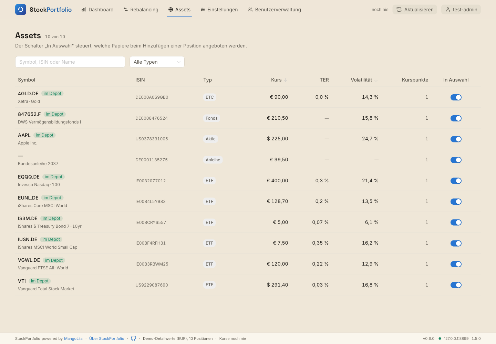
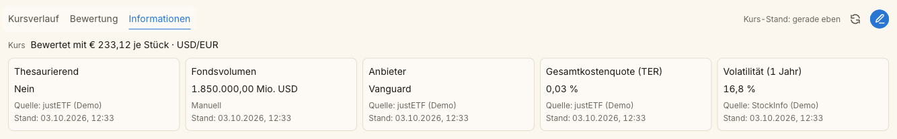
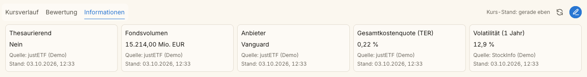
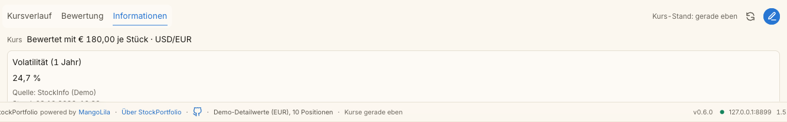
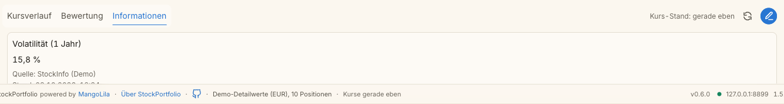

# T-79 · Fondsgröße und Volatilität aus StockInfo T-88/T-89 abgleichen

**Warum dieses Ticket:** StockInfo behebt zwei Fehler in seinen Detailwerten.
Beide wirken auf StockPortfolio, weil StockPortfolio StockInfos Detailwerte
generisch anzeigt (`frontend/src/domain/detailFields.ts`,
`projectDetailFields`). Dieses Ticket hält die Auswirkungen fest und sorgt
dafür, dass StockPortfolio nach beiden StockInfo-Tickets richtig anzeigt.

- [StockInfo T-88](/Volumes/DevLocal/DevWeb/Production/StockInfo/_tickets/40-done/T-88-fondsgroesse-in-euro.md):
  Die Fondsgröße kam in Millionen, war aber als absoluter Betrag
  deklariert (`unit: absolute`). Neu: überall `unit: millions`, Währung
  aus der Quelle (justETF: EUR) oder aus der manuellen Eingabe.
- [StockInfo T-89](/Volumes/DevLocal/DevWeb/Production/StockInfo/_tickets/40-done/T-89-volatilitaet-fuer-alle-typen.md):
  StockInfo berechnet die Volatilität für alle Instrumente, deklariert sie
  in `GET /fields` aber nur für `etf` und `etc` (über justETF). Neu:
  StockInfo deklariert `volatility` selbst für alle Typen mit Kursen.

**Stand:** Angelegt am 2026-10-02 aus StockInfo (Mike: „Verifiziere ob das
Problem aus T-88 nicht auf StockPortfolio durchschlägt … Das selbe gilt
auch für T-89 … erstell in StockPortfolio in doing ein entsprechendes
Ticket“). Liegt in `40-done/`; Rollen und Aktivierung legt
StockPortfolios `STATUS.md` fest. StockInfo T-88 und T-89 sind
abgeschlossen. Am 2026-10-03 aktiviert (Mike: „Setze die Tickets in doing um
und lass den Verifier die jeweilige Umsetzung überprüfen“) und in Runde 1 an
den Verifier übergeben; Entscheidungen und Nachweise unten.

**Abgeschlossen am 2026-10-03:** Mike: „T-78, T-79 und T-83 sind abgenommen“. Technisch freigegeben und nach `master` gemergt (`0651b2f`).

## Analyse (Claude, 2026-10-02, mit StockPortfolios Code geprüft)

Prüfweg: StockInfo mit temporärer Datenbank (EUNL.DE, APC.DE, GOLD.SG,
VTI mit manueller Fondsgröße 30 USD). Dessen echte Antworten von
`GET /fields` und `GET /instruments` liefen durch StockPortfolios
`normalizeFields`, `normalizeInstruments`, `toFieldCatalog`,
`instrumentToQuoteCacheEntry` und `projectDetailFields` (`vite-node`,
Skript außerhalb des Repos; StockPortfolio blieb unverändert). Den Stand
vor T-88 stellte das Skript nach, indem es die Einheit auf `absolute`
zurücksetzte.

### Fondsgröße (T-88)

| Instrument | vor T-88 | nach T-88 |
|---|---|---|
| EUNL.DE (justETF, 129.791 Mio. EUR) | **129.791,00 €** — um den Faktor 1 Mio. zu klein | 129.791,00 € million |
| VTI (manuell 30 Mio. USD) | 30,00 $ | 30,00 $ million |

- **Der Fehler schlug durch.** Die Zusatzinformationen einer Position
  zeigten vor T-88 dieselbe falsche Größenordnung wie StockInfo selbst.
- **T-88 behebt ihn ohne Codeänderung hier.** `valueText` kennt die Einheit
  `millions` bereits (`detailFields.millions`: „Mio.“ / „million“).
- **Kurzzeitig „—“ nach dem Update:** Der Kurs-Cache liegt in IndexedDB
  (`stores/quotes.ts`). Ein gespeicherter Detailwert mit alter Einheit
  `absolute` trifft auf die neue Definition `millions`; `valueText` gibt
  bei abweichender Einheit „—“ aus. Das endet mit dem nächsten Kursabruf.
- **Darstellung:** Die Reihenfolge ist „129.791,00 € Mio.“ (deutsch).
  StockInfo zeigt „129.791 Mio. EUR“. Ob StockPortfolio die Einheit vor die
  Währung stellt, ist hier zu entscheiden.
- **Fixtures:** Die Kopie unter `frontend/tests/fixtures/stockinfo/` steht
  noch auf `fund_size: 89123000000.0`; der Abgleich ist Teil von T-78.
- Die flachen Felder `fund_size` (`api/types.ts`, `normalizers.ts`) zeigt
  StockPortfolio nirgends an.

### Volatilität (T-89)

| Instrument | flacher Wert | Zusatzinformationen heute |
|---|---|---|
| EUNL.DE (ETF) | 10,67 | 10,67 % |
| APC.DE (Aktie) | 26,11 | **nicht gezeigt** |
| GOLD.SG (Fonds) | 27,0 | **nicht gezeigt** |

- **Heute fehlt die Volatilität bei Aktien und Fonds in den
  Zusatzinformationen.** `projectDetailFields` hat einen eigenen Rückfall
  für `ter` und `volatility` aus den flachen Feldern. Weil `GET /fields`
  aber `volatility` (justETF, Typen `etf`, `etc`) schon deklariert, ersetzt
  diese Definition den Rückfall, und die Gattungsprüfung blendet den Wert
  bei `stock` und `fund` aus.
- **Die Instrumentenansicht ist nicht betroffen.** `InstrumentsView.vue`
  zeigt die Spalte aus dem flachen Wert `row.volatility`; ebenso
  `AddPositionDialog.vue`.
- **Nach T-89** deklariert StockInfo `volatility` für alle Typen. Dann
  erscheint der Wert auch hier, **sofern** die Deklaration die Gattungen
  `stock` und `fund` und die passenden Identitätsarten in `scopes` nennt.
  Das ist als Anforderung an StockInfo T-89 vermerkt.

### Nebenbefund

`InstrumentsView.vue` zeigt TER aus dem flachen Wert `row.ter`, auch bei
Aktien. StockInfo blendet alte TER-Werte bei Aktien seit seinem T-56 aus,
wenn das Feld für die Gattung nicht deklariert ist. Ob StockPortfolio
dieselbe Regel braucht, ist hier offen.

## Was zu tun ist

1. Nach StockInfo T-88: Fondsgröße in einer Position sichtbar prüfen (ETF mit
   justETF, ETF mit manueller USD-Angabe), Darstellung „€ Mio.“ bewerten.
2. Nach StockInfo T-89: Volatilität einer Aktie und eines Fonds in den
   Zusatzinformationen sichtbar prüfen.
3. Entscheiden, ob das kurzzeitige „—“ aus dem IndexedDB-Cache hingenommen
   wird oder der Cache bei einem neuen Feldkatalog verworfen wird.
4. Nebenbefund TER bei Aktien bewerten.

### Akzeptanzkriterien

- [x] Die Zusatzinformationen zeigen die Fondsgröße eines justETF-ETFs in
      der richtigen Größenordnung und eine manuelle Angabe in ihrer Währung.
- [x] Nach StockInfo T-89 zeigen die Zusatzinformationen die Volatilität
      bei Aktie und Fonds.
- [x] **Sichtbare Prüfung im Browser** (nicht headless) mit Teststack bzw.
      StockInfo-Temp-Instanz; Screenshots als Beleg im Ticket.
- [x] Entscheidungen zu Darstellung, Cache und Nebenbefund sind im Ticket
      festgehalten.

### Side-Effects

Hängt an StockInfo T-88 und T-89; der Fixture-Abgleich gehört zu T-78.

## Entscheidungen (claude-coder, 2026-10-03)

| Frage | Entscheidung | Begründung |
|---|---|---|
| Darstellung der Fondsgröße | Wie StockInfo T-88: Zahl mit zwei Nachkommastellen, Maßstab, Währungscode — „89.123,00 Mio. EUR“ / „89,123.00 million EUR“. Manuelle Angabe in ihrer Währung („1.850.000,00 Mio. USD“). | Gleiche Schreibweise in beiden Apps; „€ 129.791,00 Mio.“ las sich wie ein Eurobetrag mit nachgestelltem Zusatz. Die Zahl trägt die Trennzeichen der Beträge (`moneyAmount`), weil `de-AT` reine Zahlen mit Leerzeichen gruppiert. |
| „—“ aus dem IndexedDB-Cache nach dem Update | Hingenommen, kein Verwerfen des Caches. | Endet mit dem nächsten Kursabruf; AGENTS.md · Tatsächlicher Entwicklungsstand schließt Migrationspfade aus. Der Test belegt, dass ein Altwert mit Einheit `absolute` als „—“ erscheint und nicht als falscher Betrag. README nennt das Verhalten. |
| TER bei Gattungen ohne Deklaration (Nebenbefund) | Die Assets-Übersicht zeigt die flache TER nur, wenn der Feldkatalog `ter` für Gattung und Identitätsart deklariert (`terApplies`). Ohne Katalog oder ohne `ter`-Deklaration bleibt der flache Wert. | StockInfo setzt die flache TER nur bei Aktien auf `null`; bei Krypto und Anleihe kam im Teststack weiter `0.2` an (per `GET /instruments` geprüft). Dieselbe Regel wie in StockInfos Dashboard (T-56) und in StockPortfolios Zusatzinformationen. |

## Review-Verlauf (neueste Runde zuerst)

### Verifier-Prüfung · Runde 1 · codex-verifier · 2026-10-03

**Technisches Urteil:** Fassung `38e3888` freigegeben. Das ist keine
menschliche Abnahme und kein Ticketabschluss.

**Eigene Prüfung:** Root-Branch und Übergabecommit gegen STATUS abgeglichen;
Produkt-, Teststack-, Prüfskript- und Doku-Diff gelesen. StockInfos
`calculated_metrics.py` deklariert Volatilität für alle Gattungen, aber nur
`listed` und `pair`; `justetf_metadata.py` deklariert TER und Fondsgröße für
ETF/ETC mit Listing. Teststack und Projektion folgen diesen Grenzen.
`make test` bestand mit 863 Frontend- und 20 API-Tests; beide Lints und
Typechecks sowie `git diff --check` endeten mit Exit 0. Den sichtbaren
`check:demo-data`-Lauf habe ich selbst gegen den isolierten Stack ausgeführt:
Exit 0, zehn Assets und Zusatzinformationen aller neun Positionen geprüft,
einschließlich Fondsgröße in EUR und manueller USD-Angabe sowie Volatilität
bei Aktie und Fonds. Die fünf übergebenen Screenshots habe ich angesehen;
der Fonds-Screenshot hat den bereits benannten überdeckten unteren Rand,
der Wert bleibt lesbar. Nach `--stack --stop` waren die drei gestarteten PIDs
und das temporäre Konto-Verzeichnis weg; ein direkter Neustart bestand die
Startprüfungen, danach wurde der Stack erneut gestoppt. Die elf roten
Gegenproben sind Coder-Belege im Handoff; ich habe sie nicht selbst wiederholt.

**Doku-Abgleich:** `README.md` beschreibt Fondsgröße, Volatilität, Altwert
und den aktualisierten Demobestand; `AGENTS.md` nennt zehn Instrumente und
den Backup-Prüfablauf. `docker/README.md` bleibt bei der allgemeinen
Funktion „asset information“ und widerspricht diesen Aussagen nicht.
`frontend/tests/fixtures/browser/README.md` erklärt das neue Backup.
`docs/` und `unraid/` enthalten hierzu keine aktuelle Nutzungszusage.

#### Lessons-Einordnung

| Befund oder Gruppe | Einordnung | Lesson-ID/Fassung oder Einzelfallgrund | Tatsächliche Übernahme / offener Rest |
|---|---|---|---|
| `/fx`-Startbruch nach StockInfo T-94 | Vorhandene Lesson angewendet; ein neuer lokaler Fall, keine zweite Lesson | [SP-R-04](../.agents/lessons/SP-R-04-erkannte-potenzielle-fehler-beheben-scout-rule.md), Blob `86c9b9e` | T-79 repariert `FxQuote` und prüft `/fx` beim Start. Das ist hier verifiziert. Der zweite Beleg für [StockInfo T-99](/Volumes/DevLocal/DevWeb/Production/StockInfo/_tickets/10-backlog/T-99-testmodus-fuer-konsumenten.md) steht dort noch nicht; Nachtrag im StockInfo-Board bleibt bei dessen zuständiger Instanz offen. |

### Übergabe Runde 1 · claude-coder · 2026-10-03

**Umfang** (Produktcommit siehe STATUS `handoff_commit`):

- **Fondsgröße** (`domain/detailFields.ts`, `domain/formatters.ts`,
  i18n `detailFields.amountMillions`): Einheit `millions` mit Währung
  erscheint als „{Zahl} Mio. {Code}“. Neue Funktion `moneyAmount` liefert die
  Zahl eines Betrags ohne Währungszeichen; `money` nutzt denselben Formatter
  (`forCurrency`), Verhalten unverändert.
- **Volatilität** (StockInfo T-89): keine Codeänderung nötig. StockInfo
  deklariert `volatility` für alle sechs Gattungen und die Identitätsarten
  `listed` und `pair` (`app/calculated_metrics.py`), nicht für `isin_only`.
  `projectDetailFields` folgt der Deklaration; im Browser sichtbar bei Aktie
  (AAPL), Fonds (DWS), ETC (Xetra-Gold) und ETFs.
- **Assets-Übersicht** (`views/InstrumentsView.vue`, neu
  `domain/instrumentDisplay.ts`): TER mit zwei Nachkommastellen (0,03 %
  statt „0,0 %“); TER nur bei deklarierter Gattung; alle sechs Gattungen
  übersetzt (neu `dashboard.kindEtc/Fund/Bond/Crypto`), unbekannte bleiben
  Rohwert; Typfilter aus den vorhandenen Gattungen statt fest ETF/Aktie;
  Spaltentitel und Platzhalter aus den vorhandenen i18n-Schlüsseln statt fest
  deutsch. Der Feldkatalog wird beim Öffnen geladen.
- **Demomodus an echtes StockInfo angeglichen**
  (`scripts/stockinfo-test-server.py`, `scripts/fixtures/demo-details.json`):
  Gattungen, Identitätsarten und Beschriftungen wie justETF-Plugin (ETF und
  ETC, nur Listings: „Gesamtkostenquote (TER)“, „Fondsvolumen“, „Anbieter“,
  „Thesaurierend“) und berechnete Volatilität (alle Gattungen, Listings und
  Paare: „Volatilität (1 Jahr)“). Folgen: Xetra-Gold bekommt ETC-Werte (TER
  0,0 %, Fondsvolumen, Deutsche Börse Commodities, thesaurierend); die
  Bundesanleihe (reine ISIN) hat keine Volatilität mehr. Neu: Fonds „DWS
  Vermögensbildungsfonds I“ (`847652.F`, Frankfurt), auch im Normalbetrieb
  (15 statt 14 Einträge).
- **Teststack-Devisenquelle repariert:** `/fx` antwortete mit HTTP 500
  (`AttributeError: 'float' object has no attribute 'rate'`). Ursache: StockInfo
  T-94 (`8991a55`, 2026-10-02) erwartet von einer Quelle `FxQuote` mit Kurs und
  Zeitpunkt. `LocalFx` liefert jetzt `FxQuote`. Damit rechnet der Teststack
  USD-Positionen wieder um. Zweiter Beleg für StockInfo T-99 (Kopplung an
  StockInfos Innenleben); das StockInfo-Ticket selbst ist nicht ergänzt.
- **Startprüfung um `/fx` erweitert** (`scripts/local_test_stack.py`, neue
  Meldung samt `.po`/`.mo`): Der Stack meldet sich erst bereit, wenn
  `/fx?base=USD&quote=EUR` mit CORS und Kurs `0.8` antwortet.
- **Prüfskript `demo-data-check.mjs` erweitert:** spielt zuerst das neue
  Backup `frontend/tests/fixtures/browser/demo-details.backup.json` ein
  (dadurch wiederholbar, unabhängig vom bisherigen Depot), prüft in der
  Assets-Übersicht zusätzlich Gattungsname und TER-Text und für alle neun
  Positionen Feldmenge, Anbieter, Fondsgröße (Zahl, „Mio.“, Währungscode) und
  Volatilität.
- **Wächter `demoDetails.spec.ts`:** TER und Fondsgröße bei ETF und ETC;
  Volatilität Pflicht bei Listings, verboten bei reinen ISINs; das Backup
  parst mit `parseBackup`, jede Position ist ein Demo-Instrument gleicher
  Gattung, und jedes Instrument mit Detailwerten steht im Backup.
- **Neue Unit-Tests:** `tests/domain/instrumentDisplay.spec.ts` (Gattungen,
  TER-Regel), `tests/domain/detailFields.spec.ts` (Fondsgröße DE/EN, Altwert
  mit Einheit `absolute` → „—“).

**Pflichtprüfungen** (nach letzter Änderung):

| Befehl | Ergebnis |
|---|---|
| `make test` | Exit 0; Frontend 84 Dateien / 863 Tests, API 5 / 20 |
| `npm --prefix frontend run lint`, `npm --prefix api run lint` | je Exit 0 |
| `npm --prefix frontend run typecheck`, `npm --prefix api run typecheck` | je Exit 0 |
| `git diff --check`, `py_compile` beider Python-Skripte | ohne Befund |

**Sichtbare Browserprüfung** (Teststack `--stack --run --demo-accounts
--demo-details`, deutsche Oberfläche): `check:demo-data` → `OK
Assets-Übersicht: 10 lesbare Instrumente` und `OK` für alle neun Positionen,
Exit 0; zweimal hintereinander gegen denselben Stack grün (wiederholbar).
`check:notice-texts` im selben Stack Exit 0. Stack gestoppt, Ports frei.

Im Fonds-Ausschnitt überdeckt die Statuszeile den unteren Rand; der Wert
„15,8 %“ samt Quelle ist lesbar.

**Rote Gegenprobe** (je ein Fall, Datei danach byte-gleich zurück, `cmp -s`;
Prüfskript-Fälle gegen den laufenden Stack mit Vite-Neuladen):

| # | Eingebauter Fehler | Beobachtet | Exit |
|---|---|---|---|
| S1 | TER wieder `percent(row.ter)` | `TER „0,0 %“ statt „0,03 %“` u. a. | 1 |
| S2 | Gattung wieder Rohwert | `Typ „etf“ statt „ETF“` u. a. | 1 |
| S3 | alte Fondsgrößen-Schreibweise | `Fondsgröße „€ 89.123,00 Mio.“ statt 89123 Mio. EUR`, `„$ 1.850.000,00 Mio.“ statt … USD`; Unit-Test Fondsgröße rot | 1 / 1 |
| S4 | erwartete Volatilität AAPL 30 | `Volatilität „24,7 %“ statt 30 %` | 1 |
| S5 | Devisenquelle wieder als Zahl (vor T-94) | Start: `…/fx?base=USD&quote=EUR returned HTTP 500`, Stack räumt auf | 2 |
| U1 | `terApplies` immer wahr | Unit-Test „zeigt die TER nur, wo der Feldkatalog sie deklariert“ | 1 |
| U2 | Übersetzung für `bond` entfernt | Unit-Test „übersetzt alle Gattungen“ | 1 |
| G1 | Backup: Xetra-Gold als `stock` | Wächter „baut das Backup-Testdepot …“ | 1 |
| G2 | Backup ohne VTI | dto. | 1 |
| G3 | Bundesanleihe mit Volatilität | Wächter „Grenzen“ und „Backup“ | 1 |
| G4 | AAPL ohne Volatilität | Wächter „Grenzen“ und „Backup“ | 1 |

**Doku-Abgleich:**

| Datei · Abschnitt | Ergebnis |
|---|---|
| `README.md` · Positionsdetails (**Information**) | Fondsgröße in Mio. mit Währungscode, manuelle Währung, Volatilität für alle Gattungen, „—“ bei Altwert bis zum nächsten Abruf |
| `README.md` · Test stack (`--demo-details`) | zehn Instrumente, Fonds, Xetra-Gold als ETC, Deklarationen wie StockInfo |
| `AGENTS.md` · Bauen und prüfen / Browserprüfung | zehn Instrumente; `demo-data-check.mjs` spielt das Backup-Testdepot ein |
| `frontend/tests/fixtures/browser/README.md` | neuer Abschnitt „Demo-Detailwerte prüfen“ |
| `docker/README.md` | nennt Detailwerte nur allgemein („asset information“); unverändert, kein Widerspruch |
| `unraid/`, `docs/` | beschreiben weder Fondsgröße noch Assets-Übersicht; unverändert |

**Lessons:** SP-CL-01 (Root, Branch geprüft); SI-P-02/12 (Inventar der
StockInfo-Deklarationen statt Annahme: dadurch fiel die `isin_only`-Lücke
auf); SI-P-04/08 (jede neue Prüfung einmal rot, auch an der Quelle: G1/G2
ändern das Backup, S5 die Devisenquelle); SP-R-04 (erkannter `/fx`-Bruch
behoben und in der Startprüfung abgesichert); SP-R-05 (Stack nach jedem Stopp
geprüft); SP-CX-04 (Backup und Skript ticketunabhängig benannt).
