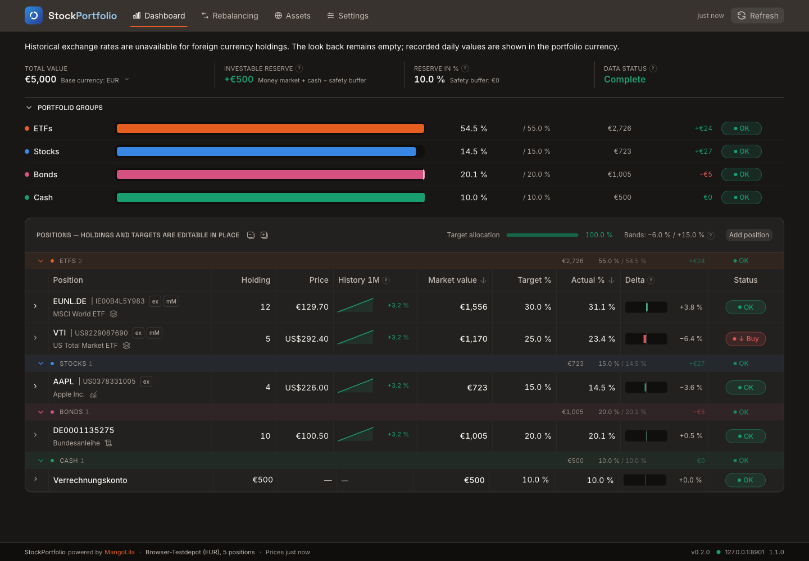
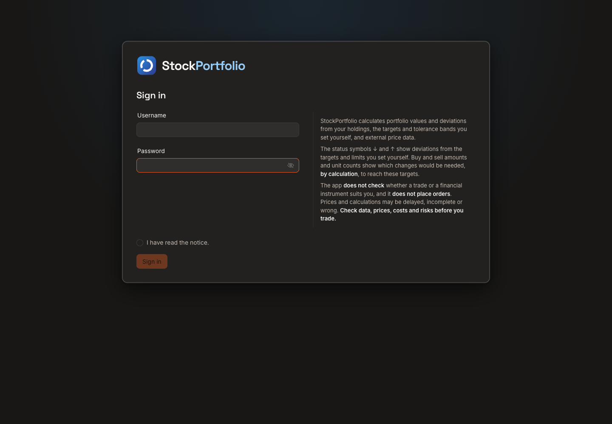
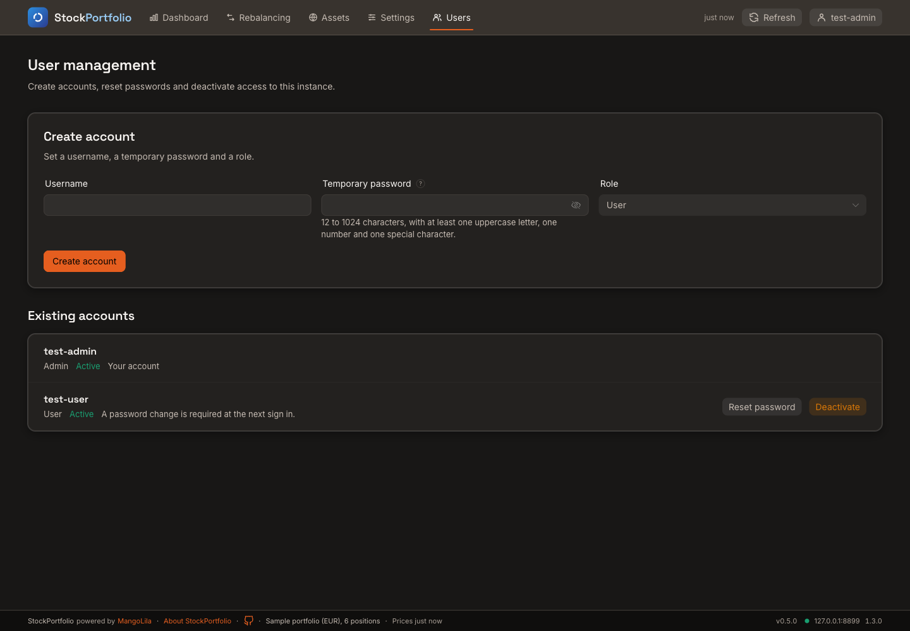

# StockPortfolio

Manage your portfolio in the browser: market data, valuation, price charts,
target allocations and rebalancing simulations.

**[GitHub repository — documentation, source code and setup](https://github.com/MikeMitterer/stockportfolio)**

**Network access:** Do not put StockPortfolio or StockInfo on the internet.
Use both only in your home network. From outside, connect to your home network
with a VPN, for example WireGuard or Tailscale.

StockPortfolio is a web app. Market data comes from a separate
[StockInfo](https://github.com/MikeMitterer/stockinfo) instance that you provide.
It does not connect to a brokerage or place orders.



_The dashboard: portfolio groups at the top, positions below. Holdings and targets
are editable in place and through the position dialog. Arrows mark positions
below (↓) or above (↑) their band. The screenshot shows the built-in sample
portfolio with test quotes, in English with the MangoLila theme._

## Features

- Track holdings, cash and target allocations in portfolio groups.
- Value positions in your portfolio's base currency, with currency conversion.
- View price history, asset information and your own position notes.
- Plan rebalancing trades using tolerance bands or a schedule.
- Read the short note below both tables: buy and sell amounts are calculated
  from your own targets; the app does not check whether a trade suits you and
  places no orders.
- Use the responsive interface in English or German, with light and dark themes.
- Export and restore portfolios and settings as JSON backups.

## Quick start

Replace the example API URL with your StockInfo address:

```bash
docker run -d --name stockportfolio \
  -p 8080:8080 \
  --mount type=volume,source=stockportfolio-data,target=/data \
  -e STOCKINFO_API_URL=https://stockinfo.example.com \
  --restart unless-stopped \
  mangolila/stockportfolio:latest
```

Read the latest setup code with `docker logs stockportfolio`, then open
`http://localhost:8080` and create the first admin account. The setup page
closes after that account is created. There are no default credentials or
public self-registration. New passwords need 12 to 1024 characters, including
an uppercase letter, a number and a special character.
Each login requires ticking that you have read a short notice on what the
calculated buy and sell values mean; the tick is not stored.



The port mapping above accepts connections on the Docker host's network
interfaces. The web interface has a login, but that login does not protect
StockInfo. Keep the host port off the internet. To allow access only from the
Docker host, use `-p 127.0.0.1:8080:8080` instead.

**The browser connects directly to StockInfo.** The API address must be
reachable from the browser; a Docker-internal hostname usually is not.
StockInfo must allow the web app's origin through CORS. For example, when
opening the app at `http://nas:8080`, allow that exact origin in StockInfo.
An HTTPS web address requires an HTTPS API. If a reverse proxy in your home
network serves the app over HTTPS, set `STOCKPORTFOLIO_PUBLIC_ORIGIN` to the
exact browser origin and `STOCKPORTFOLIO_SECURE_COOKIES=true`.

The container also serves its own account API at `/api/*`. It is separate from
StockInfo. Without a StockInfo address, setup and login still work, while the
portfolio view shows a configuration error. The active StockInfo address and
connection status are visible on the separate **Status** page, opened from the
API entry in the bottom status bar. Admins reach **User management** directly
from the people icon in the top bar. The account button at the top right shows
the username and opens the sign-out action.
On narrow screens it shows only the account icon; its accessible name retains
the username. The logo opens the dashboard, and the other navigation targets
remain available. Rebalancing keeps its text on phones where it fits; on the
smallest screens it uses an icon with an accessible name.

## Docker Compose

```yaml
services:
  stockportfolio:
    image: mangolila/stockportfolio:latest
    ports:
      - "8080:8080"
    volumes:
      - stockportfolio-data:/data
    environment:
      STOCKINFO_API_URL: https://stockinfo.example.com
      TZ: Europe/Vienna
    restart: unless-stopped
volumes:
  stockportfolio-data:
```

Start with `docker compose up -d`.

## Configuration

| Setting | Meaning |
|---|---|
| Container port `8080/tcp` | Web interface; map it to your preferred host port. |
| `STOCKINFO_API_URL` | Your StockInfo API URL, reachable from the browser. Set it when starting the container. |
| `/data` volume | Persistent SQLite accounts and sessions. Reuse it when recreating the container. |
| `STOCKPORTFOLIO_PUBLIC_ORIGIN` | Exact browser origin, including scheme and port. Required behind a reverse proxy. |
| `STOCKPORTFOLIO_SECURE_COOKIES` | Set to `true` when the browser uses HTTPS. Local HTTP testing uses `false`. |
| `PUID` / `PGID` | User and group the app runs as; default `99` / `100`. Must not be `0`. |
| `TZ` | Container log timezone; defaults to `UTC`. The interface uses the browser's timezone. |

Restart the container after changing its environment variables.
Open browsers signed in to the same account receive change notices through
`/api/data/events` and reload changed portfolio data from the account API.
After a manual price refresh, the other open browsers fetch current prices
from StockInfo without reloading their pages.
The status bar warns when the live connection is unavailable. The app also
checks the server periodically for missed changes. Concurrent edits still use
revision conflicts.
If a reverse proxy fronts the container, pass the SSE stream without buffering
and allow an idle timeout longer than its 15-second keep-alive interval.
The container starts as root only to prepare `/data`: it gives the directory
to `PUID`/`PGID` (default **99:100**, Unraid's `nobody:users`) and then starts
the app with those IDs, never as root. This also fixes a host directory that
Docker created as root. Data written by older images (UID 1000) is taken over
on the first start. If ownership cannot be changed, for example on a network
share, the container logs a warning and starts as long as that user can
create files in `/data` and read and write an existing database
(`stockportfolio.sqlite` and its `-wal`, `-shm` and `-journal` files); other
files there do not matter. Otherwise it stops with a message naming the
blocked path and the IDs.
With `--user`, no switch happens and `/data` must already be writable for that
user.
Its healthcheck calls the local `/healthz` endpoint; it does not test StockInfo.
The default build targets `linux/amd64`.

## Status and logs

```bash
docker ps --filter name=stockportfolio
docker logs --tail 100 stockportfolio
```

The container should become `healthy` after startup. For missing quotes or API
connection errors, also check **Status** from the bottom status bar.

## Data and backups

**Accounts, sessions, portfolios, settings, asset selection and recorded daily
values live in SQLite under `/data`.** Back up the Docker volume. Each account,
including each admin, sees only its own portfolios. An admin can manage
accounts without access to other accounts' portfolios.



Use **Settings → Backup** to download a JSON backup or restore one. Downloads
are saved by your browser, normally in its Downloads folder. A second browser
loads the same server data after login with the same account. A restored file
is applied in one server transaction after confirmation. Other open browsers
of the same account show the restored data without a page reload.
In an empty portfolio, **Restore backup …** opens **Settings → Backup** directly.

Keep the same `/data` mapping when updating. If the account API is unavailable,
portfolio changes cannot be saved. Clearing browser site data removes market
caches and preferences, but server portfolios remain.

Old IndexedDB portfolios are imported only after the original setup account
confirms the preview in that browser profile. Before import or explicit
discard, those old portfolios remain readable through browser developer tools
even after sign-out. Other accounts cannot see their contents or names. The
bulk import runs once; further old browsers can export one portfolio per file
for the regular restore flow. An existing account database made before the
setup-account marker cannot prove entitlement to old browser data. For a
disposable test installation, reset only the StockPortfolio API database and
create a new setup account while preserving the browser's old data.

## Updating

See the [changelog](../CHANGELOG.md) for changes grouped by Git release.
A Git release does not by itself publish a new container image.

With Compose:

```bash
docker compose pull
docker compose up -d
```

For `docker run`, pull the new image and recreate the container with the same
environment, host port and `/data` volume. Without that volume, setup starts
again with an independent empty account database.

**Upgrading from an older image:** the container port changed from `80` to
`8080`. Update the container side of the mapping while keeping the host port
unchanged, for example `8088:80` becomes `8088:8080`.

## License and source

Copyright © 2026 Michael Mitterer. **MangoLila GmbH** is the provider and licensor.

The **[EUPL 1.2](../LICENSE)** permits personal and commercial use,
modifications, redistribution, sale and hosting without an additional paid
license. Modified versions may be offered under another name. Preserve the
required notices, identify changes and comply with the license's source-code
and copyleft requirements, including for covered network services.
StockPortfolio is licensed under version 1.2 only.

[Provider and consumer declaration](../LICENSING.md): MangoLila GmbH does not
rely on the warranty and liability exclusions in EUPL Articles 7 and 8 when
dealing with consumers. Statutory rules apply; no additional voluntary
guarantee is provided. The official [German license text](../LICENSE.de.txt)
is included alongside the English version.

Open **Settings → About** in the app for the license documents, consumer
declaration and a link to `/legal.html` on your instance. Production builds
include license documents and `/stockportfolio-source.tgz`, made from the same
working files as the app.
These files are stored under `/app/public` in the image. The archive includes
build instructions in SOURCE.md.

The **About StockPortfolio** link in the status bar opens
**Settings → About**, a tab about data and calculation limits. It links to the
English or German EUPL according to the selected UI language, the consumer
declaration and the license page with the source archive.
It shows MangoLila GmbH's address, website and theme-matched logo, and links
to MangoLila's separate notice for website financial content. On narrow
screens, a section selector replaces the Settings tab row.

Third-party components keep their own licenses; see
[third-party notices](../THIRD_PARTY_NOTICES.md). StockInfo is a separate service
with its own license. Contact **office@MangoLila.at**.

## Unraid and support

- [Unraid installation, configuration, backups and updates](../unraid/README.md)
- [Full documentation](../README.md)
- [Report an issue](https://github.com/MikeMitterer/stockportfolio/issues)
